# An Introduction to Tree-Based Regression Methods

# Data Description

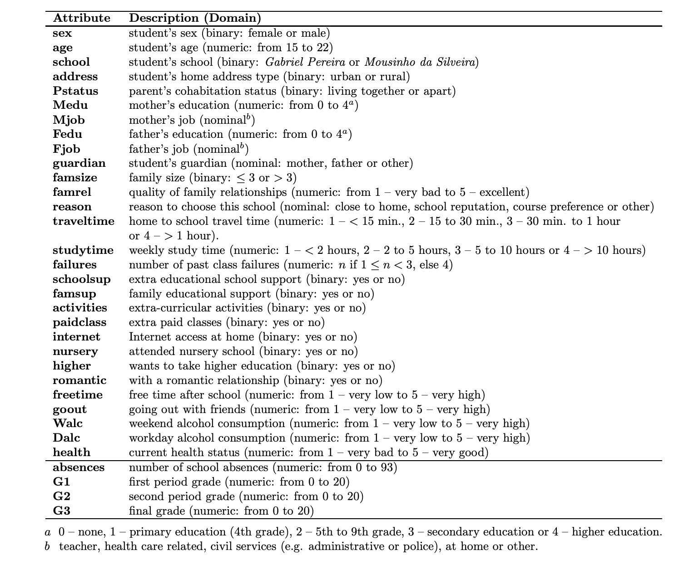


```python
import pandas as pd
import numpy as np
import matplotlib.pyplot as plt
import seaborn as sns
from scipy import stats

plt.rcParams.update(plt.rcParamsDefault)
plt.style.use("fivethirtyeight")
```


```python
df = pd.read_csv("/Users/gabrieltaylor/Downloads/student/student-mat.csv", sep = ";")
```


```python
df.head()
```


<div>
<style scoped>
    .dataframe tbody tr th:only-of-type {
        vertical-align: middle;
    }

    .dataframe tbody tr th {
        vertical-align: top;
    }

    .dataframe thead th {
        text-align: right;
    }
</style>
<table border="1" class="dataframe">
  <thead>
    <tr style="text-align: right;">
      <th></th>
      <th>school</th>
      <th>sex</th>
      <th>age</th>
      <th>address</th>
      <th>famsize</th>
      <th>Pstatus</th>
      <th>Medu</th>
      <th>Fedu</th>
      <th>Mjob</th>
      <th>Fjob</th>
      <th>...</th>
      <th>famrel</th>
      <th>freetime</th>
      <th>goout</th>
      <th>Dalc</th>
      <th>Walc</th>
      <th>health</th>
      <th>absences</th>
      <th>G1</th>
      <th>G2</th>
      <th>G3</th>
    </tr>
  </thead>
  <tbody>
    <tr>
      <th>0</th>
      <td>GP</td>
      <td>F</td>
      <td>18</td>
      <td>U</td>
      <td>GT3</td>
      <td>A</td>
      <td>4</td>
      <td>4</td>
      <td>at_home</td>
      <td>teacher</td>
      <td>...</td>
      <td>4</td>
      <td>3</td>
      <td>4</td>
      <td>1</td>
      <td>1</td>
      <td>3</td>
      <td>6</td>
      <td>5</td>
      <td>6</td>
      <td>6</td>
    </tr>
    <tr>
      <th>1</th>
      <td>GP</td>
      <td>F</td>
      <td>17</td>
      <td>U</td>
      <td>GT3</td>
      <td>T</td>
      <td>1</td>
      <td>1</td>
      <td>at_home</td>
      <td>other</td>
      <td>...</td>
      <td>5</td>
      <td>3</td>
      <td>3</td>
      <td>1</td>
      <td>1</td>
      <td>3</td>
      <td>4</td>
      <td>5</td>
      <td>5</td>
      <td>6</td>
    </tr>
    <tr>
      <th>2</th>
      <td>GP</td>
      <td>F</td>
      <td>15</td>
      <td>U</td>
      <td>LE3</td>
      <td>T</td>
      <td>1</td>
      <td>1</td>
      <td>at_home</td>
      <td>other</td>
      <td>...</td>
      <td>4</td>
      <td>3</td>
      <td>2</td>
      <td>2</td>
      <td>3</td>
      <td>3</td>
      <td>10</td>
      <td>7</td>
      <td>8</td>
      <td>10</td>
    </tr>
    <tr>
      <th>3</th>
      <td>GP</td>
      <td>F</td>
      <td>15</td>
      <td>U</td>
      <td>GT3</td>
      <td>T</td>
      <td>4</td>
      <td>2</td>
      <td>health</td>
      <td>services</td>
      <td>...</td>
      <td>3</td>
      <td>2</td>
      <td>2</td>
      <td>1</td>
      <td>1</td>
      <td>5</td>
      <td>2</td>
      <td>15</td>
      <td>14</td>
      <td>15</td>
    </tr>
    <tr>
      <th>4</th>
      <td>GP</td>
      <td>F</td>
      <td>16</td>
      <td>U</td>
      <td>GT3</td>
      <td>T</td>
      <td>3</td>
      <td>3</td>
      <td>other</td>
      <td>other</td>
      <td>...</td>
      <td>4</td>
      <td>3</td>
      <td>2</td>
      <td>1</td>
      <td>2</td>
      <td>5</td>
      <td>4</td>
      <td>6</td>
      <td>10</td>
      <td>10</td>
    </tr>
  </tbody>
</table>
<p>5 rows × 33 columns</p>
</div>


```python
df[df['G3'] == 0].shape[0] / 395
```


    0.09620253164556962


```python
# df = df[df.G3 != 0]
```

# EDA


```python
pct = pd.DataFrame(df['G3'].value_counts() / df.shape[0]).reset_index()
pct.columns = ['G3', 'density']
sns.barplot(data = pct, x = 'G3', y = 'density', color = 'dodgerblue')
plt.title('Final Grade Scores Histogram')
plt.show()
```


    
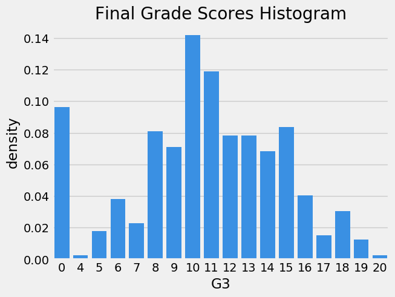
    


## Final Grade Distribution by Feature


```python
columns = ['sex', 'Medu', 'Fedu',
           'failures', 'goout', 'studytime',
           'internet', 'romantic', 'health']
           
    
fig, axes = plt.subplots(3, 3, figsize = (18, 12))

fig.subplots_adjust(hspace=0.4, wspace=0.4)

# Iterating through axes and names
for col, ax in zip(columns, axes.flatten()):
    pct = pd.DataFrame(df[col].value_counts() / df.shape[0]).reset_index()
    pct.columns = [col, 'density']
    ax.grid(False)
    sns.barplot(data = pct, y = 'density', x = col, color = 'grey', alpha = 0.3, ax = ax)
    ax2 = ax.twinx()
    sns.violinplot(data = df, x = col, y = 'G3', palette="viridis", bw=.4, cut=1, linewidth=3, ax = ax2)
    
plt.show()
```


    
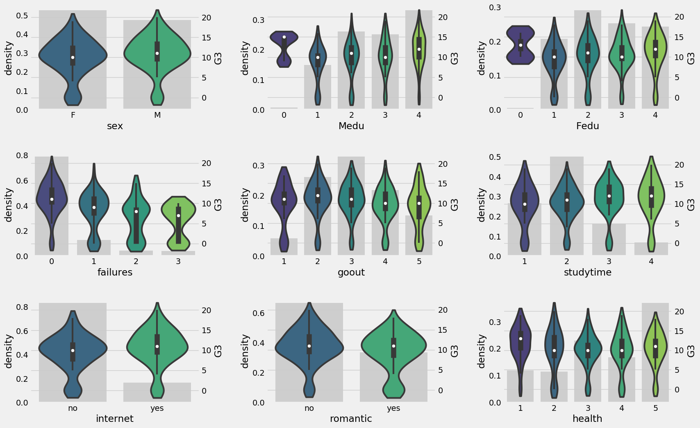
    


# Heatmap of Average Final Grade by Previous Grades


```python
plt.figure(figsize = (6, 6))
heat_df = df[['G1', 'G2', 'G3']].groupby(['G1', 'G2']).agg({'G3' : 'mean'}).reset_index().pivot(index = 'G1', columns = 'G2', values = 'G3')
ax = sns.heatmap(heat_df, cbar_kws={'label': 'G3'}, cmap = 'magma_r')
ax.invert_yaxis()
plt.show()
```


    
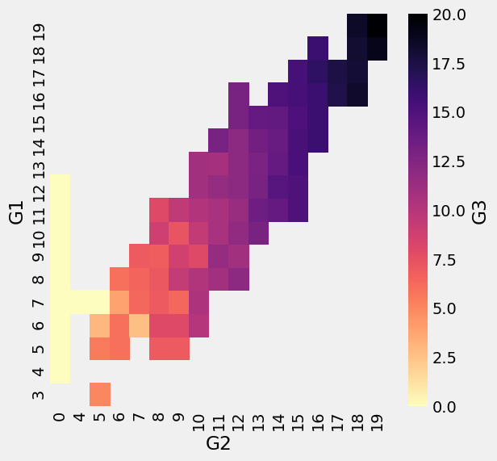
    


```python

```

# Mean Model


```python
def rmse(true, pred):
    return np.sqrt(np.mean((true - pred) ** 2))
```

$$RMSE = \sqrt{\frac{1}{n} \sum_{i = 1}^n (y_i - \hat y_i)^2}$$


```python
print("Mean Model RMSE: " + str(round(rmse(df['G3'], np.mean(df['G3'])), 3)))
```

    Mean Model RMSE: 4.576


# Cross-Validation

### 10 Fold Cross Validation

1. Split data into 10 folds
2. Reserve 1 fold for validation (scoring)
3. Train model on remaining 9 folds

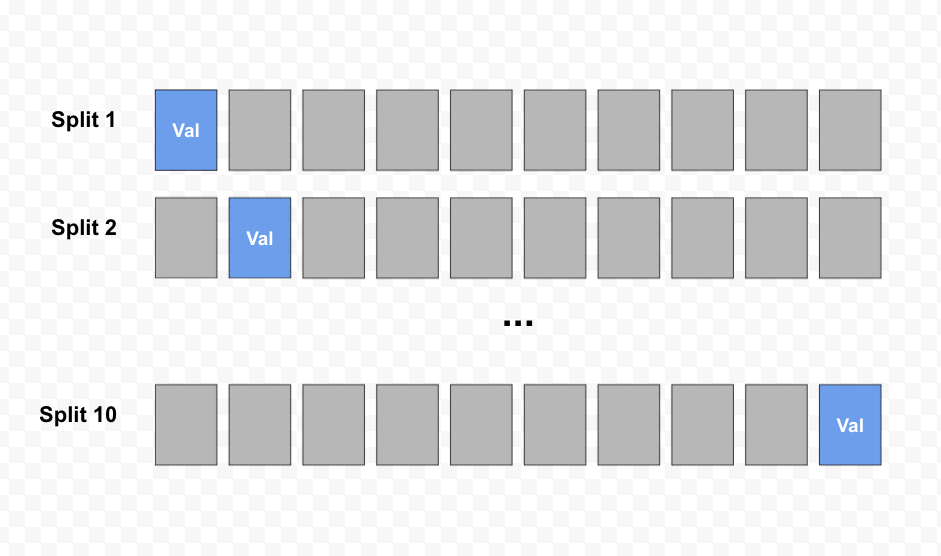

### How to evaluate performance

One could take the average error over all of the folds:

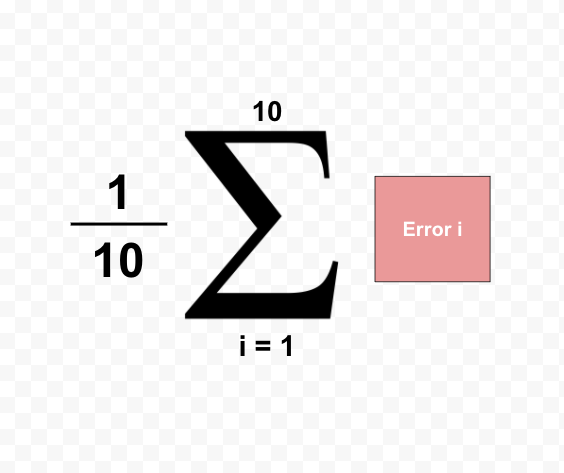


Alternatively, one could append the cross-validation predictions to the original training data, and score the predictions using the the full training observations

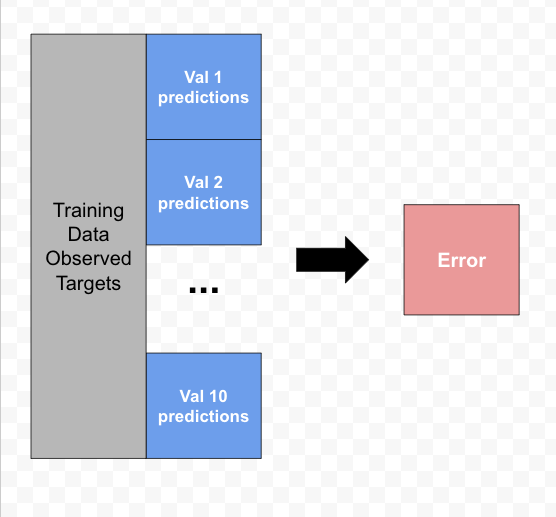

### What about the Test Data?

- In practice, it is useful to score the final model on a holdout set in order to evaluate how well the the model will generalize to unseen data. 

- In the project, due to the small training size, we will not reserve a portion of the data for a hold out, but instead, we will construct a 'test set' using the 10 folds as illustrated in the second method in previous slide.

- For consistency, this is default cross-validation scoring in H2o

# Decision Tree Base Learner

# Why Trees?

### Pros
- Highly interpretable
- Interactions for free
- Natural handling of categorical predictors (no OHE required)
- No assumptions
- Missing Data handling
- Scale invariant (log-transforms or standardizations not required)

### Cons
- Individual trees empirically demonstrated to overfit easily (low bias, high variance)

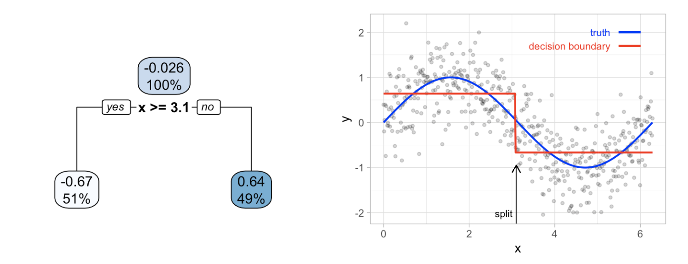

[source](https://bradleyboehmke.github.io/HOML/DT.html)

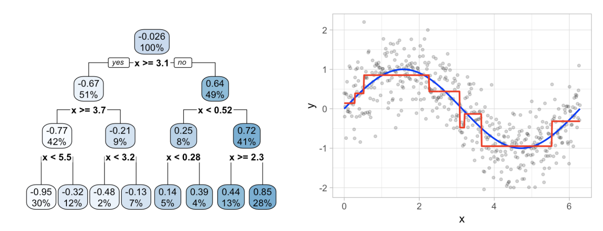

[source](https://bradleyboehmke.github.io/HOML/DT.html)

# How to fit Regression Tree?

$$f(x) = \sum_{m=1}^M c_m I(x \in r_m)$$

Consider a splitting variable $j$ at split point $s$

$$R_1(j, s) = {X|X_j \leq s} \quad \text{and} \quad R_2(j, s) = {X|X_j > s}$$

Taking the loss function to be squared error, we want

$$\min_{j, s} \left[ \min_{c_1} \sum_{x_i \in R_1(j, s)} (y_i - c_1)^2 +  \min_{c_2} \sum_{x_i \in R_1(j, s)} (y_i - c_2)^2 \right]$$

The inner minimization is solved with

$$\hat c_1 = \text{ave}(y_i |x_i \in R_1(j, s)) \quad \text{and} \quad \hat c_2 = \text{ave}(y_i |x_i \in R_2(j, s))$$

Search over the inputs for $j, s$ that yield

$$\min_{j, s} \left[ \sum_{x_i \in R_1(j, s)} (y_i - \bar y_i)^2 + \sum_{x_i \in R_1(j, s)} (y_i - \bar y_i)^2 \right]$$

Recursively perform the following until stopping criterion

    At Parent Node:

        For j in variables

            For s in split points

                sum the loss in each side of the split
            
        Split the data at j, s such that the loss is minimized, where the split planes become parent nodes. 
        


```python
import h2o
h2o.init()
h2o.connect(verbose = False)
from h2o.estimators import H2OGradientBoostingEstimator
from h2o.grid.grid_search import H2OGridSearch
from h2o.tree import H2OTree
h2o.no_progress()
```


```python
full = h2o.H2OFrame(df)
```


```python
predictors = [col for col in df.columns if col not in ['G1', 'G2', 'G3']]
```


```python
to_factor = list(df.select_dtypes(int).columns)
to_factor = [col for col in to_factor if col not in ['age', 'absences', 'G1', 'G2','G3']]

for col in to_factor:
    full[col] = full[col].asfactor()
```


```python
target = 'G3'
rmses = {"Train" : list(),
         "CV" : list()}

for depth in range(1, 6):
    
    gbm_model = H2OGradientBoostingEstimator(nfolds = 10, 
                                             categorical_encoding = 'enum',
                                             ntrees = 1,
                                             max_depth = depth,
                                             seed = 69)
    gbm_model.train(x = predictors, y = target, training_frame=full, verbose = False)
    
    ### Save RMSES
    rmses['Train'].append(round(gbm_model.rmse(train = True), 3))
    rmses['CV'].append(round(gbm_model.rmse(xval = True), 3))
    
    ### Save MOJO
    gbm_model.download_mojo(path="/Users/gabrieltaylor/Python/STAT527/DTmodels/model" + str(depth) + ".zip", get_genmodel_jar=False)
```


```python
! bash maketree.sh 1
! bash maketree.sh 2
! bash maketree.sh 3
! bash maketree.sh 4
! bash maketree.sh 5
```

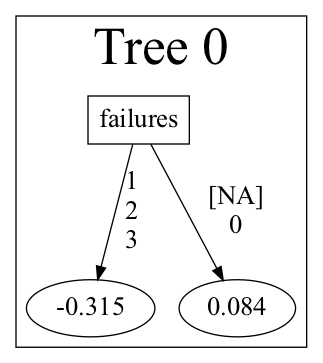

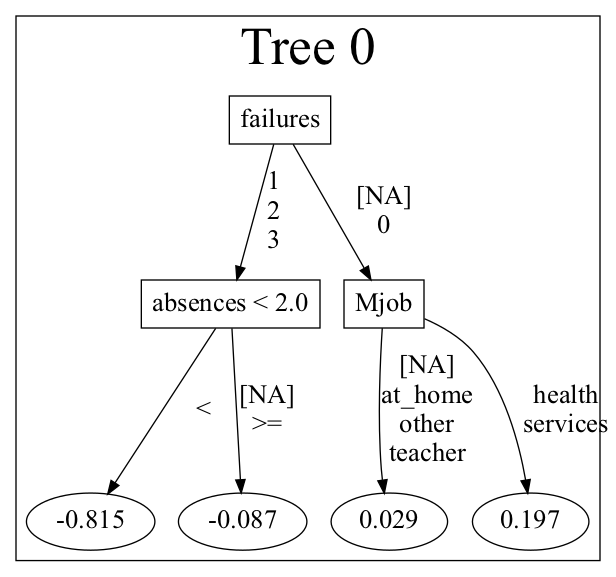

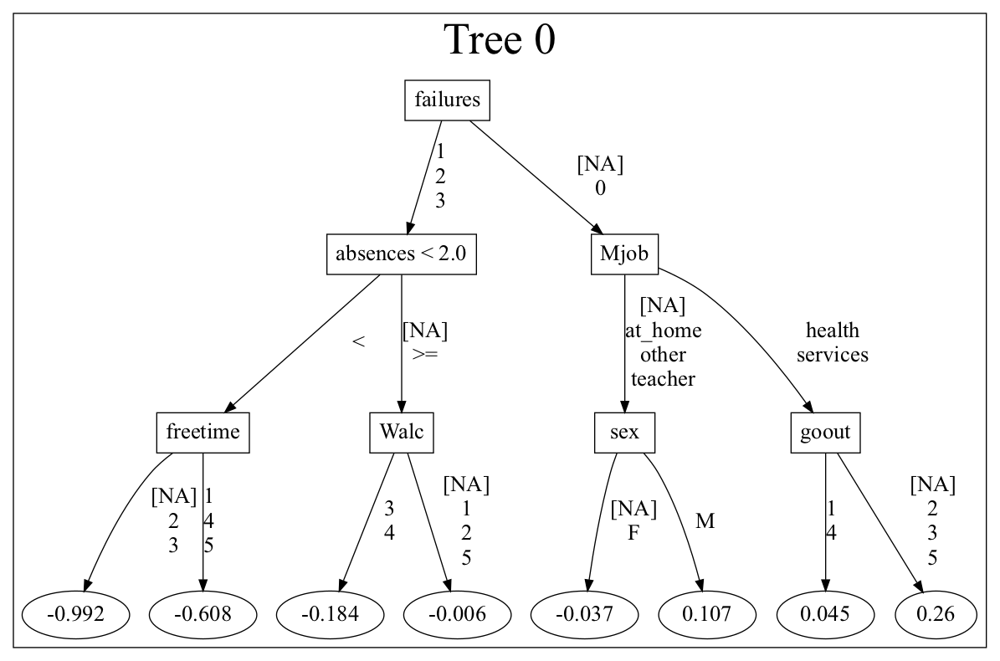

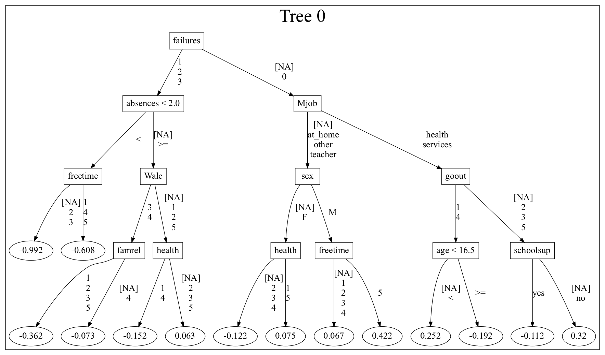

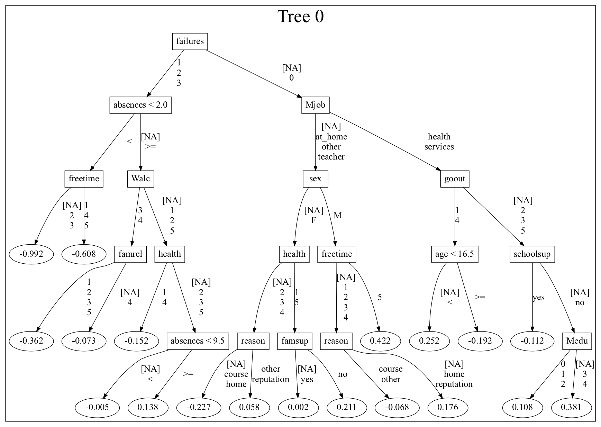


```python
dtrmses = pd.DataFrame(rmses).reset_index()
dtrmses["index"] = dtrmses["index"] + 1
sns.lineplot(x= 'index', y = 'Train', data = dtrmses, label = "Train RMSE", color = 'dodgerblue')
sns.lineplot(x= 'index', y = 'CV', data = dtrmses, label = "CV RMSE", color = 'darkorange')
plt.legend()
plt.xlabel('Depth')
plt.ylabel('RMSE')
plt.title('RMSE Depth Comparison')
plt.show()
```


    
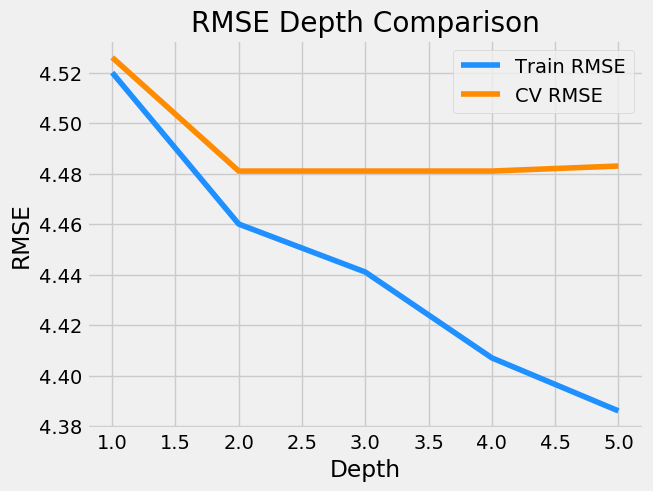
    


# Random Forests

Ensemble of decorrelated trees

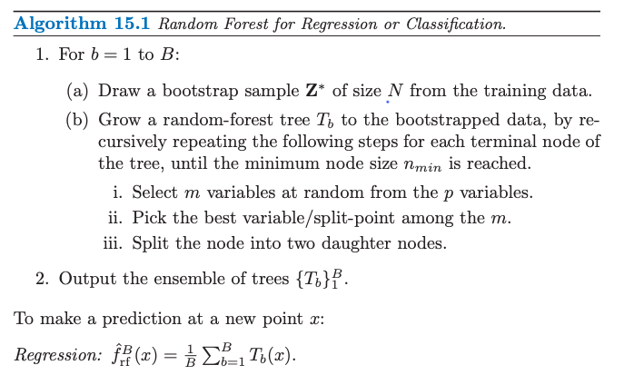

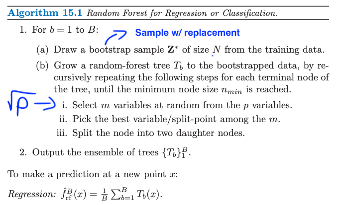


```python
from h2o.estimators import H2ORandomForestEstimator
```


```python
drf_params = { 'max_depth': [2, 3, 4, 5, 6, 7],
               'ntrees' : [25, 50, 100],
               'categorical_encoding' : 'enum'}

drf_grid = H2OGridSearch(model = H2ORandomForestEstimator,
                         hyper_params = drf_params)


drf_grid.train(x = predictors, 
               y = target,
               training_frame = full,
               nfolds = 10,
               seed = 69)

drf_grid_perf = drf_grid.get_grid(sort_by='rmse', decreasing=True)
```


```python
results_df = drf_grid.get_grid(sort_by='rmse', decreasing=False).sorted_metric_table()
sns.lineplot(x = 'max_depth', y = 'rmse', hue = "ntrees", data = results_df)
plt.legend(loc = "center left", bbox_to_anchor=(1, 0.5))
plt.title("Grid Search Results: Cross-Validated RMSE")
plt.show()
```


    
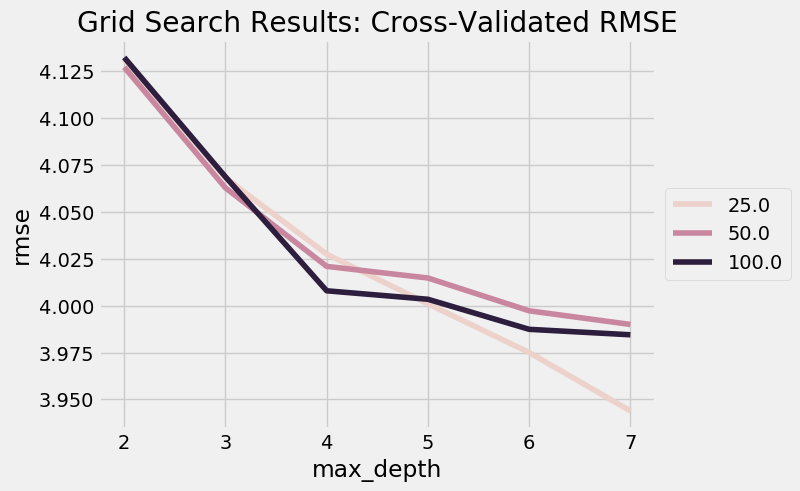
    


```python
drf = H2ORandomForestEstimator( ntrees = 100,
                                max_depth = 6,
                                nfolds = 10,
                                seed = 69)
drf.train(x=predictors,
           y=target,
           training_frame=full)

best_gbm_perf1 = drf.model_performance(full)

print("Training RMSE: " + str(round(drf.rmse(train = True), 3)))
print("Cross Validation RMSE: " + str(round(drf.rmse(xval = True), 3)))
```

    Training RMSE: 4.001
    Cross Validation RMSE: 4.022


# Gradient Boosting

### How to boost decision trees

Sequentially fitting additive decision trees in stagewise fashion.


$$\hat y_i ^{(0)} = \bar y$$
$$\hat y_i ^{(1)} = f_1(x_i) + \hat y_i ^{(0)} = f_1(x_i) + \bar y$$
$$\hat y_i ^{(2)} = f_2(x_i) + \hat y_i ^{(1)} = f_2(x_i) + f_1(x_i) + \bar y$$
$$\dots$$
$$\hat y_i ^{(t)} = \sum_{k=1}^t f_k(x_i) = f_t(x_i) + \hat y_i^{(t-1)}$$

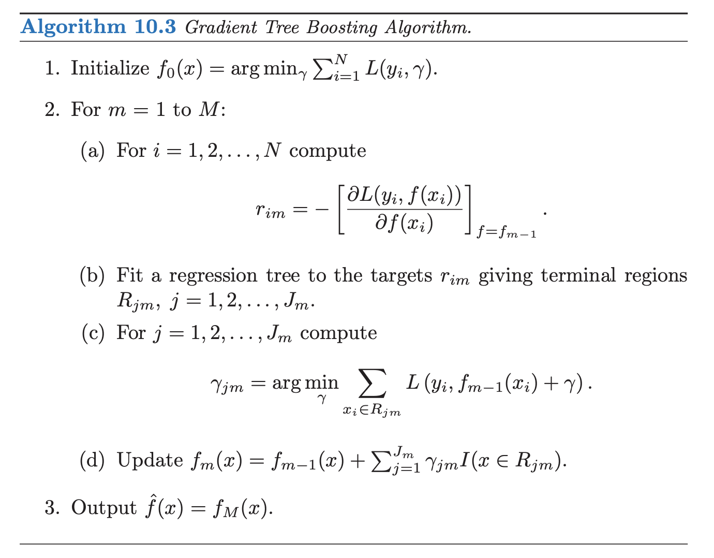

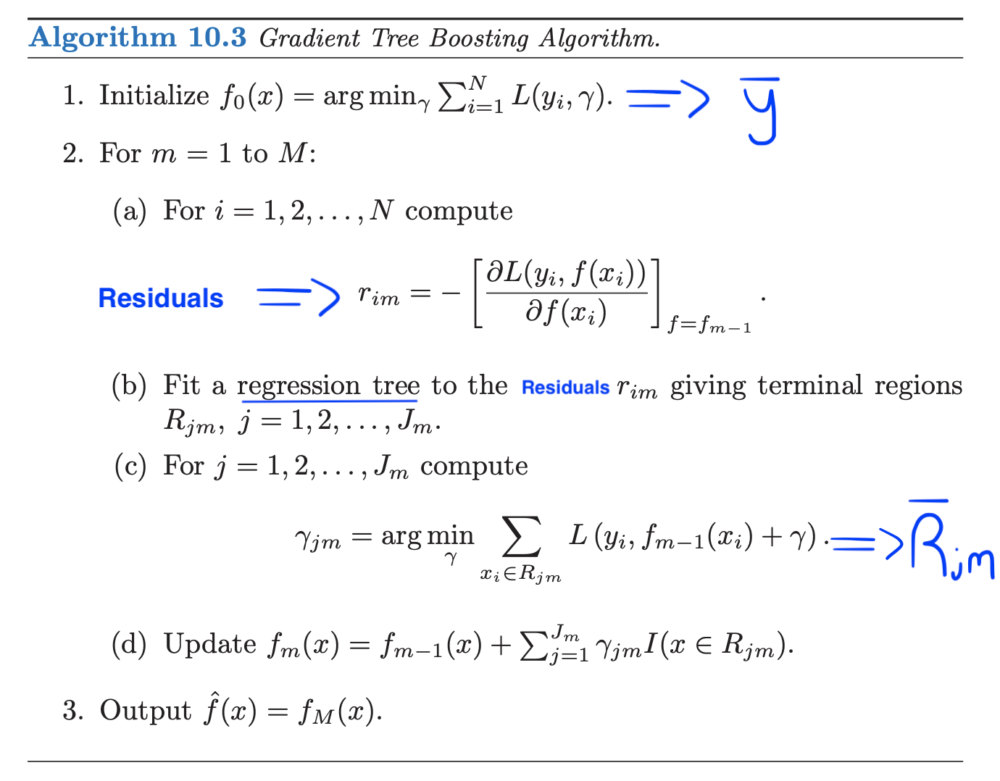

Take

$$L(x, y) = 0.5(x - y)^2$$

$$\frac{d}{dy}L(x, y) = -(x - y)$$

Then

$$r_{im} = -\left[\frac{d L(y_i, f(x_i)}{df(x_i} \right]_{f = f_{m-1}} = y_i - f_{m-1}(x_i)$$

Also

$$\gamma_{jm} = \arg \min_{\gamma} \sum_{x_i \in R_{jm}} L(y_i, f_{m-1}(x_i) + \gamma)$$

we can simply take

$$\frac{d}{d \gamma}\sum_{x_i \in R_{jm}} L(y_i, f_{m-1}(x_i) + \gamma)$$

$$\frac{d}{d \gamma}\sum_{x_i \in R_{jm}} 0.5(y_i - f_{m-1}(x_i) - \gamma)^2$$

$$= -\sum_{x_i \in R_{jm}} (y_i - f_{m-1}(x_i) - \gamma) = 0$$

$$= -\sum_{x_i \in R_{jm}} (r_{im} - \gamma) = 0$$

$$\gamma = \frac{1}{n_{jm}}\sum_{x_i \in R_{jm}} r_{im}$$

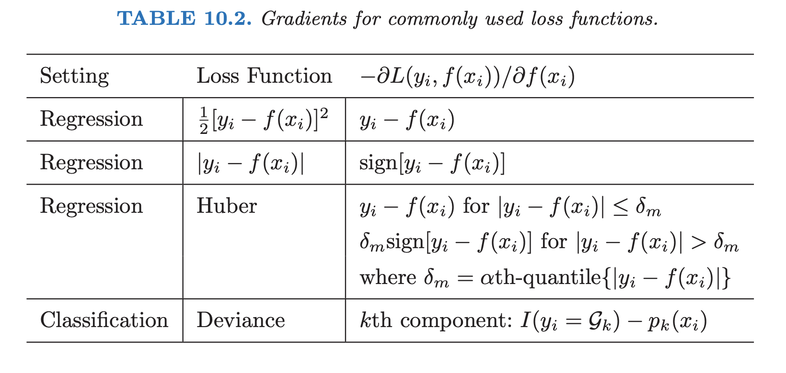

### Tuning

- Number of Trees (more trees -> overfit)
- Maximum Depth (deeper -> overfit)
- Learning Rate (larger -> overfit)
- Sampling Rates (larger -> overfit)
- Minimum Node Size (smaller -> overfit)

Use 10-fold cross validation to search for best parameters.


```python
predictors = [col for col in df.columns if col not in ['G1', 'G2', 'G3']]
```


```python
to_factor = list(df.select_dtypes(int).columns)
to_factor = [col for col in to_factor if col not in ['age', 'absences', 'G1', 'G2','G3']]

for col in to_factor:
    full[col] = full[col].asfactor()
```


```python
gbm_params = { 'learn_rate': [0.1, 0.2, 0.3],
               'max_depth': [1, 2, 3, 4],
               'ntrees' : [25, 50, 100],
               'categorical_encoding' : 'enum'}

gbm_grid = H2OGridSearch(model = H2OGradientBoostingEstimator,
                         hyper_params = gbm_params)


gbm_grid.train(x = predictors, 
               y = target,
               training_frame = full,
               nfolds = 10,
               seed = 69)

gbm_grid_perf = gbm_grid.get_grid(sort_by='rmse', decreasing=True)
```


```python
results_df = gbm_grid.get_grid(sort_by='rmse', decreasing=False).sorted_metric_table()
sns.scatterplot(x = 'max_depth', y = 'rmse', hue = "learn_rate", size = "ntrees", data = results_df)
plt.legend(loc = "center left", bbox_to_anchor=(1, 0.5))
plt.title("Grid Search Results: Cross-Validated RMSE")
plt.show()
```


    
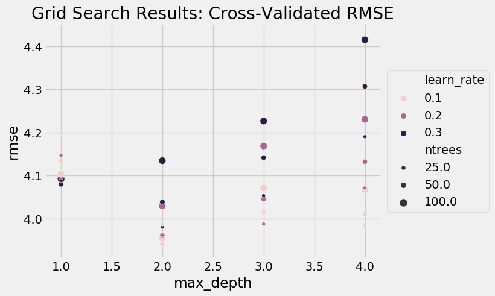
    


```python
gbm_model = H2OGradientBoostingEstimator(nfolds = 10, 
                                         distribution = 'gaussian',
                                         categorical_encoding = 'enum',
                                         ntrees = 50,
                                         max_depth = 2,
                                         learn_rate = 0.1,
                                         sample_rate = 1,
                                         col_sample_rate = 0.8,
                                         seed = 69)
gbm_model.train(x = predictors, y = target, training_frame=full)

print("Training RMSE: " + str(round(gbm_model.rmse(train = True), 3)))
print("Cross Validation RMSE: " + str(round(gbm_model.rmse(xval = True), 3)))
```

    Training RMSE: 3.382
    Cross Validation RMSE: 3.93


### Summary


```python
var_imp_df = gbm_model.varimp(use_pandas = True)
var_imp_df.loc[:10, ["variable", "scaled_importance"]]
```


<div>
<style scoped>
    .dataframe tbody tr th:only-of-type {
        vertical-align: middle;
    }

    .dataframe tbody tr th {
        vertical-align: top;
    }

    .dataframe thead th {
        text-align: right;
    }
</style>
<table border="1" class="dataframe">
  <thead>
    <tr style="text-align: right;">
      <th></th>
      <th>variable</th>
      <th>scaled_importance</th>
    </tr>
  </thead>
  <tbody>
    <tr>
      <th>0</th>
      <td>failures</td>
      <td>1.000000</td>
    </tr>
    <tr>
      <th>1</th>
      <td>absences</td>
      <td>0.866471</td>
    </tr>
    <tr>
      <th>2</th>
      <td>freetime</td>
      <td>0.242512</td>
    </tr>
    <tr>
      <th>3</th>
      <td>health</td>
      <td>0.188593</td>
    </tr>
    <tr>
      <th>4</th>
      <td>Mjob</td>
      <td>0.146370</td>
    </tr>
    <tr>
      <th>5</th>
      <td>Medu</td>
      <td>0.144549</td>
    </tr>
    <tr>
      <th>6</th>
      <td>goout</td>
      <td>0.118127</td>
    </tr>
    <tr>
      <th>7</th>
      <td>schoolsup</td>
      <td>0.093784</td>
    </tr>
    <tr>
      <th>8</th>
      <td>Walc</td>
      <td>0.086578</td>
    </tr>
    <tr>
      <th>9</th>
      <td>sex</td>
      <td>0.085563</td>
    </tr>
    <tr>
      <th>10</th>
      <td>age</td>
      <td>0.082970</td>
    </tr>
  </tbody>
</table>
</div>


```python
gbm_model.varimp_plot()
```


    
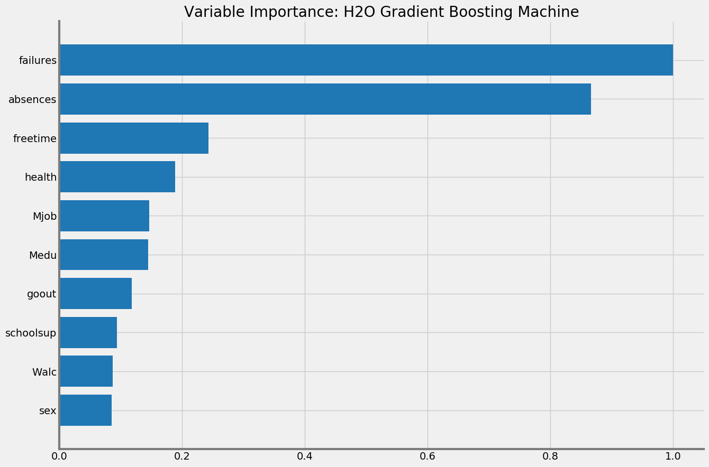
    


```python
gbm_model.pd_plot(full, column = 'failures')
```


    
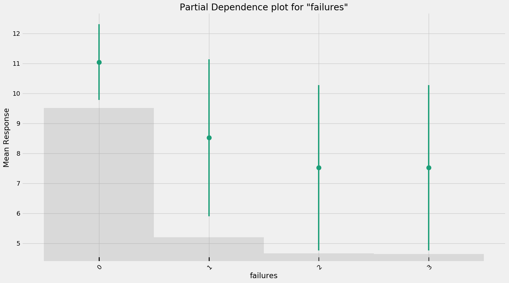
    


```python
gbm_model.pd_plot(full, column = 'absences')
```


    
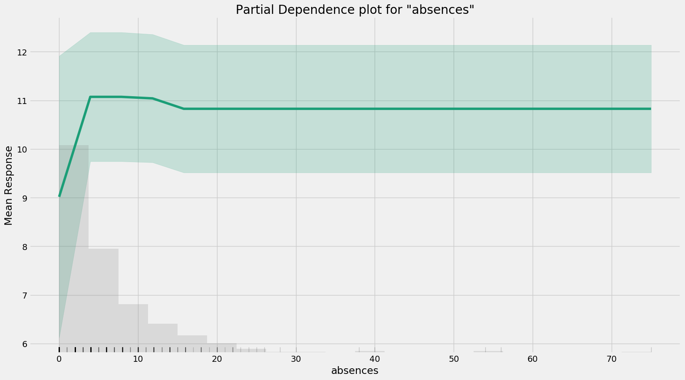
    


```python
gbm_model.pd_plot(full, column = 'Mjob')
```


    
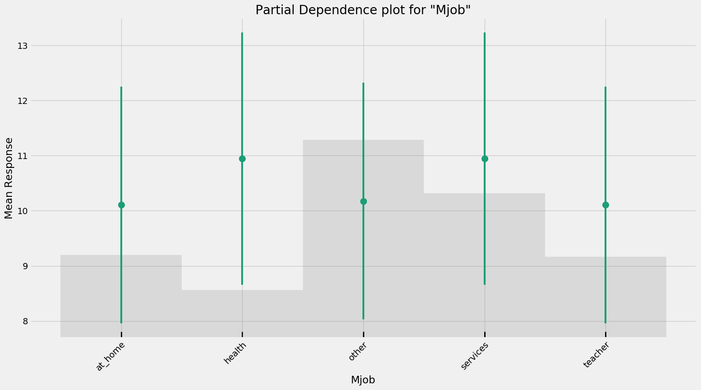
    


```python
gbm_model.pd_plot(full, column = 'studytime')
```


    
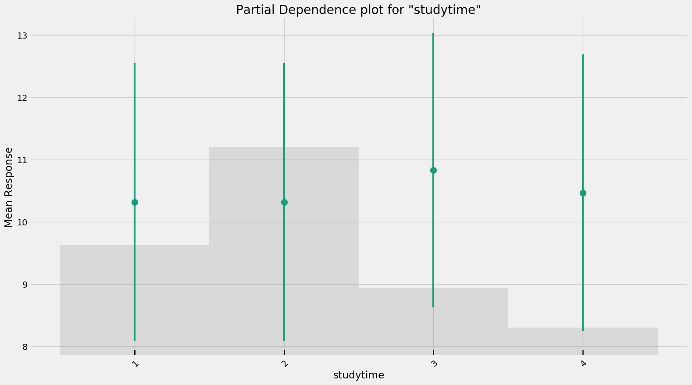
    


```python
rmse_df.loc['GBM', : ] = [round(gbm_model.rmse(train = True), 3),
                          round(gbm_model.rmse(xval = True), 3)]

rmse_df.style.format({'Train RMSE': "{:.4}", 'CV RMSE': "{:.4}"}).set_table_styles(styles)
```


<style  type="text/css" >
    #T_e5b0c0c0_514e_11ec_9edf_acde48001122 th {
          font-size: 20px;
    }    #T_e5b0c0c0_514e_11ec_9edf_acde48001122 td {
          font-size: 18px;
    }</style><table id="T_e5b0c0c0_514e_11ec_9edf_acde48001122" ><thead>    <tr>        <th class="blank level0" ></th>        <th class="col_heading level0 col0" >Train RMSE</th>        <th class="col_heading level0 col1" >CV RMSE</th>    </tr></thead><tbody>
                <tr>
                        <th id="T_e5b0c0c0_514e_11ec_9edf_acde48001122level0_row0" class="row_heading level0 row0" >Mean</th>
                        <td id="T_e5b0c0c0_514e_11ec_9edf_acde48001122row0_col0" class="data row0 col0" >4.576</td>
                        <td id="T_e5b0c0c0_514e_11ec_9edf_acde48001122row0_col1" class="data row0 col1" >4.576</td>
            </tr>
            <tr>
                        <th id="T_e5b0c0c0_514e_11ec_9edf_acde48001122level0_row1" class="row_heading level0 row1" >OLS</th>
                        <td id="T_e5b0c0c0_514e_11ec_9edf_acde48001122row1_col0" class="data row1 col0" >3.672</td>
                        <td id="T_e5b0c0c0_514e_11ec_9edf_acde48001122row1_col1" class="data row1 col1" >4.544</td>
            </tr>
            <tr>
                        <th id="T_e5b0c0c0_514e_11ec_9edf_acde48001122level0_row2" class="row_heading level0 row2" >LASSO</th>
                        <td id="T_e5b0c0c0_514e_11ec_9edf_acde48001122row2_col0" class="data row2 col0" >4.086</td>
                        <td id="T_e5b0c0c0_514e_11ec_9edf_acde48001122row2_col1" class="data row2 col1" >4.362</td>
            </tr>
            <tr>
                        <th id="T_e5b0c0c0_514e_11ec_9edf_acde48001122level0_row3" class="row_heading level0 row3" >Decision Tree</th>
                        <td id="T_e5b0c0c0_514e_11ec_9edf_acde48001122row3_col0" class="data row3 col0" >4.46</td>
                        <td id="T_e5b0c0c0_514e_11ec_9edf_acde48001122row3_col1" class="data row3 col1" >4.481</td>
            </tr>
            <tr>
                        <th id="T_e5b0c0c0_514e_11ec_9edf_acde48001122level0_row4" class="row_heading level0 row4" >Random Forest</th>
                        <td id="T_e5b0c0c0_514e_11ec_9edf_acde48001122row4_col0" class="data row4 col0" >4.001</td>
                        <td id="T_e5b0c0c0_514e_11ec_9edf_acde48001122row4_col1" class="data row4 col1" >4.022</td>
            </tr>
            <tr>
                        <th id="T_e5b0c0c0_514e_11ec_9edf_acde48001122level0_row5" class="row_heading level0 row5" >GBM</th>
                        <td id="T_e5b0c0c0_514e_11ec_9edf_acde48001122row5_col0" class="data row5 col0" >3.382</td>
                        <td id="T_e5b0c0c0_514e_11ec_9edf_acde48001122row5_col1" class="data row5 col1" >3.93</td>
            </tr>
    </tbody></table>


# Conclusion

My Github: https://github.com/gabeztaylor/STAT527

### Resources

Data Source: https://archive.ics.uci.edu/ml/datasets/student+performance

H2o Documentation: https://docs.h2o.ai/h2o/latest-stable/h2o-docs/data-science.html

ESL: https://web.stanford.edu/~hastie/ElemStatLearn/printings/ESLII_print12_toc.pdf

BSL: https://statisticallearning.org/

Hands-on Machine Learning: https://bradleyboehmke.github.io/HOML/gbm.html
