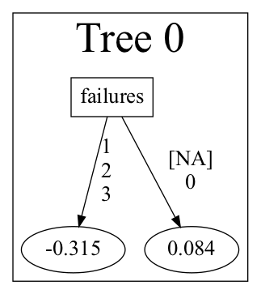
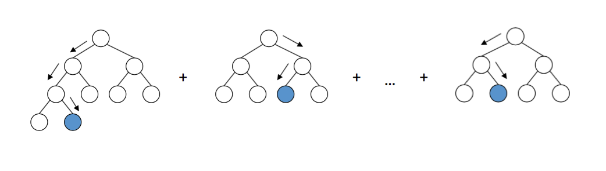

# An Introduction to Tree-Based Regression Methods

### STAT 527 - Jingbo Liu - Fall 2021

### Author: Gabe Taylor

# Agenda

### Data Overview ~ 5 mins
- Problem presentation/data description ~ 2 mins
- Exploratory Data Analysis (EDA) ~ 2 mins
- Data Preprocessing ~ 1 min

### Modeling ~ 25 mins

- Cross-Validation ~ 3 mins
- **OLS & Lasso**  ~ 3 mins
- **Decision Trees** ~ 5 mins
- **Random Forest** ~ 5 mins
- **Gradient boosting** ~ 7 mins
- Variable Importances ~ 1 min
- Partial Dependence ~ 1 min

# Data Description


```python
import pandas as pd
import numpy as np
import matplotlib.pyplot as plt
import seaborn as sns
from scipy import stats

plt.rcParams.update(plt.rcParamsDefault)
plt.style.use("fivethirtyeight")
```


```python
df = pd.read_csv("/Users/gabrieltaylor/Downloads/student/student-mat.csv", sep = ";")
```


```python
df
```


<div>
<style scoped>
    .dataframe tbody tr th:only-of-type {
        vertical-align: middle;
    }

    .dataframe tbody tr th {
        vertical-align: top;
    }

    .dataframe thead th {
        text-align: right;
    }
</style>
<table border="1" class="dataframe">
  <thead>
    <tr style="text-align: right;">
      <th></th>
      <th>school</th>
      <th>sex</th>
      <th>age</th>
      <th>address</th>
      <th>famsize</th>
      <th>Pstatus</th>
      <th>Medu</th>
      <th>Fedu</th>
      <th>Mjob</th>
      <th>Fjob</th>
      <th>...</th>
      <th>famrel</th>
      <th>freetime</th>
      <th>goout</th>
      <th>Dalc</th>
      <th>Walc</th>
      <th>health</th>
      <th>absences</th>
      <th>G1</th>
      <th>G2</th>
      <th>G3</th>
    </tr>
  </thead>
  <tbody>
    <tr>
      <th>0</th>
      <td>GP</td>
      <td>F</td>
      <td>18</td>
      <td>U</td>
      <td>GT3</td>
      <td>A</td>
      <td>4</td>
      <td>4</td>
      <td>at_home</td>
      <td>teacher</td>
      <td>...</td>
      <td>4</td>
      <td>3</td>
      <td>4</td>
      <td>1</td>
      <td>1</td>
      <td>3</td>
      <td>6</td>
      <td>5</td>
      <td>6</td>
      <td>6</td>
    </tr>
    <tr>
      <th>1</th>
      <td>GP</td>
      <td>F</td>
      <td>17</td>
      <td>U</td>
      <td>GT3</td>
      <td>T</td>
      <td>1</td>
      <td>1</td>
      <td>at_home</td>
      <td>other</td>
      <td>...</td>
      <td>5</td>
      <td>3</td>
      <td>3</td>
      <td>1</td>
      <td>1</td>
      <td>3</td>
      <td>4</td>
      <td>5</td>
      <td>5</td>
      <td>6</td>
    </tr>
    <tr>
      <th>2</th>
      <td>GP</td>
      <td>F</td>
      <td>15</td>
      <td>U</td>
      <td>LE3</td>
      <td>T</td>
      <td>1</td>
      <td>1</td>
      <td>at_home</td>
      <td>other</td>
      <td>...</td>
      <td>4</td>
      <td>3</td>
      <td>2</td>
      <td>2</td>
      <td>3</td>
      <td>3</td>
      <td>10</td>
      <td>7</td>
      <td>8</td>
      <td>10</td>
    </tr>
    <tr>
      <th>3</th>
      <td>GP</td>
      <td>F</td>
      <td>15</td>
      <td>U</td>
      <td>GT3</td>
      <td>T</td>
      <td>4</td>
      <td>2</td>
      <td>health</td>
      <td>services</td>
      <td>...</td>
      <td>3</td>
      <td>2</td>
      <td>2</td>
      <td>1</td>
      <td>1</td>
      <td>5</td>
      <td>2</td>
      <td>15</td>
      <td>14</td>
      <td>15</td>
    </tr>
    <tr>
      <th>4</th>
      <td>GP</td>
      <td>F</td>
      <td>16</td>
      <td>U</td>
      <td>GT3</td>
      <td>T</td>
      <td>3</td>
      <td>3</td>
      <td>other</td>
      <td>other</td>
      <td>...</td>
      <td>4</td>
      <td>3</td>
      <td>2</td>
      <td>1</td>
      <td>2</td>
      <td>5</td>
      <td>4</td>
      <td>6</td>
      <td>10</td>
      <td>10</td>
    </tr>
    <tr>
      <th>...</th>
      <td>...</td>
      <td>...</td>
      <td>...</td>
      <td>...</td>
      <td>...</td>
      <td>...</td>
      <td>...</td>
      <td>...</td>
      <td>...</td>
      <td>...</td>
      <td>...</td>
      <td>...</td>
      <td>...</td>
      <td>...</td>
      <td>...</td>
      <td>...</td>
      <td>...</td>
      <td>...</td>
      <td>...</td>
      <td>...</td>
      <td>...</td>
    </tr>
    <tr>
      <th>390</th>
      <td>MS</td>
      <td>M</td>
      <td>20</td>
      <td>U</td>
      <td>LE3</td>
      <td>A</td>
      <td>2</td>
      <td>2</td>
      <td>services</td>
      <td>services</td>
      <td>...</td>
      <td>5</td>
      <td>5</td>
      <td>4</td>
      <td>4</td>
      <td>5</td>
      <td>4</td>
      <td>11</td>
      <td>9</td>
      <td>9</td>
      <td>9</td>
    </tr>
    <tr>
      <th>391</th>
      <td>MS</td>
      <td>M</td>
      <td>17</td>
      <td>U</td>
      <td>LE3</td>
      <td>T</td>
      <td>3</td>
      <td>1</td>
      <td>services</td>
      <td>services</td>
      <td>...</td>
      <td>2</td>
      <td>4</td>
      <td>5</td>
      <td>3</td>
      <td>4</td>
      <td>2</td>
      <td>3</td>
      <td>14</td>
      <td>16</td>
      <td>16</td>
    </tr>
    <tr>
      <th>392</th>
      <td>MS</td>
      <td>M</td>
      <td>21</td>
      <td>R</td>
      <td>GT3</td>
      <td>T</td>
      <td>1</td>
      <td>1</td>
      <td>other</td>
      <td>other</td>
      <td>...</td>
      <td>5</td>
      <td>5</td>
      <td>3</td>
      <td>3</td>
      <td>3</td>
      <td>3</td>
      <td>3</td>
      <td>10</td>
      <td>8</td>
      <td>7</td>
    </tr>
    <tr>
      <th>393</th>
      <td>MS</td>
      <td>M</td>
      <td>18</td>
      <td>R</td>
      <td>LE3</td>
      <td>T</td>
      <td>3</td>
      <td>2</td>
      <td>services</td>
      <td>other</td>
      <td>...</td>
      <td>4</td>
      <td>4</td>
      <td>1</td>
      <td>3</td>
      <td>4</td>
      <td>5</td>
      <td>0</td>
      <td>11</td>
      <td>12</td>
      <td>10</td>
    </tr>
    <tr>
      <th>394</th>
      <td>MS</td>
      <td>M</td>
      <td>19</td>
      <td>U</td>
      <td>LE3</td>
      <td>T</td>
      <td>1</td>
      <td>1</td>
      <td>other</td>
      <td>at_home</td>
      <td>...</td>
      <td>3</td>
      <td>2</td>
      <td>3</td>
      <td>3</td>
      <td>3</td>
      <td>5</td>
      <td>5</td>
      <td>8</td>
      <td>9</td>
      <td>9</td>
    </tr>
  </tbody>
</table>
<p>395 rows × 33 columns</p>
</div>


```python
df[df['G3'] == 0].shape[0] / 395
```


    0.09620253164556962


```python
# df = df[df.G3 != 0]
```

# EDA


```python
pct = pd.DataFrame(df['G3'].value_counts() / df.shape[0]).reset_index()
pct.columns = ['G3', 'density']
sns.barplot(data = pct, x = 'G3', y = 'density', color = 'dodgerblue')
plt.title('Final Grade Scores Histogram')
plt.show()
```


    

    


## Final Grade Distribution by Feature


```python
columns = ['sex', 'Medu', 'Fedu',
           'failures', 'goout', 'studytime',
           'internet', 'romantic', 'health']
           
    
fig, axes = plt.subplots(3, 3, figsize = (18, 12))

fig.subplots_adjust(hspace=0.4, wspace=0.4)

# Iterating through axes and names
for col, ax in zip(columns, axes.flatten()):
    pct = pd.DataFrame(df[col].value_counts() / df.shape[0]).reset_index()
    pct.columns = [col, 'density']
    ax.grid(False)
    sns.barplot(data = pct, y = 'density', x = col, color = 'grey', alpha = 0.3, ax = ax)
    ax2 = ax.twinx()
    sns.violinplot(data = df, x = col, y = 'G3', palette="viridis", bw=.4, cut=1, linewidth=3, ax = ax2)
    
plt.show()
```


    

    


# Heatmap of Average Final Grade by Previous Grades


```python
plt.figure(figsize = (6, 6))
heat_df = df[['G1', 'G2', 'G3']].groupby(['G1', 'G2']).agg({'G3' : 'mean'}).reset_index().pivot(index = 'G1', columns = 'G2', values = 'G3')
ax = sns.heatmap(heat_df, cbar_kws={'label': 'G3'}, cmap = 'magma_r')
ax.invert_yaxis()
plt.show()
```


    

    


```python

```


```python

```


```python

```

# Data Pre-processing


```python
df.info()
```

    <class 'pandas.core.frame.DataFrame'>
    RangeIndex: 395 entries, 0 to 394
    Data columns (total 33 columns):
     #   Column      Non-Null Count  Dtype 
    ---  ------      --------------  ----- 
     0   school      395 non-null    object
     1   sex         395 non-null    object
     2   age         395 non-null    int64 
     3   address     395 non-null    object
     4   famsize     395 non-null    object
     5   Pstatus     395 non-null    object
     6   Medu        395 non-null    int64 
     7   Fedu        395 non-null    int64 
     8   Mjob        395 non-null    object
     9   Fjob        395 non-null    object
     10  reason      395 non-null    object
     11  guardian    395 non-null    object
     12  traveltime  395 non-null    int64 
     13  studytime   395 non-null    int64 
     14  failures    395 non-null    int64 
     15  schoolsup   395 non-null    object
     16  famsup      395 non-null    object
     17  paid        395 non-null    object
     18  activities  395 non-null    object
     19  nursery     395 non-null    object
     20  higher      395 non-null    object
     21  internet    395 non-null    object
     22  romantic    395 non-null    object
     23  famrel      395 non-null    int64 
     24  freetime    395 non-null    int64 
     25  goout       395 non-null    int64 
     26  Dalc        395 non-null    int64 
     27  Walc        395 non-null    int64 
     28  health      395 non-null    int64 
     29  absences    395 non-null    int64 
     30  G1          395 non-null    int64 
     31  G2          395 non-null    int64 
     32  G3          395 non-null    int64 
    dtypes: int64(16), object(17)
    memory usage: 102.0+ KB


```python
nlevels = dict(df.nunique())
cats = [col for col in nlevels if nlevels[col] <= 5]
cat_df = pd.get_dummies(df[cats].astype(str), drop_first = True)
```

## One-Hot Encoding

Dropped reference level in order to avoid dummy-variable trap


```python
cat_df
```


<div>
<style scoped>
    .dataframe tbody tr th:only-of-type {
        vertical-align: middle;
    }

    .dataframe tbody tr th {
        vertical-align: top;
    }

    .dataframe thead th {
        text-align: right;
    }
</style>
<table border="1" class="dataframe">
  <thead>
    <tr style="text-align: right;">
      <th></th>
      <th>school_MS</th>
      <th>sex_M</th>
      <th>address_U</th>
      <th>famsize_LE3</th>
      <th>Pstatus_T</th>
      <th>Medu_1</th>
      <th>Medu_2</th>
      <th>Medu_3</th>
      <th>Medu_4</th>
      <th>Fedu_1</th>
      <th>...</th>
      <th>Dalc_4</th>
      <th>Dalc_5</th>
      <th>Walc_2</th>
      <th>Walc_3</th>
      <th>Walc_4</th>
      <th>Walc_5</th>
      <th>health_2</th>
      <th>health_3</th>
      <th>health_4</th>
      <th>health_5</th>
    </tr>
  </thead>
  <tbody>
    <tr>
      <th>0</th>
      <td>0</td>
      <td>0</td>
      <td>1</td>
      <td>0</td>
      <td>0</td>
      <td>0</td>
      <td>0</td>
      <td>0</td>
      <td>1</td>
      <td>0</td>
      <td>...</td>
      <td>0</td>
      <td>0</td>
      <td>0</td>
      <td>0</td>
      <td>0</td>
      <td>0</td>
      <td>0</td>
      <td>1</td>
      <td>0</td>
      <td>0</td>
    </tr>
    <tr>
      <th>1</th>
      <td>0</td>
      <td>0</td>
      <td>1</td>
      <td>0</td>
      <td>1</td>
      <td>1</td>
      <td>0</td>
      <td>0</td>
      <td>0</td>
      <td>1</td>
      <td>...</td>
      <td>0</td>
      <td>0</td>
      <td>0</td>
      <td>0</td>
      <td>0</td>
      <td>0</td>
      <td>0</td>
      <td>1</td>
      <td>0</td>
      <td>0</td>
    </tr>
    <tr>
      <th>2</th>
      <td>0</td>
      <td>0</td>
      <td>1</td>
      <td>1</td>
      <td>1</td>
      <td>1</td>
      <td>0</td>
      <td>0</td>
      <td>0</td>
      <td>1</td>
      <td>...</td>
      <td>0</td>
      <td>0</td>
      <td>0</td>
      <td>1</td>
      <td>0</td>
      <td>0</td>
      <td>0</td>
      <td>1</td>
      <td>0</td>
      <td>0</td>
    </tr>
    <tr>
      <th>3</th>
      <td>0</td>
      <td>0</td>
      <td>1</td>
      <td>0</td>
      <td>1</td>
      <td>0</td>
      <td>0</td>
      <td>0</td>
      <td>1</td>
      <td>0</td>
      <td>...</td>
      <td>0</td>
      <td>0</td>
      <td>0</td>
      <td>0</td>
      <td>0</td>
      <td>0</td>
      <td>0</td>
      <td>0</td>
      <td>0</td>
      <td>1</td>
    </tr>
    <tr>
      <th>4</th>
      <td>0</td>
      <td>0</td>
      <td>1</td>
      <td>0</td>
      <td>1</td>
      <td>0</td>
      <td>0</td>
      <td>1</td>
      <td>0</td>
      <td>0</td>
      <td>...</td>
      <td>0</td>
      <td>0</td>
      <td>1</td>
      <td>0</td>
      <td>0</td>
      <td>0</td>
      <td>0</td>
      <td>0</td>
      <td>0</td>
      <td>1</td>
    </tr>
    <tr>
      <th>...</th>
      <td>...</td>
      <td>...</td>
      <td>...</td>
      <td>...</td>
      <td>...</td>
      <td>...</td>
      <td>...</td>
      <td>...</td>
      <td>...</td>
      <td>...</td>
      <td>...</td>
      <td>...</td>
      <td>...</td>
      <td>...</td>
      <td>...</td>
      <td>...</td>
      <td>...</td>
      <td>...</td>
      <td>...</td>
      <td>...</td>
      <td>...</td>
    </tr>
    <tr>
      <th>390</th>
      <td>1</td>
      <td>1</td>
      <td>1</td>
      <td>1</td>
      <td>0</td>
      <td>0</td>
      <td>1</td>
      <td>0</td>
      <td>0</td>
      <td>0</td>
      <td>...</td>
      <td>1</td>
      <td>0</td>
      <td>0</td>
      <td>0</td>
      <td>0</td>
      <td>1</td>
      <td>0</td>
      <td>0</td>
      <td>1</td>
      <td>0</td>
    </tr>
    <tr>
      <th>391</th>
      <td>1</td>
      <td>1</td>
      <td>1</td>
      <td>1</td>
      <td>1</td>
      <td>0</td>
      <td>0</td>
      <td>1</td>
      <td>0</td>
      <td>1</td>
      <td>...</td>
      <td>0</td>
      <td>0</td>
      <td>0</td>
      <td>0</td>
      <td>1</td>
      <td>0</td>
      <td>1</td>
      <td>0</td>
      <td>0</td>
      <td>0</td>
    </tr>
    <tr>
      <th>392</th>
      <td>1</td>
      <td>1</td>
      <td>0</td>
      <td>0</td>
      <td>1</td>
      <td>1</td>
      <td>0</td>
      <td>0</td>
      <td>0</td>
      <td>1</td>
      <td>...</td>
      <td>0</td>
      <td>0</td>
      <td>0</td>
      <td>1</td>
      <td>0</td>
      <td>0</td>
      <td>0</td>
      <td>1</td>
      <td>0</td>
      <td>0</td>
    </tr>
    <tr>
      <th>393</th>
      <td>1</td>
      <td>1</td>
      <td>0</td>
      <td>1</td>
      <td>1</td>
      <td>0</td>
      <td>0</td>
      <td>1</td>
      <td>0</td>
      <td>0</td>
      <td>...</td>
      <td>0</td>
      <td>0</td>
      <td>0</td>
      <td>0</td>
      <td>1</td>
      <td>0</td>
      <td>0</td>
      <td>0</td>
      <td>0</td>
      <td>1</td>
    </tr>
    <tr>
      <th>394</th>
      <td>1</td>
      <td>1</td>
      <td>1</td>
      <td>1</td>
      <td>1</td>
      <td>1</td>
      <td>0</td>
      <td>0</td>
      <td>0</td>
      <td>1</td>
      <td>...</td>
      <td>0</td>
      <td>0</td>
      <td>0</td>
      <td>1</td>
      <td>0</td>
      <td>0</td>
      <td>0</td>
      <td>0</td>
      <td>0</td>
      <td>1</td>
    </tr>
  </tbody>
</table>
<p>395 rows × 67 columns</p>
</div>


```python
cont_df = df[['age', 'absences', 'G3']]
new_df = pd.concat([cat_df, cont_df], axis = 1)
```

### Final DataFrame


```python
new_df
```


<div>
<style scoped>
    .dataframe tbody tr th:only-of-type {
        vertical-align: middle;
    }

    .dataframe tbody tr th {
        vertical-align: top;
    }

    .dataframe thead th {
        text-align: right;
    }
</style>
<table border="1" class="dataframe">
  <thead>
    <tr style="text-align: right;">
      <th></th>
      <th>school_MS</th>
      <th>sex_M</th>
      <th>address_U</th>
      <th>famsize_LE3</th>
      <th>Pstatus_T</th>
      <th>Medu_1</th>
      <th>Medu_2</th>
      <th>Medu_3</th>
      <th>Medu_4</th>
      <th>Fedu_1</th>
      <th>...</th>
      <th>Walc_3</th>
      <th>Walc_4</th>
      <th>Walc_5</th>
      <th>health_2</th>
      <th>health_3</th>
      <th>health_4</th>
      <th>health_5</th>
      <th>age</th>
      <th>absences</th>
      <th>G3</th>
    </tr>
  </thead>
  <tbody>
    <tr>
      <th>0</th>
      <td>0</td>
      <td>0</td>
      <td>1</td>
      <td>0</td>
      <td>0</td>
      <td>0</td>
      <td>0</td>
      <td>0</td>
      <td>1</td>
      <td>0</td>
      <td>...</td>
      <td>0</td>
      <td>0</td>
      <td>0</td>
      <td>0</td>
      <td>1</td>
      <td>0</td>
      <td>0</td>
      <td>18</td>
      <td>6</td>
      <td>6</td>
    </tr>
    <tr>
      <th>1</th>
      <td>0</td>
      <td>0</td>
      <td>1</td>
      <td>0</td>
      <td>1</td>
      <td>1</td>
      <td>0</td>
      <td>0</td>
      <td>0</td>
      <td>1</td>
      <td>...</td>
      <td>0</td>
      <td>0</td>
      <td>0</td>
      <td>0</td>
      <td>1</td>
      <td>0</td>
      <td>0</td>
      <td>17</td>
      <td>4</td>
      <td>6</td>
    </tr>
    <tr>
      <th>2</th>
      <td>0</td>
      <td>0</td>
      <td>1</td>
      <td>1</td>
      <td>1</td>
      <td>1</td>
      <td>0</td>
      <td>0</td>
      <td>0</td>
      <td>1</td>
      <td>...</td>
      <td>1</td>
      <td>0</td>
      <td>0</td>
      <td>0</td>
      <td>1</td>
      <td>0</td>
      <td>0</td>
      <td>15</td>
      <td>10</td>
      <td>10</td>
    </tr>
    <tr>
      <th>3</th>
      <td>0</td>
      <td>0</td>
      <td>1</td>
      <td>0</td>
      <td>1</td>
      <td>0</td>
      <td>0</td>
      <td>0</td>
      <td>1</td>
      <td>0</td>
      <td>...</td>
      <td>0</td>
      <td>0</td>
      <td>0</td>
      <td>0</td>
      <td>0</td>
      <td>0</td>
      <td>1</td>
      <td>15</td>
      <td>2</td>
      <td>15</td>
    </tr>
    <tr>
      <th>4</th>
      <td>0</td>
      <td>0</td>
      <td>1</td>
      <td>0</td>
      <td>1</td>
      <td>0</td>
      <td>0</td>
      <td>1</td>
      <td>0</td>
      <td>0</td>
      <td>...</td>
      <td>0</td>
      <td>0</td>
      <td>0</td>
      <td>0</td>
      <td>0</td>
      <td>0</td>
      <td>1</td>
      <td>16</td>
      <td>4</td>
      <td>10</td>
    </tr>
    <tr>
      <th>...</th>
      <td>...</td>
      <td>...</td>
      <td>...</td>
      <td>...</td>
      <td>...</td>
      <td>...</td>
      <td>...</td>
      <td>...</td>
      <td>...</td>
      <td>...</td>
      <td>...</td>
      <td>...</td>
      <td>...</td>
      <td>...</td>
      <td>...</td>
      <td>...</td>
      <td>...</td>
      <td>...</td>
      <td>...</td>
      <td>...</td>
      <td>...</td>
    </tr>
    <tr>
      <th>390</th>
      <td>1</td>
      <td>1</td>
      <td>1</td>
      <td>1</td>
      <td>0</td>
      <td>0</td>
      <td>1</td>
      <td>0</td>
      <td>0</td>
      <td>0</td>
      <td>...</td>
      <td>0</td>
      <td>0</td>
      <td>1</td>
      <td>0</td>
      <td>0</td>
      <td>1</td>
      <td>0</td>
      <td>20</td>
      <td>11</td>
      <td>9</td>
    </tr>
    <tr>
      <th>391</th>
      <td>1</td>
      <td>1</td>
      <td>1</td>
      <td>1</td>
      <td>1</td>
      <td>0</td>
      <td>0</td>
      <td>1</td>
      <td>0</td>
      <td>1</td>
      <td>...</td>
      <td>0</td>
      <td>1</td>
      <td>0</td>
      <td>1</td>
      <td>0</td>
      <td>0</td>
      <td>0</td>
      <td>17</td>
      <td>3</td>
      <td>16</td>
    </tr>
    <tr>
      <th>392</th>
      <td>1</td>
      <td>1</td>
      <td>0</td>
      <td>0</td>
      <td>1</td>
      <td>1</td>
      <td>0</td>
      <td>0</td>
      <td>0</td>
      <td>1</td>
      <td>...</td>
      <td>1</td>
      <td>0</td>
      <td>0</td>
      <td>0</td>
      <td>1</td>
      <td>0</td>
      <td>0</td>
      <td>21</td>
      <td>3</td>
      <td>7</td>
    </tr>
    <tr>
      <th>393</th>
      <td>1</td>
      <td>1</td>
      <td>0</td>
      <td>1</td>
      <td>1</td>
      <td>0</td>
      <td>0</td>
      <td>1</td>
      <td>0</td>
      <td>0</td>
      <td>...</td>
      <td>0</td>
      <td>1</td>
      <td>0</td>
      <td>0</td>
      <td>0</td>
      <td>0</td>
      <td>1</td>
      <td>18</td>
      <td>0</td>
      <td>10</td>
    </tr>
    <tr>
      <th>394</th>
      <td>1</td>
      <td>1</td>
      <td>1</td>
      <td>1</td>
      <td>1</td>
      <td>1</td>
      <td>0</td>
      <td>0</td>
      <td>0</td>
      <td>1</td>
      <td>...</td>
      <td>1</td>
      <td>0</td>
      <td>0</td>
      <td>0</td>
      <td>0</td>
      <td>0</td>
      <td>1</td>
      <td>19</td>
      <td>5</td>
      <td>9</td>
    </tr>
  </tbody>
</table>
<p>395 rows × 70 columns</p>
</div>


```python
new_df.mean().sort_values()
```


    traveltime_4     0.020253
    Dalc_4           0.022785
    Dalc_5           0.022785
    failures_3       0.040506
    failures_2       0.043038
                      ...    
    Pstatus_T        0.896203
    higher_yes       0.949367
    absences         5.708861
    G3              10.415190
    age             16.696203
    Length: 70, dtype: float64


# Mean Model


```python
def rmse(true, pred):
    return np.sqrt(np.mean((true - pred) ** 2))
```

$$RMSE = \sqrt{\frac{1}{n} \sum_{i = 1}^n (y_i - \hat y_i)^2}$$


```python
print("Mean Model RMSE: " + str(round(rmse(df['G3'], np.mean(df['G3'])), 3)))
```

    Mean Model RMSE: 4.576


# Cross-Validation

### 10 Fold Cross Validation

1. Split data into 10 folds
2. Reserve 1 fold for validation (scoring)
3. Train model on remaining 9 folds


### How to evaluate performance

One could take the average error over all of the folds:


Alternatively, one could append the cross-validation predictions to the original training data, and score the predictions using the the full training observations


### What about the Test Data?

- In practice, it is useful to score the final model on a holdout set in order to evaluate how well the the model will generalize to unseen data. 

- In the project, due to the small training size, we will not reserve a portion of the data for a hold out, but instead, we will construct a 'test set' using the 10 folds as illustrated in the second method in previous slide.

- For consistency, this is default cross-validation scoring in H2o


```python

```

# OLS Model


```python
import h2o
h2o.init()
from h2o.estimators.glm import H2OGeneralizedLinearEstimator
```

    Checking whether there is an H2O instance running at http://localhost:54321 ..... not found.
    Attempting to start a local H2O server...
      Java Version: java version "15.0.2" 2021-01-19; Java(TM) SE Runtime Environment (build 15.0.2+7-27); Java HotSpot(TM) 64-Bit Server VM (build 15.0.2+7-27, mixed mode, sharing)
      Starting server from /Library/Python/anaconda3/lib/python3.7/site-packages/h2o/backend/bin/h2o.jar
      Ice root: /var/folders/84/gb3jvn797wjb778ztx7byz200000gn/T/tmplcnbmei3
      JVM stdout: /var/folders/84/gb3jvn797wjb778ztx7byz200000gn/T/tmplcnbmei3/h2o_gabrieltaylor_started_from_python.out
      JVM stderr: /var/folders/84/gb3jvn797wjb778ztx7byz200000gn/T/tmplcnbmei3/h2o_gabrieltaylor_started_from_python.err
      Server is running at http://127.0.0.1:54321
    Connecting to H2O server at http://127.0.0.1:54321 ... successful.


<div style="overflow:auto"><table style="width:50%"><tr><td>H2O_cluster_uptime:</td>
<td>02 secs</td></tr>
<tr><td>H2O_cluster_timezone:</td>
<td>America/Chicago</td></tr>
<tr><td>H2O_data_parsing_timezone:</td>
<td>UTC</td></tr>
<tr><td>H2O_cluster_version:</td>
<td>3.34.0.3</td></tr>
<tr><td>H2O_cluster_version_age:</td>
<td>1 month and 23 days </td></tr>
<tr><td>H2O_cluster_name:</td>
<td>H2O_from_python_gabrieltaylor_kicoqg</td></tr>
<tr><td>H2O_cluster_total_nodes:</td>
<td>1</td></tr>
<tr><td>H2O_cluster_free_memory:</td>
<td>2 Gb</td></tr>
<tr><td>H2O_cluster_total_cores:</td>
<td>8</td></tr>
<tr><td>H2O_cluster_allowed_cores:</td>
<td>8</td></tr>
<tr><td>H2O_cluster_status:</td>
<td>locked, healthy</td></tr>
<tr><td>H2O_connection_url:</td>
<td>http://127.0.0.1:54321</td></tr>
<tr><td>H2O_connection_proxy:</td>
<td>{"http": null, "https": null}</td></tr>
<tr><td>H2O_internal_security:</td>
<td>False</td></tr>
<tr><td>H2O_API_Extensions:</td>
<td>Amazon S3, XGBoost, Algos, AutoML, Core V3, TargetEncoder, Core V4</td></tr>
<tr><td>Python_version:</td>
<td>3.7.6 final</td></tr></table></div>


```python
full_ohe = h2o.H2OFrame(new_df)
```

    Parse progress: |████████████████████████████████████████████████████████████████| (done) 100%


```python
full_ohe.describe()
```

    Rows:395
    Cols:70
    
    


<table>
<thead>
<tr><th>       </th><th>school_MS          </th><th>sex_M              </th><th>address_U          </th><th>famsize_LE3        </th><th>Pstatus_T         </th><th>Medu_1             </th><th>Medu_2            </th><th>Medu_3             </th><th>Medu_4             </th><th>Fedu_1             </th><th>Fedu_2            </th><th>Fedu_3             </th><th>Fedu_4             </th><th>Mjob_health        </th><th>Mjob_other         </th><th>Mjob_services     </th><th>Mjob_teacher      </th><th>Fjob_health        </th><th>Fjob_other       </th><th>Fjob_services      </th><th>Fjob_teacher       </th><th>reason_home        </th><th>reason_other       </th><th>reason_reputation  </th><th>guardian_mother   </th><th>guardian_other     </th><th>traveltime_2      </th><th>traveltime_3       </th><th>traveltime_4        </th><th>studytime_2       </th><th>studytime_3        </th><th>studytime_4        </th><th>failures_1         </th><th>failures_2          </th><th>failures_3         </th><th>schoolsup_yes     </th><th>famsup_yes        </th><th>paid_yes          </th><th>activities_yes    </th><th>nursery_yes       </th><th>higher_yes         </th><th>internet_yes       </th><th>romantic_yes       </th><th>famrel_2           </th><th>famrel_3           </th><th>famrel_4          </th><th>famrel_5          </th><th>freetime_2        </th><th>freetime_3         </th><th>freetime_4        </th><th>freetime_5         </th><th>goout_2           </th><th>goout_3           </th><th>goout_4            </th><th>goout_5            </th><th>Dalc_2             </th><th>Dalc_3             </th><th>Dalc_4             </th><th>Dalc_5             </th><th>Walc_2             </th><th>Walc_3             </th><th>Walc_4            </th><th>Walc_5             </th><th>health_2           </th><th>health_3           </th><th>health_4           </th><th>health_5          </th><th>age               </th><th>absences         </th><th>G3                </th></tr>
</thead>
<tbody>
<tr><td>type   </td><td>int                </td><td>int                </td><td>int                </td><td>int                </td><td>int               </td><td>int                </td><td>int               </td><td>int                </td><td>int                </td><td>int                </td><td>int               </td><td>int                </td><td>int                </td><td>int                </td><td>int                </td><td>int               </td><td>int               </td><td>int                </td><td>int              </td><td>int                </td><td>int                </td><td>int                </td><td>int                </td><td>int                </td><td>int               </td><td>int                </td><td>int               </td><td>int                </td><td>int                 </td><td>int               </td><td>int                </td><td>int                </td><td>int                </td><td>int                 </td><td>int                </td><td>int               </td><td>int               </td><td>int               </td><td>int               </td><td>int               </td><td>int                </td><td>int                </td><td>int                </td><td>int                </td><td>int                </td><td>int               </td><td>int               </td><td>int               </td><td>int                </td><td>int               </td><td>int                </td><td>int               </td><td>int               </td><td>int                </td><td>int                </td><td>int                </td><td>int                </td><td>int                </td><td>int                </td><td>int                </td><td>int                </td><td>int               </td><td>int                </td><td>int                </td><td>int                </td><td>int                </td><td>int               </td><td>int               </td><td>int              </td><td>int               </td></tr>
<tr><td>mins   </td><td>0.0                </td><td>0.0                </td><td>0.0                </td><td>0.0                </td><td>0.0               </td><td>0.0                </td><td>0.0               </td><td>0.0                </td><td>0.0                </td><td>0.0                </td><td>0.0               </td><td>0.0                </td><td>0.0                </td><td>0.0                </td><td>0.0                </td><td>0.0               </td><td>0.0               </td><td>0.0                </td><td>0.0              </td><td>0.0                </td><td>0.0                </td><td>0.0                </td><td>0.0                </td><td>0.0                </td><td>0.0               </td><td>0.0                </td><td>0.0               </td><td>0.0                </td><td>0.0                 </td><td>0.0               </td><td>0.0                </td><td>0.0                </td><td>0.0                </td><td>0.0                 </td><td>0.0                </td><td>0.0               </td><td>0.0               </td><td>0.0               </td><td>0.0               </td><td>0.0               </td><td>0.0                </td><td>0.0                </td><td>0.0                </td><td>0.0                </td><td>0.0                </td><td>0.0               </td><td>0.0               </td><td>0.0               </td><td>0.0                </td><td>0.0               </td><td>0.0                </td><td>0.0               </td><td>0.0               </td><td>0.0                </td><td>0.0                </td><td>0.0                </td><td>0.0                </td><td>0.0                </td><td>0.0                </td><td>0.0                </td><td>0.0                </td><td>0.0               </td><td>0.0                </td><td>0.0                </td><td>0.0                </td><td>0.0                </td><td>0.0               </td><td>15.0              </td><td>0.0              </td><td>0.0               </td></tr>
<tr><td>mean   </td><td>0.11645569620253164</td><td>0.47341772151898737</td><td>0.7772151898734178 </td><td>0.28860759493670884</td><td>0.8962025316455696</td><td>0.14936708860759493</td><td>0.2607594936708861</td><td>0.25063291139240507</td><td>0.33164556962025316</td><td>0.20759493670886076</td><td>0.2911392405063291</td><td>0.25316455696202533</td><td>0.2430379746835443 </td><td>0.08607594936708861</td><td>0.3569620253164557 </td><td>0.2607594936708861</td><td>0.1468354430379747</td><td>0.04556962025316456</td><td>0.549367088607595</td><td>0.2810126582278481 </td><td>0.07341772151898734</td><td>0.2759493670886076 </td><td>0.09113924050632911</td><td>0.26582278481012656</td><td>0.6911392405063291</td><td>0.0810126582278481 </td><td>0.2708860759493671</td><td>0.05822784810126582</td><td>0.020253164556962026</td><td>0.5012658227848101</td><td>0.16455696202531644</td><td>0.06835443037974684</td><td>0.12658227848101267</td><td>0.043037974683544304</td><td>0.04050632911392405</td><td>0.1291139240506329</td><td>0.6126582278481013</td><td>0.4582278481012658</td><td>0.5088607594936709</td><td>0.7949367088607595</td><td>0.9493670886075949 </td><td>0.8329113924050633 </td><td>0.3341772151898734 </td><td>0.04556962025316456</td><td>0.17215189873417722</td><td>0.4936708860759494</td><td>0.2683544303797468</td><td>0.1620253164556962</td><td>0.39746835443037976</td><td>0.2911392405063291</td><td>0.10126582278481013</td><td>0.2607594936708861</td><td>0.3291139240506329</td><td>0.21772151898734177</td><td>0.1341772151898734 </td><td>0.189873417721519  </td><td>0.06582278481012659</td><td>0.02278481012658228</td><td>0.02278481012658228</td><td>0.21518987341772153</td><td>0.20253164556962025</td><td>0.1291139240506329</td><td>0.07088607594936709</td><td>0.11392405063291139</td><td>0.23037974683544304</td><td>0.1670886075949367 </td><td>0.369620253164557 </td><td>16.69620253164557 </td><td>5.708860759493671</td><td>10.41518987341772 </td></tr>
<tr><td>maxs   </td><td>1.0                </td><td>1.0                </td><td>1.0                </td><td>1.0                </td><td>1.0               </td><td>1.0                </td><td>1.0               </td><td>1.0                </td><td>1.0                </td><td>1.0                </td><td>1.0               </td><td>1.0                </td><td>1.0                </td><td>1.0                </td><td>1.0                </td><td>1.0               </td><td>1.0               </td><td>1.0                </td><td>1.0              </td><td>1.0                </td><td>1.0                </td><td>1.0                </td><td>1.0                </td><td>1.0                </td><td>1.0               </td><td>1.0                </td><td>1.0               </td><td>1.0                </td><td>1.0                 </td><td>1.0               </td><td>1.0                </td><td>1.0                </td><td>1.0                </td><td>1.0                 </td><td>1.0                </td><td>1.0               </td><td>1.0               </td><td>1.0               </td><td>1.0               </td><td>1.0               </td><td>1.0                </td><td>1.0                </td><td>1.0                </td><td>1.0                </td><td>1.0                </td><td>1.0               </td><td>1.0               </td><td>1.0               </td><td>1.0                </td><td>1.0               </td><td>1.0                </td><td>1.0               </td><td>1.0               </td><td>1.0                </td><td>1.0                </td><td>1.0                </td><td>1.0                </td><td>1.0                </td><td>1.0                </td><td>1.0                </td><td>1.0                </td><td>1.0               </td><td>1.0                </td><td>1.0                </td><td>1.0                </td><td>1.0                </td><td>1.0               </td><td>22.0              </td><td>75.0             </td><td>20.0              </td></tr>
<tr><td>sigma  </td><td>0.3211773944683388 </td><td>0.4999261013307363 </td><td>0.41664278455406667</td><td>0.45368970751339716</td><td>0.3053844369123864</td><td>0.3569020033998722 </td><td>0.4396057652168881</td><td>0.43392712016489443</td><td>0.47140149177326324</td><td>0.40609948266651824</td><td>0.4548636972774861</td><td>0.4353758639417661 </td><td>0.42946181179802473</td><td>0.28083187575559065</td><td>0.47971108698951215</td><td>0.4396057652168881</td><td>0.3543906771348466</td><td>0.20881431551516916</td><td>0.498187939207644</td><td>0.45006371499499787</td><td>0.26115171542013   </td><td>0.44755829098089617</td><td>0.2881720234176801 </td><td>0.4423306053780974 </td><td>0.4626095352299995</td><td>0.27320059631928023</td><td>0.4449810064771593</td><td>0.23447078056391374</td><td>0.14104374059228836 </td><td>0.5006325113218328</td><td>0.3712504506769024 </td><td>0.2526731721578123 </td><td>0.3329261365160537 </td><td>0.20319999919048864 </td><td>0.1973935408903274 </td><td>0.3357512595779304</td><td>0.4877606263123417</td><td>0.4988839307693477</td><td>0.5005554968592093</td><td>0.4042599097910499</td><td>0.21952499350178586</td><td>0.37352808216970257</td><td>0.47230025615792803</td><td>0.20881431551516916</td><td>0.3779911867680309 </td><td>0.5005940055715684</td><td>0.4436650265528707</td><td>0.3689413437031569</td><td>0.48999499726657414</td><td>0.4548636972774861</td><td>0.3020629875510117 </td><td>0.4396057652168881</td><td>0.4704873536371964</td><td>0.4132204502751595 </td><td>0.34127488509304466</td><td>0.39269824658415425</td><td>0.24828655253535203</td><td>0.14940607212550455</td><td>0.14940607212550455</td><td>0.4114751867838648 </td><td>0.4023959598626491 </td><td>0.3357512595779304</td><td>0.2569599204038513 </td><td>0.31812193860391674</td><td>0.4216099282138214 </td><td>0.37352808216970257</td><td>0.4833140749246191</td><td>1.2760427246056265</td><td>8.003095687108184</td><td>4.5814426109978434</td></tr>
<tr><td>zeros  </td><td>349                </td><td>208                </td><td>88                 </td><td>281                </td><td>41                </td><td>336                </td><td>292               </td><td>296                </td><td>264                </td><td>313                </td><td>280               </td><td>295                </td><td>299                </td><td>361                </td><td>254                </td><td>292               </td><td>337               </td><td>377                </td><td>178              </td><td>284                </td><td>366                </td><td>286                </td><td>359                </td><td>290                </td><td>122               </td><td>363                </td><td>288               </td><td>372                </td><td>387                 </td><td>197               </td><td>330                </td><td>368                </td><td>345                </td><td>378                 </td><td>379                </td><td>344               </td><td>153               </td><td>214               </td><td>194               </td><td>81                </td><td>20                 </td><td>66                 </td><td>263                </td><td>377                </td><td>327                </td><td>200               </td><td>289               </td><td>331               </td><td>238                </td><td>280               </td><td>355                </td><td>292               </td><td>265               </td><td>309                </td><td>342                </td><td>320                </td><td>369                </td><td>386                </td><td>386                </td><td>310                </td><td>315                </td><td>344               </td><td>367                </td><td>350                </td><td>304                </td><td>329                </td><td>249               </td><td>0                 </td><td>115              </td><td>38                </td></tr>
<tr><td>missing</td><td>0                  </td><td>0                  </td><td>0                  </td><td>0                  </td><td>0                 </td><td>0                  </td><td>0                 </td><td>0                  </td><td>0                  </td><td>0                  </td><td>0                 </td><td>0                  </td><td>0                  </td><td>0                  </td><td>0                  </td><td>0                 </td><td>0                 </td><td>0                  </td><td>0                </td><td>0                  </td><td>0                  </td><td>0                  </td><td>0                  </td><td>0                  </td><td>0                 </td><td>0                  </td><td>0                 </td><td>0                  </td><td>0                   </td><td>0                 </td><td>0                  </td><td>0                  </td><td>0                  </td><td>0                   </td><td>0                  </td><td>0                 </td><td>0                 </td><td>0                 </td><td>0                 </td><td>0                 </td><td>0                  </td><td>0                  </td><td>0                  </td><td>0                  </td><td>0                  </td><td>0                 </td><td>0                 </td><td>0                 </td><td>0                  </td><td>0                 </td><td>0                  </td><td>0                 </td><td>0                 </td><td>0                  </td><td>0                  </td><td>0                  </td><td>0                  </td><td>0                  </td><td>0                  </td><td>0                  </td><td>0                  </td><td>0                 </td><td>0                  </td><td>0                  </td><td>0                  </td><td>0                  </td><td>0                 </td><td>0                 </td><td>0                </td><td>0                 </td></tr>
<tr><td>0      </td><td>0.0                </td><td>0.0                </td><td>1.0                </td><td>0.0                </td><td>0.0               </td><td>0.0                </td><td>0.0               </td><td>0.0                </td><td>1.0                </td><td>0.0                </td><td>0.0               </td><td>0.0                </td><td>1.0                </td><td>0.0                </td><td>0.0                </td><td>0.0               </td><td>0.0               </td><td>0.0                </td><td>0.0              </td><td>0.0                </td><td>1.0                </td><td>0.0                </td><td>0.0                </td><td>0.0                </td><td>1.0               </td><td>0.0                </td><td>1.0               </td><td>0.0                </td><td>0.0                 </td><td>1.0               </td><td>0.0                </td><td>0.0                </td><td>0.0                </td><td>0.0                 </td><td>0.0                </td><td>1.0               </td><td>0.0               </td><td>0.0               </td><td>0.0               </td><td>1.0               </td><td>1.0                </td><td>0.0                </td><td>0.0                </td><td>0.0                </td><td>0.0                </td><td>1.0               </td><td>0.0               </td><td>0.0               </td><td>1.0                </td><td>0.0               </td><td>0.0                </td><td>0.0               </td><td>0.0               </td><td>1.0                </td><td>0.0                </td><td>0.0                </td><td>0.0                </td><td>0.0                </td><td>0.0                </td><td>0.0                </td><td>0.0                </td><td>0.0               </td><td>0.0                </td><td>0.0                </td><td>1.0                </td><td>0.0                </td><td>0.0               </td><td>18.0              </td><td>6.0              </td><td>6.0               </td></tr>
<tr><td>1      </td><td>0.0                </td><td>0.0                </td><td>1.0                </td><td>0.0                </td><td>1.0               </td><td>1.0                </td><td>0.0               </td><td>0.0                </td><td>0.0                </td><td>1.0                </td><td>0.0               </td><td>0.0                </td><td>0.0                </td><td>0.0                </td><td>0.0                </td><td>0.0               </td><td>0.0               </td><td>0.0                </td><td>1.0              </td><td>0.0                </td><td>0.0                </td><td>0.0                </td><td>0.0                </td><td>0.0                </td><td>0.0               </td><td>0.0                </td><td>0.0               </td><td>0.0                </td><td>0.0                 </td><td>1.0               </td><td>0.0                </td><td>0.0                </td><td>0.0                </td><td>0.0                 </td><td>0.0                </td><td>0.0               </td><td>1.0               </td><td>0.0               </td><td>0.0               </td><td>0.0               </td><td>1.0                </td><td>1.0                </td><td>0.0                </td><td>0.0                </td><td>0.0                </td><td>0.0               </td><td>1.0               </td><td>0.0               </td><td>1.0                </td><td>0.0               </td><td>0.0                </td><td>0.0               </td><td>1.0               </td><td>0.0                </td><td>0.0                </td><td>0.0                </td><td>0.0                </td><td>0.0                </td><td>0.0                </td><td>0.0                </td><td>0.0                </td><td>0.0               </td><td>0.0                </td><td>0.0                </td><td>1.0                </td><td>0.0                </td><td>0.0               </td><td>17.0              </td><td>4.0              </td><td>6.0               </td></tr>
<tr><td>2      </td><td>0.0                </td><td>0.0                </td><td>1.0                </td><td>1.0                </td><td>1.0               </td><td>1.0                </td><td>0.0               </td><td>0.0                </td><td>0.0                </td><td>1.0                </td><td>0.0               </td><td>0.0                </td><td>0.0                </td><td>0.0                </td><td>0.0                </td><td>0.0               </td><td>0.0               </td><td>0.0                </td><td>1.0              </td><td>0.0                </td><td>0.0                </td><td>0.0                </td><td>1.0                </td><td>0.0                </td><td>1.0               </td><td>0.0                </td><td>0.0               </td><td>0.0                </td><td>0.0                 </td><td>1.0               </td><td>0.0                </td><td>0.0                </td><td>0.0                </td><td>0.0                 </td><td>1.0                </td><td>1.0               </td><td>0.0               </td><td>1.0               </td><td>0.0               </td><td>1.0               </td><td>1.0                </td><td>1.0                </td><td>0.0                </td><td>0.0                </td><td>0.0                </td><td>1.0               </td><td>0.0               </td><td>0.0               </td><td>1.0                </td><td>0.0               </td><td>0.0                </td><td>1.0               </td><td>0.0               </td><td>0.0                </td><td>0.0                </td><td>1.0                </td><td>0.0                </td><td>0.0                </td><td>0.0                </td><td>0.0                </td><td>1.0                </td><td>0.0               </td><td>0.0                </td><td>0.0                </td><td>1.0                </td><td>0.0                </td><td>0.0               </td><td>15.0              </td><td>10.0             </td><td>10.0              </td></tr>
<tr><td>3      </td><td>0.0                </td><td>0.0                </td><td>1.0                </td><td>0.0                </td><td>1.0               </td><td>0.0                </td><td>0.0               </td><td>0.0                </td><td>1.0                </td><td>0.0                </td><td>1.0               </td><td>0.0                </td><td>0.0                </td><td>1.0                </td><td>0.0                </td><td>0.0               </td><td>0.0               </td><td>0.0                </td><td>0.0              </td><td>1.0                </td><td>0.0                </td><td>1.0                </td><td>0.0                </td><td>0.0                </td><td>1.0               </td><td>0.0                </td><td>0.0               </td><td>0.0                </td><td>0.0                 </td><td>0.0               </td><td>1.0                </td><td>0.0                </td><td>0.0                </td><td>0.0                 </td><td>0.0                </td><td>0.0               </td><td>1.0               </td><td>1.0               </td><td>1.0               </td><td>1.0               </td><td>1.0                </td><td>1.0                </td><td>1.0                </td><td>0.0                </td><td>1.0                </td><td>0.0               </td><td>0.0               </td><td>1.0               </td><td>0.0                </td><td>0.0               </td><td>0.0                </td><td>1.0               </td><td>0.0               </td><td>0.0                </td><td>0.0                </td><td>0.0                </td><td>0.0                </td><td>0.0                </td><td>0.0                </td><td>0.0                </td><td>0.0                </td><td>0.0               </td><td>0.0                </td><td>0.0                </td><td>0.0                </td><td>0.0                </td><td>1.0               </td><td>15.0              </td><td>2.0              </td><td>15.0              </td></tr>
<tr><td>4      </td><td>0.0                </td><td>0.0                </td><td>1.0                </td><td>0.0                </td><td>1.0               </td><td>0.0                </td><td>0.0               </td><td>1.0                </td><td>0.0                </td><td>0.0                </td><td>0.0               </td><td>1.0                </td><td>0.0                </td><td>0.0                </td><td>1.0                </td><td>0.0               </td><td>0.0               </td><td>0.0                </td><td>1.0              </td><td>0.0                </td><td>0.0                </td><td>1.0                </td><td>0.0                </td><td>0.0                </td><td>0.0               </td><td>0.0                </td><td>0.0               </td><td>0.0                </td><td>0.0                 </td><td>1.0               </td><td>0.0                </td><td>0.0                </td><td>0.0                </td><td>0.0                 </td><td>0.0                </td><td>0.0               </td><td>1.0               </td><td>1.0               </td><td>0.0               </td><td>1.0               </td><td>1.0                </td><td>0.0                </td><td>0.0                </td><td>0.0                </td><td>0.0                </td><td>1.0               </td><td>0.0               </td><td>0.0               </td><td>1.0                </td><td>0.0               </td><td>0.0                </td><td>1.0               </td><td>0.0               </td><td>0.0                </td><td>0.0                </td><td>0.0                </td><td>0.0                </td><td>0.0                </td><td>0.0                </td><td>1.0                </td><td>0.0                </td><td>0.0               </td><td>0.0                </td><td>0.0                </td><td>0.0                </td><td>0.0                </td><td>1.0               </td><td>16.0              </td><td>4.0              </td><td>10.0              </td></tr>
<tr><td>5      </td><td>0.0                </td><td>1.0                </td><td>1.0                </td><td>1.0                </td><td>1.0               </td><td>0.0                </td><td>0.0               </td><td>0.0                </td><td>1.0                </td><td>0.0                </td><td>0.0               </td><td>1.0                </td><td>0.0                </td><td>0.0                </td><td>0.0                </td><td>1.0               </td><td>0.0               </td><td>0.0                </td><td>1.0              </td><td>0.0                </td><td>0.0                </td><td>0.0                </td><td>0.0                </td><td>1.0                </td><td>1.0               </td><td>0.0                </td><td>0.0               </td><td>0.0                </td><td>0.0                 </td><td>1.0               </td><td>0.0                </td><td>0.0                </td><td>0.0                </td><td>0.0                 </td><td>0.0                </td><td>0.0               </td><td>1.0               </td><td>1.0               </td><td>1.0               </td><td>1.0               </td><td>1.0                </td><td>1.0                </td><td>0.0                </td><td>0.0                </td><td>0.0                </td><td>0.0               </td><td>1.0               </td><td>0.0               </td><td>0.0                </td><td>1.0               </td><td>0.0                </td><td>1.0               </td><td>0.0               </td><td>0.0                </td><td>0.0                </td><td>0.0                </td><td>0.0                </td><td>0.0                </td><td>0.0                </td><td>1.0                </td><td>0.0                </td><td>0.0               </td><td>0.0                </td><td>0.0                </td><td>0.0                </td><td>0.0                </td><td>1.0               </td><td>16.0              </td><td>10.0             </td><td>15.0              </td></tr>
<tr><td>6      </td><td>0.0                </td><td>1.0                </td><td>1.0                </td><td>1.0                </td><td>1.0               </td><td>0.0                </td><td>1.0               </td><td>0.0                </td><td>0.0                </td><td>0.0                </td><td>1.0               </td><td>0.0                </td><td>0.0                </td><td>0.0                </td><td>1.0                </td><td>0.0               </td><td>0.0               </td><td>0.0                </td><td>1.0              </td><td>0.0                </td><td>0.0                </td><td>1.0                </td><td>0.0                </td><td>0.0                </td><td>1.0               </td><td>0.0                </td><td>0.0               </td><td>0.0                </td><td>0.0                 </td><td>1.0               </td><td>0.0                </td><td>0.0                </td><td>0.0                </td><td>0.0                 </td><td>0.0                </td><td>0.0               </td><td>0.0               </td><td>0.0               </td><td>0.0               </td><td>1.0               </td><td>1.0                </td><td>1.0                </td><td>0.0                </td><td>0.0                </td><td>0.0                </td><td>1.0               </td><td>0.0               </td><td>0.0               </td><td>0.0                </td><td>1.0               </td><td>0.0                </td><td>0.0               </td><td>0.0               </td><td>1.0                </td><td>0.0                </td><td>0.0                </td><td>0.0                </td><td>0.0                </td><td>0.0                </td><td>0.0                </td><td>0.0                </td><td>0.0               </td><td>0.0                </td><td>0.0                </td><td>1.0                </td><td>0.0                </td><td>0.0               </td><td>16.0              </td><td>0.0              </td><td>11.0              </td></tr>
<tr><td>7      </td><td>0.0                </td><td>0.0                </td><td>1.0                </td><td>0.0                </td><td>0.0               </td><td>0.0                </td><td>0.0               </td><td>0.0                </td><td>1.0                </td><td>0.0                </td><td>0.0               </td><td>0.0                </td><td>1.0                </td><td>0.0                </td><td>1.0                </td><td>0.0               </td><td>0.0               </td><td>0.0                </td><td>0.0              </td><td>0.0                </td><td>1.0                </td><td>1.0                </td><td>0.0                </td><td>0.0                </td><td>1.0               </td><td>0.0                </td><td>1.0               </td><td>0.0                </td><td>0.0                 </td><td>1.0               </td><td>0.0                </td><td>0.0                </td><td>0.0                </td><td>0.0                 </td><td>0.0                </td><td>1.0               </td><td>1.0               </td><td>0.0               </td><td>0.0               </td><td>1.0               </td><td>1.0                </td><td>0.0                </td><td>0.0                </td><td>0.0                </td><td>0.0                </td><td>1.0               </td><td>0.0               </td><td>0.0               </td><td>0.0                </td><td>0.0               </td><td>0.0                </td><td>0.0               </td><td>0.0               </td><td>1.0                </td><td>0.0                </td><td>0.0                </td><td>0.0                </td><td>0.0                </td><td>0.0                </td><td>0.0                </td><td>0.0                </td><td>0.0               </td><td>0.0                </td><td>0.0                </td><td>0.0                </td><td>0.0                </td><td>0.0               </td><td>17.0              </td><td>6.0              </td><td>6.0               </td></tr>
<tr><td>8      </td><td>0.0                </td><td>1.0                </td><td>1.0                </td><td>1.0                </td><td>0.0               </td><td>0.0                </td><td>0.0               </td><td>1.0                </td><td>0.0                </td><td>0.0                </td><td>1.0               </td><td>0.0                </td><td>0.0                </td><td>0.0                </td><td>0.0                </td><td>1.0               </td><td>0.0               </td><td>0.0                </td><td>1.0              </td><td>0.0                </td><td>0.0                </td><td>1.0                </td><td>0.0                </td><td>0.0                </td><td>1.0               </td><td>0.0                </td><td>0.0               </td><td>0.0                </td><td>0.0                 </td><td>1.0               </td><td>0.0                </td><td>0.0                </td><td>0.0                </td><td>0.0                 </td><td>0.0                </td><td>0.0               </td><td>1.0               </td><td>1.0               </td><td>0.0               </td><td>1.0               </td><td>1.0                </td><td>1.0                </td><td>0.0                </td><td>0.0                </td><td>0.0                </td><td>1.0               </td><td>0.0               </td><td>1.0               </td><td>0.0                </td><td>0.0               </td><td>0.0                </td><td>1.0               </td><td>0.0               </td><td>0.0                </td><td>0.0                </td><td>0.0                </td><td>0.0                </td><td>0.0                </td><td>0.0                </td><td>0.0                </td><td>0.0                </td><td>0.0               </td><td>0.0                </td><td>0.0                </td><td>0.0                </td><td>0.0                </td><td>0.0               </td><td>15.0              </td><td>0.0              </td><td>19.0              </td></tr>
<tr><td>9      </td><td>0.0                </td><td>1.0                </td><td>1.0                </td><td>0.0                </td><td>1.0               </td><td>0.0                </td><td>0.0               </td><td>1.0                </td><td>0.0                </td><td>0.0                </td><td>0.0               </td><td>0.0                </td><td>1.0                </td><td>0.0                </td><td>1.0                </td><td>0.0               </td><td>0.0               </td><td>0.0                </td><td>1.0              </td><td>0.0                </td><td>0.0                </td><td>1.0                </td><td>0.0                </td><td>0.0                </td><td>1.0               </td><td>0.0                </td><td>0.0               </td><td>0.0                </td><td>0.0                 </td><td>1.0               </td><td>0.0                </td><td>0.0                </td><td>0.0                </td><td>0.0                 </td><td>0.0                </td><td>0.0               </td><td>1.0               </td><td>1.0               </td><td>1.0               </td><td>1.0               </td><td>1.0                </td><td>1.0                </td><td>0.0                </td><td>0.0                </td><td>0.0                </td><td>0.0               </td><td>1.0               </td><td>0.0               </td><td>0.0                </td><td>0.0               </td><td>1.0                </td><td>0.0               </td><td>0.0               </td><td>0.0                </td><td>0.0                </td><td>0.0                </td><td>0.0                </td><td>0.0                </td><td>0.0                </td><td>0.0                </td><td>0.0                </td><td>0.0               </td><td>0.0                </td><td>0.0                </td><td>0.0                </td><td>0.0                </td><td>1.0               </td><td>15.0              </td><td>0.0              </td><td>15.0              </td></tr>
</tbody>
</table>


```python
predictors = [col for col in full_ohe.columns if col not in ['G1', 'G2', 'G3']]
target = 'G3'
```


```python
ols_model = H2OGeneralizedLinearEstimator(family= "gaussian",
                                          nfolds = 10,
                                          lambda_ = 0,
                                          seed = 69)
ols_model.train(predictors, target, training_frame= full_ohe)
```

    glm Model Build progress: |██████████████████████████████████████████████████████| (done) 100%
    Model Details
    =============
    H2OGeneralizedLinearEstimator :  Generalized Linear Modeling
    Model Key:  GLM_model_python_1638312490922_1
    
    
    GLM Model: summary


<div>
<style scoped>
    .dataframe tbody tr th:only-of-type {
        vertical-align: middle;
    }

    .dataframe tbody tr th {
        vertical-align: top;
    }

    .dataframe thead th {
        text-align: right;
    }
</style>
<table border="1" class="dataframe">
  <thead>
    <tr style="text-align: right;">
      <th></th>
      <th></th>
      <th>family</th>
      <th>link</th>
      <th>regularization</th>
      <th>number_of_predictors_total</th>
      <th>number_of_active_predictors</th>
      <th>number_of_iterations</th>
      <th>training_frame</th>
    </tr>
  </thead>
  <tbody>
    <tr>
      <th>0</th>
      <td></td>
      <td>gaussian</td>
      <td>identity</td>
      <td>None</td>
      <td>69</td>
      <td>69</td>
      <td>1</td>
      <td>Key_Frame__upload_af0ffd35ab9503822863d55798ea4ca6.hex</td>
    </tr>
  </tbody>
</table>
</div>


    
    
    ModelMetricsRegressionGLM: glm
    ** Reported on train data. **
    
    MSE: 13.486932509706511
    RMSE: 3.672455923453202
    MAE: 2.832419135802664
    RMSLE: 0.6845751042785602
    R^2: 0.35581655964648506
    Mean Residual Deviance: 13.486932509706511
    Null degrees of freedom: 394
    Residual degrees of freedom: 325
    Null deviance: 8269.908860759497
    Residual deviance: 5327.338341334072
    AIC: 2290.6413367285545
    
    ModelMetricsRegressionGLM: glm
    ** Reported on cross-validation data. **
    
    MSE: 20.64984600204307
    RMSE: 4.54421016261826
    MAE: 3.4879550604006737
    RMSLE: NaN
    R^2: 0.013690560785949102
    Mean Residual Deviance: 20.64984600204307
    Null degrees of freedom: 394
    Residual degrees of freedom: 325
    Null deviance: 8288.036459343948
    Residual deviance: 8156.6891708070125
    AIC: 2458.9060466628575
    
    Cross-Validation Metrics Summary: 


<div>
<style scoped>
    .dataframe tbody tr th:only-of-type {
        vertical-align: middle;
    }

    .dataframe tbody tr th {
        vertical-align: top;
    }

    .dataframe thead th {
        text-align: right;
    }
</style>
<table border="1" class="dataframe">
  <thead>
    <tr style="text-align: right;">
      <th></th>
      <th></th>
      <th>mean</th>
      <th>sd</th>
      <th>cv_1_valid</th>
      <th>cv_2_valid</th>
      <th>cv_3_valid</th>
      <th>cv_4_valid</th>
      <th>cv_5_valid</th>
      <th>cv_6_valid</th>
      <th>cv_7_valid</th>
      <th>cv_8_valid</th>
      <th>cv_9_valid</th>
      <th>cv_10_valid</th>
    </tr>
  </thead>
  <tbody>
    <tr>
      <th>0</th>
      <td>mae</td>
      <td>3.515280</td>
      <td>0.518278</td>
      <td>3.488361</td>
      <td>2.772879</td>
      <td>3.468215</td>
      <td>3.939081</td>
      <td>4.120913</td>
      <td>3.398821</td>
      <td>3.515055</td>
      <td>2.632099</td>
      <td>3.581660</td>
      <td>4.235719</td>
    </tr>
    <tr>
      <th>1</th>
      <td>mean_residual_deviance</td>
      <td>20.902940</td>
      <td>6.359789</td>
      <td>20.864578</td>
      <td>12.655334</td>
      <td>17.971107</td>
      <td>23.391563</td>
      <td>27.739735</td>
      <td>19.431885</td>
      <td>21.885250</td>
      <td>11.201832</td>
      <td>21.276756</td>
      <td>32.611355</td>
    </tr>
    <tr>
      <th>2</th>
      <td>mse</td>
      <td>20.902940</td>
      <td>6.359789</td>
      <td>20.864578</td>
      <td>12.655334</td>
      <td>17.971107</td>
      <td>23.391563</td>
      <td>27.739735</td>
      <td>19.431885</td>
      <td>21.885250</td>
      <td>11.201832</td>
      <td>21.276756</td>
      <td>32.611355</td>
    </tr>
    <tr>
      <th>3</th>
      <td>null_deviance</td>
      <td>828.803650</td>
      <td>223.412460</td>
      <td>957.898600</td>
      <td>771.433300</td>
      <td>897.355500</td>
      <td>889.953200</td>
      <td>1025.828600</td>
      <td>527.424440</td>
      <td>608.781860</td>
      <td>500.123800</td>
      <td>926.654400</td>
      <td>1182.582600</td>
    </tr>
    <tr>
      <th>4</th>
      <td>r2</td>
      <td>-0.003950</td>
      <td>0.170611</td>
      <td>0.052774</td>
      <td>0.130282</td>
      <td>0.289714</td>
      <td>0.104140</td>
      <td>-0.227449</td>
      <td>-0.243952</td>
      <td>-0.117045</td>
      <td>-0.025153</td>
      <td>0.103498</td>
      <td>-0.106313</td>
    </tr>
    <tr>
      <th>5</th>
      <td>residual_deviance</td>
      <td>815.668950</td>
      <td>270.214200</td>
      <td>897.176900</td>
      <td>670.732700</td>
      <td>628.988800</td>
      <td>795.313200</td>
      <td>1248.288100</td>
      <td>621.820300</td>
      <td>678.442750</td>
      <td>481.678770</td>
      <td>829.793500</td>
      <td>1304.454200</td>
    </tr>
    <tr>
      <th>6</th>
      <td>rmse</td>
      <td>4.522433</td>
      <td>0.707530</td>
      <td>4.567776</td>
      <td>3.557434</td>
      <td>4.239234</td>
      <td>4.836482</td>
      <td>5.266852</td>
      <td>4.408161</td>
      <td>4.678167</td>
      <td>3.346914</td>
      <td>4.612673</td>
      <td>5.710635</td>
    </tr>
    <tr>
      <th>7</th>
      <td>rmsle</td>
      <td>0.787635</td>
      <td>0.119882</td>
      <td>0.761417</td>
      <td>0.556220</td>
      <td>0.832551</td>
      <td>0.803709</td>
      <td>0.871184</td>
      <td>0.702446</td>
      <td>0.738558</td>
      <td>NaN</td>
      <td>0.836424</td>
      <td>0.986209</td>
    </tr>
  </tbody>
</table>
</div>


    
    Scoring History: 


<div>
<style scoped>
    .dataframe tbody tr th:only-of-type {
        vertical-align: middle;
    }

    .dataframe tbody tr th {
        vertical-align: top;
    }

    .dataframe thead th {
        text-align: right;
    }
</style>
<table border="1" class="dataframe">
  <thead>
    <tr style="text-align: right;">
      <th></th>
      <th></th>
      <th>timestamp</th>
      <th>duration</th>
      <th>iterations</th>
      <th>negative_log_likelihood</th>
      <th>objective</th>
      <th>training_rmse</th>
      <th>training_deviance</th>
      <th>training_mae</th>
      <th>training_r2</th>
    </tr>
  </thead>
  <tbody>
    <tr>
      <th>0</th>
      <td></td>
      <td>2021-11-30 16:48:28</td>
      <td>0.000 sec</td>
      <td>0</td>
      <td>8269.91</td>
      <td>20.9365</td>
      <td></td>
      <td></td>
      <td></td>
      <td></td>
    </tr>
    <tr>
      <th>1</th>
      <td></td>
      <td>2021-11-30 16:48:28</td>
      <td>0.007 sec</td>
      <td>1</td>
      <td></td>
      <td></td>
      <td>3.67246</td>
      <td>13.4869</td>
      <td>2.83242</td>
      <td>0.355817</td>
    </tr>
  </tbody>
</table>
</div>


    
    Variable Importances: 


<div>
<style scoped>
    .dataframe tbody tr th:only-of-type {
        vertical-align: middle;
    }

    .dataframe tbody tr th {
        vertical-align: top;
    }

    .dataframe thead th {
        text-align: right;
    }
</style>
<table border="1" class="dataframe">
  <thead>
    <tr style="text-align: right;">
      <th></th>
      <th>variable</th>
      <th>relative_importance</th>
      <th>scaled_importance</th>
      <th>percentage</th>
    </tr>
  </thead>
  <tbody>
    <tr>
      <th>0</th>
      <td>Medu_2</td>
      <td>1.835298</td>
      <td>1.000000</td>
      <td>0.061281</td>
    </tr>
    <tr>
      <th>1</th>
      <td>Medu_1</td>
      <td>1.669643</td>
      <td>0.909740</td>
      <td>0.055750</td>
    </tr>
    <tr>
      <th>2</th>
      <td>Medu_3</td>
      <td>1.636650</td>
      <td>0.891763</td>
      <td>0.054648</td>
    </tr>
    <tr>
      <th>3</th>
      <td>Medu_4</td>
      <td>1.230500</td>
      <td>0.670463</td>
      <td>0.041087</td>
    </tr>
    <tr>
      <th>4</th>
      <td>Fedu_2</td>
      <td>0.992622</td>
      <td>0.540851</td>
      <td>0.033144</td>
    </tr>
    <tr>
      <th>5</th>
      <td>Fedu_3</td>
      <td>0.905426</td>
      <td>0.493340</td>
      <td>0.030232</td>
    </tr>
    <tr>
      <th>6</th>
      <td>failures_3</td>
      <td>0.893726</td>
      <td>0.486965</td>
      <td>0.029842</td>
    </tr>
    <tr>
      <th>7</th>
      <td>Fedu_4</td>
      <td>0.881375</td>
      <td>0.480236</td>
      <td>0.029429</td>
    </tr>
    <tr>
      <th>8</th>
      <td>failures_1</td>
      <td>0.857225</td>
      <td>0.467077</td>
      <td>0.028623</td>
    </tr>
    <tr>
      <th>9</th>
      <td>freetime_5</td>
      <td>0.828484</td>
      <td>0.451417</td>
      <td>0.027663</td>
    </tr>
    <tr>
      <th>10</th>
      <td>failures_2</td>
      <td>0.787204</td>
      <td>0.428924</td>
      <td>0.026285</td>
    </tr>
    <tr>
      <th>11</th>
      <td>studytime_3</td>
      <td>0.681765</td>
      <td>0.371473</td>
      <td>0.022764</td>
    </tr>
    <tr>
      <th>12</th>
      <td>goout_2</td>
      <td>0.668160</td>
      <td>0.364060</td>
      <td>0.022310</td>
    </tr>
    <tr>
      <th>13</th>
      <td>Fedu_1</td>
      <td>0.667243</td>
      <td>0.363561</td>
      <td>0.022279</td>
    </tr>
    <tr>
      <th>14</th>
      <td>Mjob_teacher</td>
      <td>0.649335</td>
      <td>0.353803</td>
      <td>0.021681</td>
    </tr>
    <tr>
      <th>15</th>
      <td>Walc_5</td>
      <td>0.633913</td>
      <td>0.345400</td>
      <td>0.021166</td>
    </tr>
    <tr>
      <th>16</th>
      <td>romantic_yes</td>
      <td>0.623946</td>
      <td>0.339970</td>
      <td>0.020834</td>
    </tr>
    <tr>
      <th>17</th>
      <td>health_5</td>
      <td>0.607102</td>
      <td>0.330792</td>
      <td>0.020271</td>
    </tr>
    <tr>
      <th>18</th>
      <td>sex_M</td>
      <td>0.595258</td>
      <td>0.324338</td>
      <td>0.019876</td>
    </tr>
    <tr>
      <th>19</th>
      <td>freetime_2</td>
      <td>0.588476</td>
      <td>0.320644</td>
      <td>0.019649</td>
    </tr>
  </tbody>
</table>
</div>


    
    See the whole table with table.as_data_frame()


    


### Summary


```python
print("Training RMSE: " + str(round(ols_model.rmse(train = True), 3)))
print("Cross Validation RMSE: " + str(round(ols_model.rmse(xval = True), 3)))
```

    Training RMSE: 3.672
    Cross Validation RMSE: 4.544


```python
ols_model._model_json['output']['coefficients_table'].as_data_frame()[['names', 'standardized_coefficients']].sort_values('standardized_coefficients', ascending = False)
```


<div>
<style scoped>
    .dataframe tbody tr th:only-of-type {
        vertical-align: middle;
    }

    .dataframe tbody tr th {
        vertical-align: top;
    }

    .dataframe thead th {
        text-align: right;
    }
</style>
<table border="1" class="dataframe">
  <thead>
    <tr style="text-align: right;">
      <th></th>
      <th>names</th>
      <th>standardized_coefficients</th>
    </tr>
  </thead>
  <tbody>
    <tr>
      <th>0</th>
      <td>Intercept</td>
      <td>10.415190</td>
    </tr>
    <tr>
      <th>51</th>
      <td>freetime_5</td>
      <td>0.828484</td>
    </tr>
    <tr>
      <th>31</th>
      <td>studytime_3</td>
      <td>0.681765</td>
    </tr>
    <tr>
      <th>52</th>
      <td>goout_2</td>
      <td>0.668160</td>
    </tr>
    <tr>
      <th>63</th>
      <td>Walc_5</td>
      <td>0.633913</td>
    </tr>
    <tr>
      <th>...</th>
      <td>...</td>
      <td>...</td>
    </tr>
    <tr>
      <th>11</th>
      <td>Fedu_2</td>
      <td>-0.992622</td>
    </tr>
    <tr>
      <th>9</th>
      <td>Medu_4</td>
      <td>-1.230500</td>
    </tr>
    <tr>
      <th>8</th>
      <td>Medu_3</td>
      <td>-1.636650</td>
    </tr>
    <tr>
      <th>6</th>
      <td>Medu_1</td>
      <td>-1.669643</td>
    </tr>
    <tr>
      <th>7</th>
      <td>Medu_2</td>
      <td>-1.835298</td>
    </tr>
  </tbody>
</table>
<p>70 rows × 2 columns</p>
</div>


# LASSO Model


```python
glm_model = H2OGeneralizedLinearEstimator(family= "gaussian",
                                          lambda_search = True,
                                          alpha = 1,
                                          nfolds = 10,
                                          seed = 69)
glm_model.train(predictors, target, training_frame= full_ohe)
```

    glm Model Build progress: |██████████████████████████████████████████████████████| (done) 100%
    Model Details
    =============
    H2OGeneralizedLinearEstimator :  Generalized Linear Modeling
    Model Key:  GLM_model_python_1638312490922_2
    
    
    GLM Model: summary


<div>
<style scoped>
    .dataframe tbody tr th:only-of-type {
        vertical-align: middle;
    }

    .dataframe tbody tr th {
        vertical-align: top;
    }

    .dataframe thead th {
        text-align: right;
    }
</style>
<table border="1" class="dataframe">
  <thead>
    <tr style="text-align: right;">
      <th></th>
      <th></th>
      <th>family</th>
      <th>link</th>
      <th>regularization</th>
      <th>lambda_search</th>
      <th>number_of_predictors_total</th>
      <th>number_of_active_predictors</th>
      <th>number_of_iterations</th>
      <th>training_frame</th>
    </tr>
  </thead>
  <tbody>
    <tr>
      <th>0</th>
      <td></td>
      <td>gaussian</td>
      <td>identity</td>
      <td>Lasso (lambda = 0.2965 )</td>
      <td>nlambda = 100, lambda.max = 0.9485, lambda.min = 0.2965, lambda.1s...</td>
      <td>69</td>
      <td>25</td>
      <td>26</td>
      <td>Key_Frame__upload_af0ffd35ab9503822863d55798ea4ca6.hex</td>
    </tr>
  </tbody>
</table>
</div>


    
    
    ModelMetricsRegressionGLM: glm
    ** Reported on train data. **
    
    MSE: 16.692176462204667
    RMSE: 4.085606009174731
    MAE: 3.0638028916474225
    RMSLE: 0.7535808183599787
    R^2: 0.20272280945484178
    Mean Residual Deviance: 16.692176462204667
    Null degrees of freedom: 394
    Residual degrees of freedom: 369
    Null deviance: 8269.908860759497
    Residual deviance: 6593.409702570843
    AIC: 2286.8627942947187
    
    ModelMetricsRegressionGLM: glm
    ** Reported on cross-validation data. **
    
    MSE: 19.022776165265565
    RMSE: 4.361510766381938
    MAE: 3.2773486993879195
    RMSLE: 0.7788629037282087
    R^2: 0.09140515188340048
    Mean Residual Deviance: 19.022776165265565
    Null degrees of freedom: 394
    Residual degrees of freedom: 375
    Null deviance: 8288.036459343948
    Residual deviance: 7513.996585279898
    AIC: 2326.488058911758
    
    Cross-Validation Metrics Summary: 


<div>
<style scoped>
    .dataframe tbody tr th:only-of-type {
        vertical-align: middle;
    }

    .dataframe tbody tr th {
        vertical-align: top;
    }

    .dataframe thead th {
        text-align: right;
    }
</style>
<table border="1" class="dataframe">
  <thead>
    <tr style="text-align: right;">
      <th></th>
      <th></th>
      <th>mean</th>
      <th>sd</th>
      <th>cv_1_valid</th>
      <th>cv_2_valid</th>
      <th>cv_3_valid</th>
      <th>cv_4_valid</th>
      <th>cv_5_valid</th>
      <th>cv_6_valid</th>
      <th>cv_7_valid</th>
      <th>cv_8_valid</th>
      <th>cv_9_valid</th>
      <th>cv_10_valid</th>
    </tr>
  </thead>
  <tbody>
    <tr>
      <th>0</th>
      <td>mae</td>
      <td>3.273087</td>
      <td>0.581883</td>
      <td>3.554074</td>
      <td>2.631927</td>
      <td>3.371198</td>
      <td>3.945518</td>
      <td>3.683917</td>
      <td>2.870856</td>
      <td>3.127855</td>
      <td>2.218140</td>
      <td>3.260117</td>
      <td>4.067265</td>
    </tr>
    <tr>
      <th>1</th>
      <td>mean_residual_deviance</td>
      <td>18.236427</td>
      <td>6.004068</td>
      <td>20.034657</td>
      <td>11.685548</td>
      <td>17.789808</td>
      <td>23.295992</td>
      <td>22.926697</td>
      <td>15.159411</td>
      <td>15.264750</td>
      <td>8.401168</td>
      <td>18.841473</td>
      <td>28.964767</td>
    </tr>
    <tr>
      <th>2</th>
      <td>mse</td>
      <td>18.236427</td>
      <td>6.004068</td>
      <td>20.034657</td>
      <td>11.685548</td>
      <td>17.789808</td>
      <td>23.295992</td>
      <td>22.926697</td>
      <td>15.159411</td>
      <td>15.264750</td>
      <td>8.401168</td>
      <td>18.841473</td>
      <td>28.964767</td>
    </tr>
    <tr>
      <th>3</th>
      <td>null_deviance</td>
      <td>828.803650</td>
      <td>223.412460</td>
      <td>957.898600</td>
      <td>771.433300</td>
      <td>897.355500</td>
      <td>889.953200</td>
      <td>1025.828600</td>
      <td>527.424440</td>
      <td>608.781860</td>
      <td>500.123800</td>
      <td>926.654400</td>
      <td>1182.582600</td>
    </tr>
    <tr>
      <th>4</th>
      <td>r2</td>
      <td>0.138267</td>
      <td>0.106264</td>
      <td>0.090452</td>
      <td>0.196930</td>
      <td>0.296880</td>
      <td>0.107800</td>
      <td>-0.014478</td>
      <td>0.029555</td>
      <td>0.220872</td>
      <td>0.231154</td>
      <td>0.206109</td>
      <td>0.017394</td>
    </tr>
    <tr>
      <th>5</th>
      <td>residual_deviance</td>
      <td>714.019960</td>
      <td>253.638340</td>
      <td>861.490230</td>
      <td>619.334050</td>
      <td>622.643250</td>
      <td>792.063700</td>
      <td>1031.701400</td>
      <td>485.101170</td>
      <td>473.207240</td>
      <td>361.250240</td>
      <td>734.817440</td>
      <td>1158.590700</td>
    </tr>
    <tr>
      <th>6</th>
      <td>rmse</td>
      <td>4.214856</td>
      <td>0.723736</td>
      <td>4.476009</td>
      <td>3.418413</td>
      <td>4.217796</td>
      <td>4.826592</td>
      <td>4.788183</td>
      <td>3.893509</td>
      <td>3.907013</td>
      <td>2.898477</td>
      <td>4.340677</td>
      <td>5.381893</td>
    </tr>
    <tr>
      <th>7</th>
      <td>rmsle</td>
      <td>0.753824</td>
      <td>0.162502</td>
      <td>0.771572</td>
      <td>0.579793</td>
      <td>0.847503</td>
      <td>0.785289</td>
      <td>0.857846</td>
      <td>0.752453</td>
      <td>0.730772</td>
      <td>0.398213</td>
      <td>0.828945</td>
      <td>0.985856</td>
    </tr>
  </tbody>
</table>
</div>


    
    Scoring History: 


<div>
<style scoped>
    .dataframe tbody tr th:only-of-type {
        vertical-align: middle;
    }

    .dataframe tbody tr th {
        vertical-align: top;
    }

    .dataframe thead th {
        text-align: right;
    }
</style>
<table border="1" class="dataframe">
  <thead>
    <tr style="text-align: right;">
      <th></th>
      <th></th>
      <th>timestamp</th>
      <th>duration</th>
      <th>iteration</th>
      <th>lambda</th>
      <th>predictors</th>
      <th>deviance_train</th>
      <th>deviance_xval</th>
      <th>deviance_se</th>
      <th>alpha</th>
      <th>iterations</th>
      <th>training_rmse</th>
      <th>training_deviance</th>
      <th>training_mae</th>
      <th>training_r2</th>
    </tr>
  </thead>
  <tbody>
    <tr>
      <th>0</th>
      <td></td>
      <td>2021-11-30 16:48:36</td>
      <td>0.000 sec</td>
      <td>1</td>
      <td>.95E0</td>
      <td>1</td>
      <td>20.936478</td>
      <td>21.265692</td>
      <td>1.780919</td>
      <td>1.0</td>
      <td>NaN</td>
      <td></td>
      <td></td>
      <td></td>
      <td></td>
    </tr>
    <tr>
      <th>1</th>
      <td></td>
      <td>2021-11-30 16:48:36</td>
      <td>0.001 sec</td>
      <td>2</td>
      <td>.91E0</td>
      <td>3</td>
      <td>20.760005</td>
      <td>21.248242</td>
      <td>1.788466</td>
      <td>1.0</td>
      <td>NaN</td>
      <td></td>
      <td></td>
      <td></td>
      <td></td>
    </tr>
    <tr>
      <th>2</th>
      <td></td>
      <td>2021-11-30 16:48:36</td>
      <td>0.003 sec</td>
      <td>3</td>
      <td>.86E0</td>
      <td>5</td>
      <td>20.584222</td>
      <td>21.255312</td>
      <td>1.785461</td>
      <td>1.0</td>
      <td>NaN</td>
      <td></td>
      <td></td>
      <td></td>
      <td></td>
    </tr>
    <tr>
      <th>3</th>
      <td></td>
      <td>2021-11-30 16:48:36</td>
      <td>0.004 sec</td>
      <td>4</td>
      <td>.82E0</td>
      <td>5</td>
      <td>20.330440</td>
      <td>21.242915</td>
      <td>1.775094</td>
      <td>1.0</td>
      <td>NaN</td>
      <td></td>
      <td></td>
      <td></td>
      <td></td>
    </tr>
    <tr>
      <th>4</th>
      <td></td>
      <td>2021-11-30 16:48:36</td>
      <td>0.004 sec</td>
      <td>5</td>
      <td>.79E0</td>
      <td>5</td>
      <td>20.099173</td>
      <td>21.172989</td>
      <td>1.773689</td>
      <td>1.0</td>
      <td>NaN</td>
      <td></td>
      <td></td>
      <td></td>
      <td></td>
    </tr>
    <tr>
      <th>5</th>
      <td></td>
      <td>2021-11-30 16:48:36</td>
      <td>0.005 sec</td>
      <td>6</td>
      <td>.75E0</td>
      <td>5</td>
      <td>19.888451</td>
      <td>21.034314</td>
      <td>1.769087</td>
      <td>1.0</td>
      <td>NaN</td>
      <td></td>
      <td></td>
      <td></td>
      <td></td>
    </tr>
    <tr>
      <th>6</th>
      <td></td>
      <td>2021-11-30 16:48:36</td>
      <td>0.006 sec</td>
      <td>7</td>
      <td>.72E0</td>
      <td>5</td>
      <td>19.696450</td>
      <td>20.910351</td>
      <td>1.771771</td>
      <td>1.0</td>
      <td>NaN</td>
      <td></td>
      <td></td>
      <td></td>
      <td></td>
    </tr>
    <tr>
      <th>7</th>
      <td></td>
      <td>2021-11-30 16:48:36</td>
      <td>0.006 sec</td>
      <td>8</td>
      <td>.68E0</td>
      <td>6</td>
      <td>19.512544</td>
      <td>20.793966</td>
      <td>1.775418</td>
      <td>1.0</td>
      <td>NaN</td>
      <td></td>
      <td></td>
      <td></td>
      <td></td>
    </tr>
    <tr>
      <th>8</th>
      <td></td>
      <td>2021-11-30 16:48:36</td>
      <td>0.007 sec</td>
      <td>9</td>
      <td>.65E0</td>
      <td>6</td>
      <td>19.343079</td>
      <td>20.657493</td>
      <td>1.773811</td>
      <td>1.0</td>
      <td>NaN</td>
      <td></td>
      <td></td>
      <td></td>
      <td></td>
    </tr>
    <tr>
      <th>9</th>
      <td></td>
      <td>2021-11-30 16:48:36</td>
      <td>0.007 sec</td>
      <td>10</td>
      <td>.62E0</td>
      <td>6</td>
      <td>19.188666</td>
      <td>20.514029</td>
      <td>1.781145</td>
      <td>1.0</td>
      <td>NaN</td>
      <td></td>
      <td></td>
      <td></td>
      <td></td>
    </tr>
    <tr>
      <th>10</th>
      <td></td>
      <td>2021-11-30 16:48:36</td>
      <td>0.008 sec</td>
      <td>11</td>
      <td>.6E0</td>
      <td>6</td>
      <td>19.047970</td>
      <td>20.332674</td>
      <td>1.790249</td>
      <td>1.0</td>
      <td>NaN</td>
      <td></td>
      <td></td>
      <td></td>
      <td></td>
    </tr>
    <tr>
      <th>11</th>
      <td></td>
      <td>2021-11-30 16:48:36</td>
      <td>0.009 sec</td>
      <td>12</td>
      <td>.57E0</td>
      <td>6</td>
      <td>18.919774</td>
      <td>20.192168</td>
      <td>1.806648</td>
      <td>1.0</td>
      <td>NaN</td>
      <td></td>
      <td></td>
      <td></td>
      <td></td>
    </tr>
    <tr>
      <th>12</th>
      <td></td>
      <td>2021-11-30 16:48:36</td>
      <td>0.010 sec</td>
      <td>13</td>
      <td>.54E0</td>
      <td>7</td>
      <td>18.799361</td>
      <td>20.077211</td>
      <td>1.820156</td>
      <td>1.0</td>
      <td>NaN</td>
      <td></td>
      <td></td>
      <td></td>
      <td></td>
    </tr>
    <tr>
      <th>13</th>
      <td></td>
      <td>2021-11-30 16:48:36</td>
      <td>0.011 sec</td>
      <td>14</td>
      <td>.52E0</td>
      <td>8</td>
      <td>18.656315</td>
      <td>19.983983</td>
      <td>1.832395</td>
      <td>1.0</td>
      <td>NaN</td>
      <td></td>
      <td></td>
      <td></td>
      <td></td>
    </tr>
    <tr>
      <th>14</th>
      <td></td>
      <td>2021-11-30 16:48:36</td>
      <td>0.012 sec</td>
      <td>15</td>
      <td>.49E0</td>
      <td>10</td>
      <td>18.509771</td>
      <td>19.906579</td>
      <td>1.844846</td>
      <td>1.0</td>
      <td>NaN</td>
      <td></td>
      <td></td>
      <td></td>
      <td></td>
    </tr>
    <tr>
      <th>15</th>
      <td></td>
      <td>2021-11-30 16:48:36</td>
      <td>0.013 sec</td>
      <td>16</td>
      <td>.47E0</td>
      <td>11</td>
      <td>18.365158</td>
      <td>19.811944</td>
      <td>1.852508</td>
      <td>1.0</td>
      <td>NaN</td>
      <td></td>
      <td></td>
      <td></td>
      <td></td>
    </tr>
    <tr>
      <th>16</th>
      <td></td>
      <td>2021-11-30 16:48:36</td>
      <td>0.014 sec</td>
      <td>17</td>
      <td>.45E0</td>
      <td>13</td>
      <td>18.200860</td>
      <td>19.753798</td>
      <td>1.865342</td>
      <td>1.0</td>
      <td>NaN</td>
      <td></td>
      <td></td>
      <td></td>
      <td></td>
    </tr>
    <tr>
      <th>17</th>
      <td></td>
      <td>2021-11-30 16:48:36</td>
      <td>0.015 sec</td>
      <td>18</td>
      <td>.43E0</td>
      <td>13</td>
      <td>18.030812</td>
      <td>19.737459</td>
      <td>1.896161</td>
      <td>1.0</td>
      <td>NaN</td>
      <td></td>
      <td></td>
      <td></td>
      <td></td>
    </tr>
    <tr>
      <th>18</th>
      <td></td>
      <td>2021-11-30 16:48:36</td>
      <td>0.015 sec</td>
      <td>19</td>
      <td>.41E0</td>
      <td>14</td>
      <td>17.870146</td>
      <td>19.686354</td>
      <td>1.905671</td>
      <td>1.0</td>
      <td>NaN</td>
      <td></td>
      <td></td>
      <td></td>
      <td></td>
    </tr>
    <tr>
      <th>19</th>
      <td></td>
      <td>2021-11-30 16:48:36</td>
      <td>0.016 sec</td>
      <td>20</td>
      <td>.39E0</td>
      <td>15</td>
      <td>17.714290</td>
      <td>19.622857</td>
      <td>1.913140</td>
      <td>1.0</td>
      <td>NaN</td>
      <td></td>
      <td></td>
      <td></td>
      <td></td>
    </tr>
  </tbody>
</table>
</div>


    
    See the whole table with table.as_data_frame()
    
    Variable Importances: 


<div>
<style scoped>
    .dataframe tbody tr th:only-of-type {
        vertical-align: middle;
    }

    .dataframe tbody tr th {
        vertical-align: top;
    }

    .dataframe thead th {
        text-align: right;
    }
</style>
<table border="1" class="dataframe">
  <thead>
    <tr style="text-align: right;">
      <th></th>
      <th>variable</th>
      <th>relative_importance</th>
      <th>scaled_importance</th>
      <th>percentage</th>
    </tr>
  </thead>
  <tbody>
    <tr>
      <th>0</th>
      <td>failures_2</td>
      <td>0.621929</td>
      <td>1.000000</td>
      <td>0.149538</td>
    </tr>
    <tr>
      <th>1</th>
      <td>failures_1</td>
      <td>0.608071</td>
      <td>0.977717</td>
      <td>0.146206</td>
    </tr>
    <tr>
      <th>2</th>
      <td>failures_3</td>
      <td>0.604934</td>
      <td>0.972673</td>
      <td>0.145452</td>
    </tr>
    <tr>
      <th>3</th>
      <td>Medu_4</td>
      <td>0.336882</td>
      <td>0.541673</td>
      <td>0.081001</td>
    </tr>
    <tr>
      <th>4</th>
      <td>freetime_3</td>
      <td>0.241182</td>
      <td>0.387797</td>
      <td>0.057990</td>
    </tr>
    <tr>
      <th>5</th>
      <td>Mjob_services</td>
      <td>0.204124</td>
      <td>0.328210</td>
      <td>0.049080</td>
    </tr>
    <tr>
      <th>6</th>
      <td>sex_M</td>
      <td>0.193052</td>
      <td>0.310408</td>
      <td>0.046418</td>
    </tr>
    <tr>
      <th>7</th>
      <td>romantic_yes</td>
      <td>0.170427</td>
      <td>0.274029</td>
      <td>0.040978</td>
    </tr>
    <tr>
      <th>8</th>
      <td>higher_yes</td>
      <td>0.168823</td>
      <td>0.271451</td>
      <td>0.040592</td>
    </tr>
    <tr>
      <th>9</th>
      <td>goout_5</td>
      <td>0.121048</td>
      <td>0.194634</td>
      <td>0.029105</td>
    </tr>
    <tr>
      <th>10</th>
      <td>studytime_3</td>
      <td>0.118721</td>
      <td>0.190892</td>
      <td>0.028546</td>
    </tr>
    <tr>
      <th>11</th>
      <td>goout_2</td>
      <td>0.107856</td>
      <td>0.173422</td>
      <td>0.025933</td>
    </tr>
    <tr>
      <th>12</th>
      <td>Dalc_2</td>
      <td>0.077596</td>
      <td>0.124767</td>
      <td>0.018657</td>
    </tr>
    <tr>
      <th>13</th>
      <td>Mjob_health</td>
      <td>0.074712</td>
      <td>0.120129</td>
      <td>0.017964</td>
    </tr>
    <tr>
      <th>14</th>
      <td>famsize_LE3</td>
      <td>0.072247</td>
      <td>0.116166</td>
      <td>0.017371</td>
    </tr>
    <tr>
      <th>15</th>
      <td>goout_4</td>
      <td>0.067517</td>
      <td>0.108560</td>
      <td>0.016234</td>
    </tr>
    <tr>
      <th>16</th>
      <td>age</td>
      <td>0.064371</td>
      <td>0.103501</td>
      <td>0.015477</td>
    </tr>
    <tr>
      <th>17</th>
      <td>schoolsup_yes</td>
      <td>0.063288</td>
      <td>0.101760</td>
      <td>0.015217</td>
    </tr>
    <tr>
      <th>18</th>
      <td>Medu_1</td>
      <td>0.061367</td>
      <td>0.098673</td>
      <td>0.014755</td>
    </tr>
    <tr>
      <th>19</th>
      <td>freetime_5</td>
      <td>0.054082</td>
      <td>0.086958</td>
      <td>0.013004</td>
    </tr>
  </tbody>
</table>
</div>


    
    See the whole table with table.as_data_frame()


    


### Summary


```python
print("Training RMSE: " + str(round(glm_model.rmse(train = True), 3)))
print("Cross Validation RMSE: " + str(round(glm_model.rmse(xval = True), 3)))
```

    Training RMSE: 4.086
    Cross Validation RMSE: 4.362


### Coefficients


```python
glm_model._model_json['output']['coefficients_table'].as_data_frame()[['names', 'standardized_coefficients']]
```


<div>
<style scoped>
    .dataframe tbody tr th:only-of-type {
        vertical-align: middle;
    }

    .dataframe tbody tr th {
        vertical-align: top;
    }

    .dataframe thead th {
        text-align: right;
    }
</style>
<table border="1" class="dataframe">
  <thead>
    <tr style="text-align: right;">
      <th></th>
      <th>names</th>
      <th>standardized_coefficients</th>
    </tr>
  </thead>
  <tbody>
    <tr>
      <th>0</th>
      <td>Intercept</td>
      <td>10.415190</td>
    </tr>
    <tr>
      <th>1</th>
      <td>school_MS</td>
      <td>0.000000</td>
    </tr>
    <tr>
      <th>2</th>
      <td>sex_M</td>
      <td>0.193052</td>
    </tr>
    <tr>
      <th>3</th>
      <td>address_U</td>
      <td>0.034271</td>
    </tr>
    <tr>
      <th>4</th>
      <td>famsize_LE3</td>
      <td>0.072247</td>
    </tr>
    <tr>
      <th>...</th>
      <td>...</td>
      <td>...</td>
    </tr>
    <tr>
      <th>65</th>
      <td>health_3</td>
      <td>0.000000</td>
    </tr>
    <tr>
      <th>66</th>
      <td>health_4</td>
      <td>0.000000</td>
    </tr>
    <tr>
      <th>67</th>
      <td>health_5</td>
      <td>0.000000</td>
    </tr>
    <tr>
      <th>68</th>
      <td>age</td>
      <td>-0.064371</td>
    </tr>
    <tr>
      <th>69</th>
      <td>absences</td>
      <td>0.007380</td>
    </tr>
  </tbody>
</table>
<p>70 rows × 2 columns</p>
</div>


```python
l1_coef  =  glm_model._model_json['output']['coefficients_table']\
                     .as_data_frame()\
                     .query("standardized_coefficients != 0")\
                     .sort_values('standardized_coefficients', ascending = False)\
                     .reset_index(drop = True)
l1_coef[['names', 'standardized_coefficients']]
```


<div>
<style scoped>
    .dataframe tbody tr th:only-of-type {
        vertical-align: middle;
    }

    .dataframe tbody tr th {
        vertical-align: top;
    }

    .dataframe thead th {
        text-align: right;
    }
</style>
<table border="1" class="dataframe">
  <thead>
    <tr style="text-align: right;">
      <th></th>
      <th>names</th>
      <th>standardized_coefficients</th>
    </tr>
  </thead>
  <tbody>
    <tr>
      <th>0</th>
      <td>Intercept</td>
      <td>10.415190</td>
    </tr>
    <tr>
      <th>1</th>
      <td>Medu_4</td>
      <td>0.336882</td>
    </tr>
    <tr>
      <th>2</th>
      <td>Mjob_services</td>
      <td>0.204124</td>
    </tr>
    <tr>
      <th>3</th>
      <td>sex_M</td>
      <td>0.193052</td>
    </tr>
    <tr>
      <th>4</th>
      <td>higher_yes</td>
      <td>0.168823</td>
    </tr>
    <tr>
      <th>5</th>
      <td>studytime_3</td>
      <td>0.118721</td>
    </tr>
    <tr>
      <th>6</th>
      <td>goout_2</td>
      <td>0.107856</td>
    </tr>
    <tr>
      <th>7</th>
      <td>Mjob_health</td>
      <td>0.074712</td>
    </tr>
    <tr>
      <th>8</th>
      <td>famsize_LE3</td>
      <td>0.072247</td>
    </tr>
    <tr>
      <th>9</th>
      <td>freetime_5</td>
      <td>0.054082</td>
    </tr>
    <tr>
      <th>10</th>
      <td>reason_reputation</td>
      <td>0.052682</td>
    </tr>
    <tr>
      <th>11</th>
      <td>address_U</td>
      <td>0.034271</td>
    </tr>
    <tr>
      <th>12</th>
      <td>freetime_2</td>
      <td>0.030301</td>
    </tr>
    <tr>
      <th>13</th>
      <td>absences</td>
      <td>0.007380</td>
    </tr>
    <tr>
      <th>14</th>
      <td>internet_yes</td>
      <td>0.002141</td>
    </tr>
    <tr>
      <th>15</th>
      <td>Medu_1</td>
      <td>-0.061367</td>
    </tr>
    <tr>
      <th>16</th>
      <td>schoolsup_yes</td>
      <td>-0.063288</td>
    </tr>
    <tr>
      <th>17</th>
      <td>age</td>
      <td>-0.064371</td>
    </tr>
    <tr>
      <th>18</th>
      <td>goout_4</td>
      <td>-0.067517</td>
    </tr>
    <tr>
      <th>19</th>
      <td>Dalc_2</td>
      <td>-0.077596</td>
    </tr>
    <tr>
      <th>20</th>
      <td>goout_5</td>
      <td>-0.121048</td>
    </tr>
    <tr>
      <th>21</th>
      <td>romantic_yes</td>
      <td>-0.170427</td>
    </tr>
    <tr>
      <th>22</th>
      <td>freetime_3</td>
      <td>-0.241182</td>
    </tr>
    <tr>
      <th>23</th>
      <td>failures_3</td>
      <td>-0.604934</td>
    </tr>
    <tr>
      <th>24</th>
      <td>failures_1</td>
      <td>-0.608071</td>
    </tr>
    <tr>
      <th>25</th>
      <td>failures_2</td>
      <td>-0.621929</td>
    </tr>
  </tbody>
</table>
</div>


```python
sign = lambda x: 'Positive' if x > 0 else 'Negative'
l1_coef['sign'] = l1_coef['coefficients'].apply(sign)
l1_coef['abs'] = l1_coef['standardized_coefficients'].apply(abs)
l1_coef = l1_coef.sort_values('standardized_coefficients').iloc[ :-1, :].reset_index(drop = True)
```


```python
plt.figure(figsize = (10, 10))
g = sns.barplot(x = 'standardized_coefficients', y = 'names', data = l1_coef, palette ='bwr')
plt.title('Non-Zero Standardized Coef. Magnitudes')
plt.show()
```


    

    


# Lambda Search


```python
coef_path = glm_model.getGLMRegularizationPath(glm_model)['coefficients']
coef_path_df = pd.concat([pd.DataFrame(coef_path[i], index = [1]) for i in range(len(coef_path))])
coef_path_df['lambdas'] = glm_model.getGLMRegularizationPath(glm_model)['lambdas']
```


```python
top10 = list(l1_coef.sort_values('abs', ascending = False).reset_index(drop = True).loc[:9, 'names'])
coef_path_df = coef_path_df[top10 + ['lambdas']]
```


```python
sns.set_palette('Set3', n_colors = 10)
for col in coef_path_df.columns[:-1]:
    sns.lineplot(x = 'lambdas', y = col, data = coef_path_df, 
                 label = col)

plt.ylabel('Coeffifcient')
plt.legend(loc = "center left", bbox_to_anchor=(1, 0.5))
plt.title("Coefficient Path Over Lambda Search (Top 10)")
plt.show()
```


    

    


```python
rmse_df = pd.DataFrame({"Train RMSE" : [round(rmse(df['G3'], np.mean(df['G3'])), 3),
                                        round(ols_model.rmse(train = True), 3),
                                        round(glm_model.rmse(train = True), 3)],
                        "CV RMSE" : [round(rmse(df['G3'], np.mean(df['G3'])), 3),
                                     round(ols_model.rmse(xval = True), 3),
                                     round(glm_model.rmse(xval = True), 3)]},
                       index = ['Mean', 'OLS', 'LASSO'])
```


```python
th_props = [
  ('font-size', '20px')
  ]

# Set CSS properties for td elements in dataframe
td_props = [
  ('font-size', '18px')
  ]

# Set table styles
styles = [
  dict(selector="th", props=th_props),
  dict(selector="td", props=td_props)
  ]

rmse_df.style.format({'Train RMSE': "{:.4}", 'CV RMSE': "{:.4}"}).set_table_styles(styles)
```


<style  type="text/css" >
    #T_b8e0e016_522f_11ec_96ae_acde48001122 th {
          font-size: 20px;
    }    #T_b8e0e016_522f_11ec_96ae_acde48001122 td {
          font-size: 18px;
    }</style><table id="T_b8e0e016_522f_11ec_96ae_acde48001122" ><thead>    <tr>        <th class="blank level0" ></th>        <th class="col_heading level0 col0" >Train RMSE</th>        <th class="col_heading level0 col1" >CV RMSE</th>    </tr></thead><tbody>
                <tr>
                        <th id="T_b8e0e016_522f_11ec_96ae_acde48001122level0_row0" class="row_heading level0 row0" >Mean</th>
                        <td id="T_b8e0e016_522f_11ec_96ae_acde48001122row0_col0" class="data row0 col0" >4.576</td>
                        <td id="T_b8e0e016_522f_11ec_96ae_acde48001122row0_col1" class="data row0 col1" >4.576</td>
            </tr>
            <tr>
                        <th id="T_b8e0e016_522f_11ec_96ae_acde48001122level0_row1" class="row_heading level0 row1" >OLS</th>
                        <td id="T_b8e0e016_522f_11ec_96ae_acde48001122row1_col0" class="data row1 col0" >3.672</td>
                        <td id="T_b8e0e016_522f_11ec_96ae_acde48001122row1_col1" class="data row1 col1" >4.544</td>
            </tr>
            <tr>
                        <th id="T_b8e0e016_522f_11ec_96ae_acde48001122level0_row2" class="row_heading level0 row2" >LASSO</th>
                        <td id="T_b8e0e016_522f_11ec_96ae_acde48001122row2_col0" class="data row2 col0" >4.086</td>
                        <td id="T_b8e0e016_522f_11ec_96ae_acde48001122row2_col1" class="data row2 col1" >4.362</td>
            </tr>
    </tbody></table>


# Tree Based Learning

# Decision Tree Base Learner

# Why Trees?

### Pros
- Highly interpretable
- Interactions for free
- Natural handling of categorical predictors (no OHE required)
- No assumptions
- Missing Data handling
- Scale invariant (log-transforms or standardizations not required)

### Cons
- Individual trees empirically demonstrated to overfit easily (low bias, high variance)


[source](https://bradleyboehmke.github.io/HOML/DT.html)


[source](https://bradleyboehmke.github.io/HOML/DT.html)

# How to fit Regression Tree?

$$f(x) = \sum_{m=1}^M c_m I(x \in r_m)$$

Consider a splitting variable $j$ at split point $s$

$$R_1(j, s) = {X|X_j \leq s} \quad \text{and} \quad R_2(j, s) = {X|X_j > s}$$

Taking the loss function to be squared error, we want

$$\min_{j, s} \left[ \min_{c_1} \sum_{x_i \in R_1(j, s)} (y_i - c_1)^2 +  \min_{c_2} \sum_{x_i \in R_1(j, s)} (y_i - c_2)^2 \right]$$

The inner minimization is solved with

$$\hat c_1 = \text{ave}(y_i |x_i \in R_1(j, s)) \quad \text{and} \quad \hat c_2 = \text{ave}(y_i |x_i \in R_2(j, s))$$

Search over the inputs for $j, s$ that yield

$$\min_{j, s} \left[ \sum_{x_i \in R_1(j, s)} (y_i - \bar y_i)^2 + \sum_{x_i \in R_1(j, s)} (y_i - \bar y_i)^2 \right]$$

Recursively perform the following until stopping criterion

    At Parent Node:

        For j in variables

            For s in split points

                sum the loss in each side of the split
            
        Split the data at j, s such that the loss is minimized, where the split planes become parent nodes. 
        


```python
from h2o.estimators import H2OGradientBoostingEstimator
from h2o.grid.grid_search import H2OGridSearch
from h2o.tree import H2OTree
```


```python
full = h2o.H2OFrame(df)
```

    Parse progress: |████████████████████████████████████████████████████████████████| (done) 100%


```python
predictors = [col for col in df.columns if col not in ['G1', 'G2', 'G3']]
```


```python
to_factor = list(df.select_dtypes(int).columns)
to_factor = [col for col in to_factor if col not in ['age', 'absences', 'G1', 'G2','G3']]

for col in to_factor:
    full[col] = full[col].asfactor()
```


```python
rmses = {"Train" : list(),
         "CV" : list()}

for depth in range(1, 6):
    
    gbm_model = H2OGradientBoostingEstimator(nfolds = 10, 
                                             categorical_encoding = 'enum',
                                             ntrees = 1,
                                             max_depth = depth,
                                             seed = 69)
    gbm_model.train(x = predictors, y = target, training_frame=full)
    
    ### Save RMSES
    rmses['Train'].append(round(gbm_model.rmse(train = True), 3))
    rmses['CV'].append(round(gbm_model.rmse(xval = True), 3))
    
    ### Save MOJO
    gbm_model.download_mojo(path="/Users/gabrieltaylor/Python/STAT527/DTmodels/model" + str(depth) + ".zip", get_genmodel_jar=False)
```

    gbm Model Build progress: |██████████████████████████████████████████████████████| (done) 100%
    gbm Model Build progress: |██████████████████████████████████████████████████████| (done) 100%
    gbm Model Build progress: |██████████████████████████████████████████████████████| (done) 100%
    gbm Model Build progress: |██████████████████████████████████████████████████████| (done) 100%
    gbm Model Build progress: |██████████████████████████████████████████████████████| (done) 100%


```python
! bash maketree.sh 1
! bash maketree.sh 2
! bash maketree.sh 3
! bash maketree.sh 4
! bash maketree.sh 5
```




```python
dtrmses = pd.DataFrame(rmses).reset_index()
dtrmses["index"] = dtrmses["index"] + 1
sns.lineplot(x= 'index', y = 'Train', data = dtrmses, label = "Train RMSE", color = 'dodgerblue')
sns.lineplot(x= 'index', y = 'CV', data = dtrmses, label = "CV RMSE", color = 'darkorange')
plt.legend()
plt.xlabel('Depth')
plt.ylabel('RMSE')
plt.title('RMSE Depth Comparison')
plt.show()
```


    

    


```python
rmse_df.loc['Decision Tree', : ] = [rmses['Train'][1], rmses['CV'][1]]

rmse_df.style.format({'Train RMSE': "{:.4}", 'CV RMSE': "{:.4}"}).set_table_styles(styles)
```


<style  type="text/css" >
    #T_0449fa50_5231_11ec_96ae_acde48001122 th {
          font-size: 20px;
    }    #T_0449fa50_5231_11ec_96ae_acde48001122 td {
          font-size: 18px;
    }</style><table id="T_0449fa50_5231_11ec_96ae_acde48001122" ><thead>    <tr>        <th class="blank level0" ></th>        <th class="col_heading level0 col0" >Train RMSE</th>        <th class="col_heading level0 col1" >CV RMSE</th>    </tr></thead><tbody>
                <tr>
                        <th id="T_0449fa50_5231_11ec_96ae_acde48001122level0_row0" class="row_heading level0 row0" >Mean</th>
                        <td id="T_0449fa50_5231_11ec_96ae_acde48001122row0_col0" class="data row0 col0" >4.576</td>
                        <td id="T_0449fa50_5231_11ec_96ae_acde48001122row0_col1" class="data row0 col1" >4.576</td>
            </tr>
            <tr>
                        <th id="T_0449fa50_5231_11ec_96ae_acde48001122level0_row1" class="row_heading level0 row1" >OLS</th>
                        <td id="T_0449fa50_5231_11ec_96ae_acde48001122row1_col0" class="data row1 col0" >3.672</td>
                        <td id="T_0449fa50_5231_11ec_96ae_acde48001122row1_col1" class="data row1 col1" >4.544</td>
            </tr>
            <tr>
                        <th id="T_0449fa50_5231_11ec_96ae_acde48001122level0_row2" class="row_heading level0 row2" >LASSO</th>
                        <td id="T_0449fa50_5231_11ec_96ae_acde48001122row2_col0" class="data row2 col0" >4.086</td>
                        <td id="T_0449fa50_5231_11ec_96ae_acde48001122row2_col1" class="data row2 col1" >4.362</td>
            </tr>
            <tr>
                        <th id="T_0449fa50_5231_11ec_96ae_acde48001122level0_row3" class="row_heading level0 row3" >Decision Tree</th>
                        <td id="T_0449fa50_5231_11ec_96ae_acde48001122row3_col0" class="data row3 col0" >4.46</td>
                        <td id="T_0449fa50_5231_11ec_96ae_acde48001122row3_col1" class="data row3 col1" >4.481</td>
            </tr>
    </tbody></table>


# Random Forests

Ensemble of decorrelated trees


```python
from h2o.estimators import H2ORandomForestEstimator
```


```python
drf_params = { 'max_depth': [2, 3, 4, 5, 6, 7],
               'ntrees' : [25, 50, 100],
               'categorical_encoding' : 'enum'}

drf_grid = H2OGridSearch(model = H2ORandomForestEstimator,
                         hyper_params = drf_params)


drf_grid.train(x = predictors, 
               y = target,
               training_frame = full,
               nfolds = 10,
               seed = 69)
```

    drf Grid Build progress: |███████████████████████████████████████████████████████| (done) 100%
         categorical_encoding  max_depth  ntrees  \
    0                    Enum        6.0   100.0   
    1                    Enum        7.0   100.0   
    2                    Enum        5.0   100.0   
    3                    Enum        4.0   100.0   
    4                    Enum        5.0    50.0   
    5                    Enum        6.0    50.0   
    6                    Enum        7.0    50.0   
    7                    Enum        3.0   100.0   
    8                    Enum        4.0    50.0   
    9                    Enum        3.0    50.0   
    10                   Enum        6.0    25.0   
    11                   Enum        4.0    25.0   
    12                   Enum        5.0    25.0   
    13                   Enum        3.0    25.0   
    14                   Enum        7.0    25.0   
    15                   Enum        2.0   100.0   
    16                   Enum        2.0    50.0   
    17                   Enum        2.0    25.0   
    
                                                            model_ids  \
    0   Grid_DRF_py_11_sid_b753_model_python_1638312490922_8_model_17   
    1   Grid_DRF_py_11_sid_b753_model_python_1638312490922_8_model_18   
    2   Grid_DRF_py_11_sid_b753_model_python_1638312490922_8_model_16   
    3   Grid_DRF_py_11_sid_b753_model_python_1638312490922_8_model_15   
    4   Grid_DRF_py_11_sid_b753_model_python_1638312490922_8_model_10   
    5   Grid_DRF_py_11_sid_b753_model_python_1638312490922_8_model_11   
    6   Grid_DRF_py_11_sid_b753_model_python_1638312490922_8_model_12   
    7   Grid_DRF_py_11_sid_b753_model_python_1638312490922_8_model_14   
    8    Grid_DRF_py_11_sid_b753_model_python_1638312490922_8_model_9   
    9    Grid_DRF_py_11_sid_b753_model_python_1638312490922_8_model_8   
    10   Grid_DRF_py_11_sid_b753_model_python_1638312490922_8_model_5   
    11   Grid_DRF_py_11_sid_b753_model_python_1638312490922_8_model_3   
    12   Grid_DRF_py_11_sid_b753_model_python_1638312490922_8_model_4   
    13   Grid_DRF_py_11_sid_b753_model_python_1638312490922_8_model_2   
    14   Grid_DRF_py_11_sid_b753_model_python_1638312490922_8_model_6   
    15  Grid_DRF_py_11_sid_b753_model_python_1638312490922_8_model_13   
    16   Grid_DRF_py_11_sid_b753_model_python_1638312490922_8_model_7   
    17   Grid_DRF_py_11_sid_b753_model_python_1638312490922_8_model_1   
    
        residual_deviance  
    0           16.177728  
    1           16.225807  
    2           16.267895  
    3           16.448820  
    4           16.555057  
    5           16.610088  
    6           16.612494  
    7           16.680376  
    8           16.692041  
    9           16.885188  
    10          16.888811  
    11          16.890897  
    12          16.910761  
    13          16.972949  
    14          16.983278  
    15          17.247216  
    16          17.419001  
    17          17.450182  


    


```python
results_df = drf_grid.get_grid(sort_by='rmse', decreasing=False).sorted_metric_table()
sns.lineplot(x = 'max_depth', y = 'rmse', hue = "ntrees", data = results_df)
plt.legend(loc = "center left", bbox_to_anchor=(1, 0.5))
plt.title("Grid Search Results: Cross-Validated RMSE")
plt.show()
```


    

    


```python
drf = H2ORandomForestEstimator( ntrees = 100,
                                max_depth = 6,
                                nfolds = 10,
                                seed = 69)
drf.train(x=predictors,
           y=target,
           training_frame=full)
```

    drf Model Build progress: |██████████████████████████████████████████████████████| (done) 100%
    Model Details
    =============
    H2ORandomForestEstimator :  Distributed Random Forest
    Model Key:  DRF_model_python_1638312490922_9
    
    
    Model Summary: 


<div>
<style scoped>
    .dataframe tbody tr th:only-of-type {
        vertical-align: middle;
    }

    .dataframe tbody tr th {
        vertical-align: top;
    }

    .dataframe thead th {
        text-align: right;
    }
</style>
<table border="1" class="dataframe">
  <thead>
    <tr style="text-align: right;">
      <th></th>
      <th></th>
      <th>number_of_trees</th>
      <th>number_of_internal_trees</th>
      <th>model_size_in_bytes</th>
      <th>min_depth</th>
      <th>max_depth</th>
      <th>mean_depth</th>
      <th>min_leaves</th>
      <th>max_leaves</th>
      <th>mean_leaves</th>
    </tr>
  </thead>
  <tbody>
    <tr>
      <th>0</th>
      <td></td>
      <td>100.0</td>
      <td>100.0</td>
      <td>59839.0</td>
      <td>6.0</td>
      <td>6.0</td>
      <td>6.0</td>
      <td>29.0</td>
      <td>54.0</td>
      <td>43.05</td>
    </tr>
  </tbody>
</table>
</div>


    
    
    ModelMetricsRegression: drf
    ** Reported on train data. **
    
    MSE: 16.00471722571542
    RMSE: 4.000589609759469
    MAE: 3.0457240703122737
    RMSLE: 0.713218919433551
    Mean Residual Deviance: 16.00471722571542
    
    ModelMetricsRegression: drf
    ** Reported on cross-validation data. **
    
    MSE: 16.177728021704528
    RMSE: 4.022154649153179
    MAE: 3.038711117394363
    RMSLE: 0.7184407635488881
    Mean Residual Deviance: 16.177728021704528
    
    Cross-Validation Metrics Summary: 


<div>
<style scoped>
    .dataframe tbody tr th:only-of-type {
        vertical-align: middle;
    }

    .dataframe tbody tr th {
        vertical-align: top;
    }

    .dataframe thead th {
        text-align: right;
    }
</style>
<table border="1" class="dataframe">
  <thead>
    <tr style="text-align: right;">
      <th></th>
      <th></th>
      <th>mean</th>
      <th>sd</th>
      <th>cv_1_valid</th>
      <th>cv_2_valid</th>
      <th>cv_3_valid</th>
      <th>cv_4_valid</th>
      <th>cv_5_valid</th>
      <th>cv_6_valid</th>
      <th>cv_7_valid</th>
      <th>cv_8_valid</th>
      <th>cv_9_valid</th>
      <th>cv_10_valid</th>
    </tr>
  </thead>
  <tbody>
    <tr>
      <th>0</th>
      <td>mae</td>
      <td>3.050891</td>
      <td>0.559784</td>
      <td>3.409283</td>
      <td>2.582969</td>
      <td>3.313291</td>
      <td>3.794595</td>
      <td>3.311994</td>
      <td>2.496818</td>
      <td>2.752003</td>
      <td>2.170495</td>
      <td>2.866727</td>
      <td>3.810732</td>
    </tr>
    <tr>
      <th>1</th>
      <td>mean_residual_deviance</td>
      <td>16.223282</td>
      <td>6.152204</td>
      <td>19.045248</td>
      <td>10.904507</td>
      <td>18.177103</td>
      <td>22.809605</td>
      <td>19.499626</td>
      <td>8.900160</td>
      <td>11.584647</td>
      <td>8.129190</td>
      <td>16.683712</td>
      <td>26.499018</td>
    </tr>
    <tr>
      <th>2</th>
      <td>mse</td>
      <td>16.223282</td>
      <td>6.152204</td>
      <td>19.045248</td>
      <td>10.904507</td>
      <td>18.177103</td>
      <td>22.809605</td>
      <td>19.499626</td>
      <td>8.900160</td>
      <td>11.584647</td>
      <td>8.129190</td>
      <td>16.683712</td>
      <td>26.499018</td>
    </tr>
    <tr>
      <th>3</th>
      <td>r2</td>
      <td>0.242421</td>
      <td>0.117226</td>
      <td>0.135370</td>
      <td>0.250605</td>
      <td>0.281572</td>
      <td>0.126428</td>
      <td>0.137166</td>
      <td>0.430247</td>
      <td>0.408708</td>
      <td>0.256045</td>
      <td>0.297027</td>
      <td>0.101043</td>
    </tr>
    <tr>
      <th>4</th>
      <td>residual_deviance</td>
      <td>16.223282</td>
      <td>6.152204</td>
      <td>19.045248</td>
      <td>10.904507</td>
      <td>18.177103</td>
      <td>22.809605</td>
      <td>19.499626</td>
      <td>8.900160</td>
      <td>11.584647</td>
      <td>8.129190</td>
      <td>16.683712</td>
      <td>26.499018</td>
    </tr>
    <tr>
      <th>5</th>
      <td>rmse</td>
      <td>3.959192</td>
      <td>0.780369</td>
      <td>4.364086</td>
      <td>3.302197</td>
      <td>4.263461</td>
      <td>4.775940</td>
      <td>4.415838</td>
      <td>2.983314</td>
      <td>3.403623</td>
      <td>2.851173</td>
      <td>4.084570</td>
      <td>5.147719</td>
    </tr>
    <tr>
      <th>6</th>
      <td>rmsle</td>
      <td>0.704293</td>
      <td>0.171054</td>
      <td>0.733412</td>
      <td>0.551055</td>
      <td>0.831328</td>
      <td>0.784480</td>
      <td>0.810454</td>
      <td>0.577092</td>
      <td>0.655985</td>
      <td>0.361073</td>
      <td>0.783632</td>
      <td>0.954415</td>
    </tr>
  </tbody>
</table>
</div>


    
    Scoring History: 


<div>
<style scoped>
    .dataframe tbody tr th:only-of-type {
        vertical-align: middle;
    }

    .dataframe tbody tr th {
        vertical-align: top;
    }

    .dataframe thead th {
        text-align: right;
    }
</style>
<table border="1" class="dataframe">
  <thead>
    <tr style="text-align: right;">
      <th></th>
      <th></th>
      <th>timestamp</th>
      <th>duration</th>
      <th>number_of_trees</th>
      <th>training_rmse</th>
      <th>training_mae</th>
      <th>training_deviance</th>
    </tr>
  </thead>
  <tbody>
    <tr>
      <th>0</th>
      <td></td>
      <td>2021-11-30 17:00:15</td>
      <td>1.006 sec</td>
      <td>0.0</td>
      <td>NaN</td>
      <td>NaN</td>
      <td>NaN</td>
    </tr>
    <tr>
      <th>1</th>
      <td></td>
      <td>2021-11-30 17:00:15</td>
      <td>1.008 sec</td>
      <td>1.0</td>
      <td>4.847378</td>
      <td>3.514090</td>
      <td>23.497073</td>
    </tr>
    <tr>
      <th>2</th>
      <td></td>
      <td>2021-11-30 17:00:15</td>
      <td>1.010 sec</td>
      <td>2.0</td>
      <td>4.388299</td>
      <td>3.129572</td>
      <td>19.257169</td>
    </tr>
    <tr>
      <th>3</th>
      <td></td>
      <td>2021-11-30 17:00:15</td>
      <td>1.011 sec</td>
      <td>3.0</td>
      <td>4.559926</td>
      <td>3.335303</td>
      <td>20.792922</td>
    </tr>
    <tr>
      <th>4</th>
      <td></td>
      <td>2021-11-30 17:00:15</td>
      <td>1.012 sec</td>
      <td>4.0</td>
      <td>4.617342</td>
      <td>3.446388</td>
      <td>21.319843</td>
    </tr>
    <tr>
      <th>5</th>
      <td></td>
      <td>2021-11-30 17:00:15</td>
      <td>1.014 sec</td>
      <td>5.0</td>
      <td>4.591576</td>
      <td>3.470526</td>
      <td>21.082573</td>
    </tr>
    <tr>
      <th>6</th>
      <td></td>
      <td>2021-11-30 17:00:15</td>
      <td>1.015 sec</td>
      <td>6.0</td>
      <td>4.335539</td>
      <td>3.327006</td>
      <td>18.796898</td>
    </tr>
    <tr>
      <th>7</th>
      <td></td>
      <td>2021-11-30 17:00:15</td>
      <td>1.017 sec</td>
      <td>7.0</td>
      <td>4.329108</td>
      <td>3.308132</td>
      <td>18.741176</td>
    </tr>
    <tr>
      <th>8</th>
      <td></td>
      <td>2021-11-30 17:00:15</td>
      <td>1.019 sec</td>
      <td>8.0</td>
      <td>4.166632</td>
      <td>3.208670</td>
      <td>17.360824</td>
    </tr>
    <tr>
      <th>9</th>
      <td></td>
      <td>2021-11-30 17:00:15</td>
      <td>1.020 sec</td>
      <td>9.0</td>
      <td>4.185340</td>
      <td>3.197975</td>
      <td>17.517075</td>
    </tr>
    <tr>
      <th>10</th>
      <td></td>
      <td>2021-11-30 17:00:15</td>
      <td>1.022 sec</td>
      <td>10.0</td>
      <td>4.259072</td>
      <td>3.254244</td>
      <td>18.139691</td>
    </tr>
    <tr>
      <th>11</th>
      <td></td>
      <td>2021-11-30 17:00:15</td>
      <td>1.024 sec</td>
      <td>11.0</td>
      <td>4.253926</td>
      <td>3.271726</td>
      <td>18.095888</td>
    </tr>
    <tr>
      <th>12</th>
      <td></td>
      <td>2021-11-30 17:00:15</td>
      <td>1.025 sec</td>
      <td>12.0</td>
      <td>4.233116</td>
      <td>3.270350</td>
      <td>17.919267</td>
    </tr>
    <tr>
      <th>13</th>
      <td></td>
      <td>2021-11-30 17:00:15</td>
      <td>1.036 sec</td>
      <td>13.0</td>
      <td>4.145761</td>
      <td>3.189809</td>
      <td>17.187334</td>
    </tr>
    <tr>
      <th>14</th>
      <td></td>
      <td>2021-11-30 17:00:15</td>
      <td>1.038 sec</td>
      <td>14.0</td>
      <td>4.158333</td>
      <td>3.189610</td>
      <td>17.291732</td>
    </tr>
    <tr>
      <th>15</th>
      <td></td>
      <td>2021-11-30 17:00:15</td>
      <td>1.039 sec</td>
      <td>15.0</td>
      <td>4.157013</td>
      <td>3.180466</td>
      <td>17.280760</td>
    </tr>
    <tr>
      <th>16</th>
      <td></td>
      <td>2021-11-30 17:00:15</td>
      <td>1.041 sec</td>
      <td>16.0</td>
      <td>4.140280</td>
      <td>3.174345</td>
      <td>17.141921</td>
    </tr>
    <tr>
      <th>17</th>
      <td></td>
      <td>2021-11-30 17:00:15</td>
      <td>1.044 sec</td>
      <td>17.0</td>
      <td>4.113353</td>
      <td>3.159494</td>
      <td>16.919671</td>
    </tr>
    <tr>
      <th>18</th>
      <td></td>
      <td>2021-11-30 17:00:15</td>
      <td>1.046 sec</td>
      <td>18.0</td>
      <td>4.116913</td>
      <td>3.144839</td>
      <td>16.948971</td>
    </tr>
    <tr>
      <th>19</th>
      <td></td>
      <td>2021-11-30 17:00:15</td>
      <td>1.048 sec</td>
      <td>19.0</td>
      <td>4.150486</td>
      <td>3.164338</td>
      <td>17.226536</td>
    </tr>
  </tbody>
</table>
</div>


    
    See the whole table with table.as_data_frame()
    
    Variable Importances: 


<div>
<style scoped>
    .dataframe tbody tr th:only-of-type {
        vertical-align: middle;
    }

    .dataframe tbody tr th {
        vertical-align: top;
    }

    .dataframe thead th {
        text-align: right;
    }
</style>
<table border="1" class="dataframe">
  <thead>
    <tr style="text-align: right;">
      <th></th>
      <th>variable</th>
      <th>relative_importance</th>
      <th>scaled_importance</th>
      <th>percentage</th>
    </tr>
  </thead>
  <tbody>
    <tr>
      <th>0</th>
      <td>failures</td>
      <td>70849.890625</td>
      <td>1.000000</td>
      <td>0.202604</td>
    </tr>
    <tr>
      <th>1</th>
      <td>absences</td>
      <td>44790.449219</td>
      <td>0.632188</td>
      <td>0.128084</td>
    </tr>
    <tr>
      <th>2</th>
      <td>Medu</td>
      <td>18922.406250</td>
      <td>0.267077</td>
      <td>0.054111</td>
    </tr>
    <tr>
      <th>3</th>
      <td>goout</td>
      <td>18049.058594</td>
      <td>0.254751</td>
      <td>0.051613</td>
    </tr>
    <tr>
      <th>4</th>
      <td>freetime</td>
      <td>17478.701172</td>
      <td>0.246700</td>
      <td>0.049982</td>
    </tr>
    <tr>
      <th>5</th>
      <td>health</td>
      <td>16084.187500</td>
      <td>0.227018</td>
      <td>0.045995</td>
    </tr>
    <tr>
      <th>6</th>
      <td>Mjob</td>
      <td>15079.566406</td>
      <td>0.212838</td>
      <td>0.043122</td>
    </tr>
    <tr>
      <th>7</th>
      <td>Walc</td>
      <td>12577.906250</td>
      <td>0.177529</td>
      <td>0.035968</td>
    </tr>
    <tr>
      <th>8</th>
      <td>studytime</td>
      <td>11903.026367</td>
      <td>0.168003</td>
      <td>0.034038</td>
    </tr>
    <tr>
      <th>9</th>
      <td>Fjob</td>
      <td>11439.905273</td>
      <td>0.161467</td>
      <td>0.032714</td>
    </tr>
    <tr>
      <th>10</th>
      <td>age</td>
      <td>10945.031250</td>
      <td>0.154482</td>
      <td>0.031299</td>
    </tr>
    <tr>
      <th>11</th>
      <td>higher</td>
      <td>9654.787109</td>
      <td>0.136271</td>
      <td>0.027609</td>
    </tr>
    <tr>
      <th>12</th>
      <td>famrel</td>
      <td>9155.874023</td>
      <td>0.129229</td>
      <td>0.026182</td>
    </tr>
    <tr>
      <th>13</th>
      <td>traveltime</td>
      <td>8870.870117</td>
      <td>0.125207</td>
      <td>0.025367</td>
    </tr>
    <tr>
      <th>14</th>
      <td>reason</td>
      <td>8613.847656</td>
      <td>0.121579</td>
      <td>0.024632</td>
    </tr>
    <tr>
      <th>15</th>
      <td>Fedu</td>
      <td>8544.967773</td>
      <td>0.120607</td>
      <td>0.024435</td>
    </tr>
    <tr>
      <th>16</th>
      <td>guardian</td>
      <td>8014.397461</td>
      <td>0.113118</td>
      <td>0.022918</td>
    </tr>
    <tr>
      <th>17</th>
      <td>schoolsup</td>
      <td>7649.638184</td>
      <td>0.107970</td>
      <td>0.021875</td>
    </tr>
    <tr>
      <th>18</th>
      <td>Dalc</td>
      <td>6462.947754</td>
      <td>0.091220</td>
      <td>0.018482</td>
    </tr>
    <tr>
      <th>19</th>
      <td>sex</td>
      <td>5918.233887</td>
      <td>0.083532</td>
      <td>0.016924</td>
    </tr>
  </tbody>
</table>
</div>


    
    See the whole table with table.as_data_frame()


    


```python
rmse_df.loc['Random Forest', : ] = [round(drf.rmse(train = True), 3),
                                    round(drf.rmse(xval = True), 3)]

rmse_df.style.format({'Train RMSE': "{:.4}", 'CV RMSE': "{:.4}"}).set_table_styles(styles)
```


<style  type="text/css" >
    #T_51abbd56_5231_11ec_96ae_acde48001122 th {
          font-size: 20px;
    }    #T_51abbd56_5231_11ec_96ae_acde48001122 td {
          font-size: 18px;
    }</style><table id="T_51abbd56_5231_11ec_96ae_acde48001122" ><thead>    <tr>        <th class="blank level0" ></th>        <th class="col_heading level0 col0" >Train RMSE</th>        <th class="col_heading level0 col1" >CV RMSE</th>    </tr></thead><tbody>
                <tr>
                        <th id="T_51abbd56_5231_11ec_96ae_acde48001122level0_row0" class="row_heading level0 row0" >Mean</th>
                        <td id="T_51abbd56_5231_11ec_96ae_acde48001122row0_col0" class="data row0 col0" >4.576</td>
                        <td id="T_51abbd56_5231_11ec_96ae_acde48001122row0_col1" class="data row0 col1" >4.576</td>
            </tr>
            <tr>
                        <th id="T_51abbd56_5231_11ec_96ae_acde48001122level0_row1" class="row_heading level0 row1" >OLS</th>
                        <td id="T_51abbd56_5231_11ec_96ae_acde48001122row1_col0" class="data row1 col0" >3.672</td>
                        <td id="T_51abbd56_5231_11ec_96ae_acde48001122row1_col1" class="data row1 col1" >4.544</td>
            </tr>
            <tr>
                        <th id="T_51abbd56_5231_11ec_96ae_acde48001122level0_row2" class="row_heading level0 row2" >LASSO</th>
                        <td id="T_51abbd56_5231_11ec_96ae_acde48001122row2_col0" class="data row2 col0" >4.086</td>
                        <td id="T_51abbd56_5231_11ec_96ae_acde48001122row2_col1" class="data row2 col1" >4.362</td>
            </tr>
            <tr>
                        <th id="T_51abbd56_5231_11ec_96ae_acde48001122level0_row3" class="row_heading level0 row3" >Decision Tree</th>
                        <td id="T_51abbd56_5231_11ec_96ae_acde48001122row3_col0" class="data row3 col0" >4.46</td>
                        <td id="T_51abbd56_5231_11ec_96ae_acde48001122row3_col1" class="data row3 col1" >4.481</td>
            </tr>
            <tr>
                        <th id="T_51abbd56_5231_11ec_96ae_acde48001122level0_row4" class="row_heading level0 row4" >Random Forest</th>
                        <td id="T_51abbd56_5231_11ec_96ae_acde48001122row4_col0" class="data row4 col0" >4.001</td>
                        <td id="T_51abbd56_5231_11ec_96ae_acde48001122row4_col1" class="data row4 col1" >4.022</td>
            </tr>
    </tbody></table>


# Gradient Boosting

### How to boost decision trees

Sequentially fitting additive decision trees in stagewise fashion.



$$\hat y_i ^{(0)} = \bar y$$
$$\hat y_i ^{(1)} = f_1(x_i) + \hat y_i ^{(0)} = f_1(x_i) + \bar y$$
$$\hat y_i ^{(2)} = f_2(x_i) + \hat y_i ^{(1)} = f_2(x_i) + f_1(x_i) + \bar y$$
$$\dots$$
$$\hat y_i ^{(t)} = \sum_{k=1}^t f_k(x_i) = f_t(x_i) + \hat y_i^{(t-1)}$$


Take

$$L(x, y) = 0.5(x - y)^2$$

$$\frac{d}{dy}L(x, y) = -(x - y)$$

Then

$$r_{im} = -\left[\frac{d L(y_i, f(x_i)}{df(x_i} \right]_{f = f_{m-1}} = y_i - f_{m-1}(x_i)$$

Also

$$\gamma_{jm} = \arg \min_{\gamma} \sum_{x_i \in R_{jm}} L(y_i, f_{m-1}(x_i) + \gamma)$$

we can simply take

$$\frac{d}{d \gamma}\sum_{x_i \in R_{jm}} L(y_i, f_{m-1}(x_i) + \gamma)$$

$$\frac{d}{d \gamma}\sum_{x_i \in R_{jm}} 0.5(y_i - f_{m-1}(x_i) - \gamma)^2$$

$$= -\sum_{x_i \in R_{jm}} (y_i - f_{m-1}(x_i) - \gamma) = 0$$

$$= -\sum_{x_i \in R_{jm}} (r_{im} - \gamma) = 0$$

$$\gamma = \frac{1}{n_{jm}}\sum_{x_i \in R_{jm}} r_{im}$$


### Tuning

- Number of Trees (more trees -> overfit)
- Maximum Depth (deeper -> overfit)
- Learning Rate (larger -> overfit)
- Sampling Rates (larger -> overfit)
- Minimum Node Size (smaller -> overfit)

Use 10-fold cross validation to search for best parameters.


```python
full = h2o.H2OFrame(df)
```

    Parse progress: |████████████████████████████████████████████████████████████████| (done) 100%


```python
predictors = [col for col in df.columns if col not in ['G1', 'G2', 'G3']]
```


```python
to_factor = list(df.select_dtypes(int).columns)
to_factor = [col for col in to_factor if col not in ['age', 'absences', 'G1', 'G2','G3']]

for col in to_factor:
    full[col] = full[col].asfactor()
```


```python
gbm_params = { 'learn_rate': [0.1, 0.2, 0.3],
               'max_depth': [1, 2, 3, 4],
               'ntrees' : [25, 50, 100],
               'categorical_encoding' : 'enum'}

gbm_grid = H2OGridSearch(model = H2OGradientBoostingEstimator,
                         hyper_params = gbm_params)


gbm_grid.train(x = predictors, 
               y = target,
               training_frame = full,
               nfolds = 10,
               seed = 69)
```

    gbm Grid Build progress: |███████████████████████████████████████████████████████| (done) 100%
         categorical_encoding  learn_rate  max_depth  ntrees  \
    0                    Enum         0.1        2.0    50.0   
    1                    Enum         0.1        2.0   100.0   
    2                    Enum         0.2        2.0    50.0   
    3                    Enum         0.2        2.0    25.0   
    4                    Enum         0.3        2.0    25.0   
    5                    Enum         0.1        4.0    25.0   
    6                    Enum         0.1        2.0    25.0   
    7                    Enum         0.2        3.0    25.0   
    8                    Enum         0.1        4.0    50.0   
    9                    Enum         0.1        3.0    50.0   
    10                   Enum         0.1        3.0    25.0   
    11                   Enum         0.2        2.0   100.0   
    12                   Enum         0.3        2.0    50.0   
    13                   Enum         0.2        3.0    50.0   
    14                   Enum         0.3        3.0    25.0   
    15                   Enum         0.1        4.0   100.0   
    16                   Enum         0.2        4.0    25.0   
    17                   Enum         0.1        3.0   100.0   
    18                   Enum         0.3        1.0    50.0   
    19                   Enum         0.2        1.0   100.0   
    20                   Enum         0.3        1.0   100.0   
    21                   Enum         0.2        1.0    50.0   
    22                   Enum         0.3        1.0    25.0   
    23                   Enum         0.1        1.0   100.0   
    24                   Enum         0.2        4.0    50.0   
    25                   Enum         0.1        1.0    50.0   
    26                   Enum         0.3        2.0   100.0   
    27                   Enum         0.3        3.0    50.0   
    28                   Enum         0.2        1.0    25.0   
    29                   Enum         0.2        3.0   100.0   
    30                   Enum         0.3        4.0    25.0   
    31                   Enum         0.1        1.0    25.0   
    32                   Enum         0.3        3.0   100.0   
    33                   Enum         0.2        4.0   100.0   
    34                   Enum         0.3        4.0    50.0   
    35                   Enum         0.3        4.0   100.0   
    
                                                               model_ids  \
    0   Grid_GBM_py_11_sid_ae3e_model_python_1637777366396_2808_model_16   
    1   Grid_GBM_py_11_sid_ae3e_model_python_1637777366396_2808_model_28   
    2   Grid_GBM_py_11_sid_ae3e_model_python_1637777366396_2808_model_17   
    3    Grid_GBM_py_11_sid_ae3e_model_python_1637777366396_2808_model_5   
    4    Grid_GBM_py_11_sid_ae3e_model_python_1637777366396_2808_model_6   
    5   Grid_GBM_py_11_sid_ae3e_model_python_1637777366396_2808_model_10   
    6    Grid_GBM_py_11_sid_ae3e_model_python_1637777366396_2808_model_4   
    7    Grid_GBM_py_11_sid_ae3e_model_python_1637777366396_2808_model_8   
    8   Grid_GBM_py_11_sid_ae3e_model_python_1637777366396_2808_model_22   
    9   Grid_GBM_py_11_sid_ae3e_model_python_1637777366396_2808_model_19   
    10   Grid_GBM_py_11_sid_ae3e_model_python_1637777366396_2808_model_7   
    11  Grid_GBM_py_11_sid_ae3e_model_python_1637777366396_2808_model_29   
    12  Grid_GBM_py_11_sid_ae3e_model_python_1637777366396_2808_model_18   
    13  Grid_GBM_py_11_sid_ae3e_model_python_1637777366396_2808_model_20   
    14   Grid_GBM_py_11_sid_ae3e_model_python_1637777366396_2808_model_9   
    15  Grid_GBM_py_11_sid_ae3e_model_python_1637777366396_2808_model_34   
    16  Grid_GBM_py_11_sid_ae3e_model_python_1637777366396_2808_model_11   
    17  Grid_GBM_py_11_sid_ae3e_model_python_1637777366396_2808_model_31   
    18  Grid_GBM_py_11_sid_ae3e_model_python_1637777366396_2808_model_15   
    19  Grid_GBM_py_11_sid_ae3e_model_python_1637777366396_2808_model_26   
    20  Grid_GBM_py_11_sid_ae3e_model_python_1637777366396_2808_model_27   
    21  Grid_GBM_py_11_sid_ae3e_model_python_1637777366396_2808_model_14   
    22   Grid_GBM_py_11_sid_ae3e_model_python_1637777366396_2808_model_3   
    23  Grid_GBM_py_11_sid_ae3e_model_python_1637777366396_2808_model_25   
    24  Grid_GBM_py_11_sid_ae3e_model_python_1637777366396_2808_model_23   
    25  Grid_GBM_py_11_sid_ae3e_model_python_1637777366396_2808_model_13   
    26  Grid_GBM_py_11_sid_ae3e_model_python_1637777366396_2808_model_30   
    27  Grid_GBM_py_11_sid_ae3e_model_python_1637777366396_2808_model_21   
    28   Grid_GBM_py_11_sid_ae3e_model_python_1637777366396_2808_model_2   
    29  Grid_GBM_py_11_sid_ae3e_model_python_1637777366396_2808_model_32   
    30  Grid_GBM_py_11_sid_ae3e_model_python_1637777366396_2808_model_12   
    31   Grid_GBM_py_11_sid_ae3e_model_python_1637777366396_2808_model_1   
    32  Grid_GBM_py_11_sid_ae3e_model_python_1637777366396_2808_model_33   
    33  Grid_GBM_py_11_sid_ae3e_model_python_1637777366396_2808_model_35   
    34  Grid_GBM_py_11_sid_ae3e_model_python_1637777366396_2808_model_24   
    35  Grid_GBM_py_11_sid_ae3e_model_python_1637777366396_2808_model_36   
    
        residual_deviance  
    0           15.529740  
    1           15.635937  
    2           15.693892  
    3           15.696643  
    4           15.841295  
    5           15.869869  
    6           15.890564  
    7           15.898421  
    8           16.075545  
    9           16.115425  
    10          16.126800  
    11          16.237017  
    12          16.310389  
    13          16.364795  
    14          16.428574  
    15          16.542692  
    16          16.573775  
    17          16.576997  
    18          16.642703  
    19          16.732810  
    20          16.748646  
    21          16.774071  
    22          16.811685  
    23          16.842995  
    24          17.074041  
    25          17.084373  
    26          17.093941  
    27          17.151983  
    28          17.193239  
    29          17.377314  
    30          17.557387  
    31          17.616479  
    32          17.862531  
    33          17.897341  
    34          18.550784  
    35          19.495142  


    


```python
results_df = gbm_grid.get_grid(sort_by='rmse', decreasing=False).sorted_metric_table()
sns.scatterplot(x = 'max_depth', y = 'rmse', hue = "learn_rate", size = "ntrees", data = results_df)
plt.legend(loc = "center left", bbox_to_anchor=(1, 0.5))
plt.title("Grid Search Results: Cross-Validated RMSE")
plt.show()
```


    

    


```python
gbm_model = H2OGradientBoostingEstimator(nfolds = 10, 
                                         distribution = 'gaussian',
                                         categorical_encoding = 'enum',
                                         ntrees = 50,
                                         max_depth = 2,
                                         learn_rate = 0.1,
                                         sample_rate = 1,
                                         col_sample_rate = 0.8,
                                         seed = 69)
gbm_model.train(x = predictors, y = target, training_frame=full)

print("Training RMSE: " + str(round(gbm_model.rmse(train = True), 3)))
print("Cross Validation RMSE: " + str(round(gbm_model.rmse(xval = True), 3)))
```

    gbm Model Build progress: |██████████████████████████████████████████████████████| (done) 100%
    Training RMSE: 3.382
    Cross Validation RMSE: 3.93


### Summary


```python
var_imp_df = gbm_model.varimp(use_pandas = True)
var_imp_df.loc[:10, ["variable", "scaled_importance"]]
```


<div>
<style scoped>
    .dataframe tbody tr th:only-of-type {
        vertical-align: middle;
    }

    .dataframe tbody tr th {
        vertical-align: top;
    }

    .dataframe thead th {
        text-align: right;
    }
</style>
<table border="1" class="dataframe">
  <thead>
    <tr style="text-align: right;">
      <th></th>
      <th>variable</th>
      <th>scaled_importance</th>
    </tr>
  </thead>
  <tbody>
    <tr>
      <th>0</th>
      <td>failures</td>
      <td>1.000000</td>
    </tr>
    <tr>
      <th>1</th>
      <td>absences</td>
      <td>0.866471</td>
    </tr>
    <tr>
      <th>2</th>
      <td>freetime</td>
      <td>0.242512</td>
    </tr>
    <tr>
      <th>3</th>
      <td>health</td>
      <td>0.188593</td>
    </tr>
    <tr>
      <th>4</th>
      <td>Mjob</td>
      <td>0.146370</td>
    </tr>
    <tr>
      <th>5</th>
      <td>Medu</td>
      <td>0.144549</td>
    </tr>
    <tr>
      <th>6</th>
      <td>goout</td>
      <td>0.118127</td>
    </tr>
    <tr>
      <th>7</th>
      <td>schoolsup</td>
      <td>0.093784</td>
    </tr>
    <tr>
      <th>8</th>
      <td>Walc</td>
      <td>0.086578</td>
    </tr>
    <tr>
      <th>9</th>
      <td>sex</td>
      <td>0.085563</td>
    </tr>
    <tr>
      <th>10</th>
      <td>age</td>
      <td>0.082970</td>
    </tr>
  </tbody>
</table>
</div>


```python
gbm_model.varimp_plot()
```


    

    


```python
gbm_model.pd_plot(full, column = 'failures')
```


    

    


```python
gbm_model.pd_plot(full, column = 'absences')
```


    

    


```python
gbm_model.pd_plot(full, column = 'Mjob')
```


    

    


```python
gbm_model.pd_plot(full, column = 'studytime')
```


    

    


# Compare Models


```python
rmse_df.loc['GBM', : ] = [round(gbm_model.rmse(train = True), 3),
                          round(gbm_model.rmse(xval = True), 3)]

rmse_df.style.format({'Train RMSE': "{:.4}", 'CV RMSE': "{:.4}"}).set_table_styles(styles)
```


<style  type="text/css" >
    #T_e5b0c0c0_514e_11ec_9edf_acde48001122 th {
          font-size: 20px;
    }    #T_e5b0c0c0_514e_11ec_9edf_acde48001122 td {
          font-size: 18px;
    }</style><table id="T_e5b0c0c0_514e_11ec_9edf_acde48001122" ><thead>    <tr>        <th class="blank level0" ></th>        <th class="col_heading level0 col0" >Train RMSE</th>        <th class="col_heading level0 col1" >CV RMSE</th>    </tr></thead><tbody>
                <tr>
                        <th id="T_e5b0c0c0_514e_11ec_9edf_acde48001122level0_row0" class="row_heading level0 row0" >Mean</th>
                        <td id="T_e5b0c0c0_514e_11ec_9edf_acde48001122row0_col0" class="data row0 col0" >4.576</td>
                        <td id="T_e5b0c0c0_514e_11ec_9edf_acde48001122row0_col1" class="data row0 col1" >4.576</td>
            </tr>
            <tr>
                        <th id="T_e5b0c0c0_514e_11ec_9edf_acde48001122level0_row1" class="row_heading level0 row1" >OLS</th>
                        <td id="T_e5b0c0c0_514e_11ec_9edf_acde48001122row1_col0" class="data row1 col0" >3.672</td>
                        <td id="T_e5b0c0c0_514e_11ec_9edf_acde48001122row1_col1" class="data row1 col1" >4.544</td>
            </tr>
            <tr>
                        <th id="T_e5b0c0c0_514e_11ec_9edf_acde48001122level0_row2" class="row_heading level0 row2" >LASSO</th>
                        <td id="T_e5b0c0c0_514e_11ec_9edf_acde48001122row2_col0" class="data row2 col0" >4.086</td>
                        <td id="T_e5b0c0c0_514e_11ec_9edf_acde48001122row2_col1" class="data row2 col1" >4.362</td>
            </tr>
            <tr>
                        <th id="T_e5b0c0c0_514e_11ec_9edf_acde48001122level0_row3" class="row_heading level0 row3" >Decision Tree</th>
                        <td id="T_e5b0c0c0_514e_11ec_9edf_acde48001122row3_col0" class="data row3 col0" >4.46</td>
                        <td id="T_e5b0c0c0_514e_11ec_9edf_acde48001122row3_col1" class="data row3 col1" >4.481</td>
            </tr>
            <tr>
                        <th id="T_e5b0c0c0_514e_11ec_9edf_acde48001122level0_row4" class="row_heading level0 row4" >Random Forest</th>
                        <td id="T_e5b0c0c0_514e_11ec_9edf_acde48001122row4_col0" class="data row4 col0" >4.001</td>
                        <td id="T_e5b0c0c0_514e_11ec_9edf_acde48001122row4_col1" class="data row4 col1" >4.022</td>
            </tr>
            <tr>
                        <th id="T_e5b0c0c0_514e_11ec_9edf_acde48001122level0_row5" class="row_heading level0 row5" >GBM</th>
                        <td id="T_e5b0c0c0_514e_11ec_9edf_acde48001122row5_col0" class="data row5 col0" >3.382</td>
                        <td id="T_e5b0c0c0_514e_11ec_9edf_acde48001122row5_col1" class="data row5 col1" >3.93</td>
            </tr>
    </tbody></table>


```python
ols_preds = ols_model.predict(full_ohe).as_data_frame()
lasso_preds = glm_model.predict(full_ohe).as_data_frame()
imported_model = h2o.import_mojo('DTmodels/model2.zip')
dt_preds = imported_model.predict(full).as_data_frame()
gbm_preds = gbm_model.predict(full).as_data_frame()
```

    glm prediction progress: |███████████████████████████████████████████████████████| (done) 100%
    glm prediction progress: |███████████████████████████████████████████████████████| (done) 100%
    generic Model Build progress: |██████████████████████████████████████████████████| (done) 100%
    Model Details
    =============
    H2OGenericEstimator :  Import MOJO Model
    Model Key:  Generic_model_python_1638203282538_10
    
    
    Model Summary: 


<div>
<style scoped>
    .dataframe tbody tr th:only-of-type {
        vertical-align: middle;
    }

    .dataframe tbody tr th {
        vertical-align: top;
    }

    .dataframe thead th {
        text-align: right;
    }
</style>
<table border="1" class="dataframe">
  <thead>
    <tr style="text-align: right;">
      <th></th>
      <th></th>
      <th>number_of_trees</th>
      <th>number_of_internal_trees</th>
      <th>model_size_in_bytes</th>
      <th>min_depth</th>
      <th>max_depth</th>
      <th>mean_depth</th>
      <th>min_leaves</th>
      <th>max_leaves</th>
      <th>mean_leaves</th>
    </tr>
  </thead>
  <tbody>
    <tr>
      <th>0</th>
      <td></td>
      <td>1.0</td>
      <td>1.0</td>
      <td>108.0</td>
      <td>2.0</td>
      <td>2.0</td>
      <td>2.0</td>
      <td>4.0</td>
      <td>4.0</td>
      <td>4.0</td>
    </tr>
  </tbody>
</table>
</div>


    
    
    ModelMetricsRegressionGeneric: generic
    ** Reported on train data. **
    
    MSE: 19.88745204515439
    RMSE: 4.459534958395818
    MAE: 3.355258721943143
    RMSLE: 0.787999887124809
    Mean Residual Deviance: 19.88745204515439
    
    ModelMetricsRegressionGeneric: generic
    ** Reported on cross-validation data. **
    
    MSE: 20.075471764172576
    RMSE: 4.480566009353347
    MAE: 3.3777709217107748
    RMSLE: 0.7892275104974655
    Mean Residual Deviance: 20.075471764172576
    
    Cross-Validation Metrics Summary: 


<div>
<style scoped>
    .dataframe tbody tr th:only-of-type {
        vertical-align: middle;
    }

    .dataframe tbody tr th {
        vertical-align: top;
    }

    .dataframe thead th {
        text-align: right;
    }
</style>
<table border="1" class="dataframe">
  <thead>
    <tr style="text-align: right;">
      <th></th>
      <th></th>
      <th>mean</th>
      <th>sd</th>
      <th>cv_1_valid</th>
      <th>cv_2_valid</th>
      <th>cv_3_valid</th>
      <th>cv_4_valid</th>
      <th>cv_5_valid</th>
      <th>cv_6_valid</th>
      <th>cv_7_valid</th>
      <th>cv_8_valid</th>
      <th>cv_9_valid</th>
      <th>cv_10_valid</th>
    </tr>
  </thead>
  <tbody>
    <tr>
      <th>0</th>
      <td>mae</td>
      <td>3.397175</td>
      <td>0.612076</td>
      <td>3.795451</td>
      <td>2.701628</td>
      <td>3.657555</td>
      <td>4.061594</td>
      <td>3.613639</td>
      <td>2.774570</td>
      <td>3.129989</td>
      <td>2.438588</td>
      <td>3.517981</td>
      <td>4.280750</td>
    </tr>
    <tr>
      <th>1</th>
      <td>mean_residual_deviance</td>
      <td>20.322868</td>
      <td>5.736453</td>
      <td>21.379078</td>
      <td>13.737843</td>
      <td>23.783262</td>
      <td>26.344297</td>
      <td>22.006660</td>
      <td>14.931936</td>
      <td>18.487990</td>
      <td>11.037305</td>
      <td>22.380955</td>
      <td>29.139359</td>
    </tr>
    <tr>
      <th>2</th>
      <td>mse</td>
      <td>20.322868</td>
      <td>5.736453</td>
      <td>21.379078</td>
      <td>13.737843</td>
      <td>23.783262</td>
      <td>26.344297</td>
      <td>22.006660</td>
      <td>14.931936</td>
      <td>18.487990</td>
      <td>11.037305</td>
      <td>22.380955</td>
      <td>29.139359</td>
    </tr>
    <tr>
      <th>3</th>
      <td>r2</td>
      <td>0.032141</td>
      <td>0.027137</td>
      <td>0.029417</td>
      <td>0.055889</td>
      <td>0.059996</td>
      <td>-0.008945</td>
      <td>0.026233</td>
      <td>0.044117</td>
      <td>0.056354</td>
      <td>-0.010096</td>
      <td>0.056972</td>
      <td>0.011471</td>
    </tr>
    <tr>
      <th>4</th>
      <td>residual_deviance</td>
      <td>20.322868</td>
      <td>5.736453</td>
      <td>21.379078</td>
      <td>13.737843</td>
      <td>23.783262</td>
      <td>26.344297</td>
      <td>22.006660</td>
      <td>14.931936</td>
      <td>18.487990</td>
      <td>11.037305</td>
      <td>22.380955</td>
      <td>29.139359</td>
    </tr>
    <tr>
      <th>5</th>
      <td>rmse</td>
      <td>4.464595</td>
      <td>0.658499</td>
      <td>4.623752</td>
      <td>3.706459</td>
      <td>4.876809</td>
      <td>5.132669</td>
      <td>4.691126</td>
      <td>3.864186</td>
      <td>4.299766</td>
      <td>3.322244</td>
      <td>4.730851</td>
      <td>5.398089</td>
    </tr>
    <tr>
      <th>6</th>
      <td>rmsle</td>
      <td>0.782549</td>
      <td>0.160096</td>
      <td>0.786636</td>
      <td>0.613819</td>
      <td>0.934351</td>
      <td>0.802333</td>
      <td>0.849332</td>
      <td>0.756275</td>
      <td>0.779817</td>
      <td>0.432487</td>
      <td>0.888116</td>
      <td>0.982321</td>
    </tr>
  </tbody>
</table>
</div>


    
    Scoring History: 


<div>
<style scoped>
    .dataframe tbody tr th:only-of-type {
        vertical-align: middle;
    }

    .dataframe tbody tr th {
        vertical-align: top;
    }

    .dataframe thead th {
        text-align: right;
    }
</style>
<table border="1" class="dataframe">
  <thead>
    <tr style="text-align: right;">
      <th></th>
      <th></th>
      <th>timestamp</th>
      <th>duration</th>
      <th>number_of_trees</th>
      <th>training_rmse</th>
      <th>training_mae</th>
      <th>training_deviance</th>
    </tr>
  </thead>
  <tbody>
    <tr>
      <th>0</th>
      <td></td>
      <td>2021-11-29 10:35:44</td>
      <td>0.618 sec</td>
      <td>0.0</td>
      <td>4.575640</td>
      <td>3.428989</td>
      <td>20.936478</td>
    </tr>
    <tr>
      <th>1</th>
      <td></td>
      <td>2021-11-29 10:35:44</td>
      <td>0.624 sec</td>
      <td>1.0</td>
      <td>4.459535</td>
      <td>3.355259</td>
      <td>19.887452</td>
    </tr>
  </tbody>
</table>
</div>


    
    Variable Importances: 


<div>
<style scoped>
    .dataframe tbody tr th:only-of-type {
        vertical-align: middle;
    }

    .dataframe tbody tr th {
        vertical-align: top;
    }

    .dataframe thead th {
        text-align: right;
    }
</style>
<table border="1" class="dataframe">
  <thead>
    <tr style="text-align: right;">
      <th></th>
      <th>variable</th>
      <th>relative_importance</th>
      <th>scaled_importance</th>
      <th>percentage</th>
    </tr>
  </thead>
  <tbody>
    <tr>
      <th>0</th>
      <td>failures</td>
      <td>1042.743408</td>
      <td>1.000000</td>
      <td>0.478132</td>
    </tr>
    <tr>
      <th>1</th>
      <td>absences</td>
      <td>944.912964</td>
      <td>0.906180</td>
      <td>0.433273</td>
    </tr>
    <tr>
      <th>2</th>
      <td>Mjob</td>
      <td>193.213333</td>
      <td>0.185293</td>
      <td>0.088595</td>
    </tr>
    <tr>
      <th>3</th>
      <td>school</td>
      <td>0.000000</td>
      <td>0.000000</td>
      <td>0.000000</td>
    </tr>
    <tr>
      <th>4</th>
      <td>sex</td>
      <td>0.000000</td>
      <td>0.000000</td>
      <td>0.000000</td>
    </tr>
    <tr>
      <th>5</th>
      <td>age</td>
      <td>0.000000</td>
      <td>0.000000</td>
      <td>0.000000</td>
    </tr>
    <tr>
      <th>6</th>
      <td>address</td>
      <td>0.000000</td>
      <td>0.000000</td>
      <td>0.000000</td>
    </tr>
    <tr>
      <th>7</th>
      <td>famsize</td>
      <td>0.000000</td>
      <td>0.000000</td>
      <td>0.000000</td>
    </tr>
    <tr>
      <th>8</th>
      <td>Pstatus</td>
      <td>0.000000</td>
      <td>0.000000</td>
      <td>0.000000</td>
    </tr>
    <tr>
      <th>9</th>
      <td>Medu</td>
      <td>0.000000</td>
      <td>0.000000</td>
      <td>0.000000</td>
    </tr>
    <tr>
      <th>10</th>
      <td>Fedu</td>
      <td>0.000000</td>
      <td>0.000000</td>
      <td>0.000000</td>
    </tr>
    <tr>
      <th>11</th>
      <td>Fjob</td>
      <td>0.000000</td>
      <td>0.000000</td>
      <td>0.000000</td>
    </tr>
    <tr>
      <th>12</th>
      <td>reason</td>
      <td>0.000000</td>
      <td>0.000000</td>
      <td>0.000000</td>
    </tr>
    <tr>
      <th>13</th>
      <td>guardian</td>
      <td>0.000000</td>
      <td>0.000000</td>
      <td>0.000000</td>
    </tr>
    <tr>
      <th>14</th>
      <td>traveltime</td>
      <td>0.000000</td>
      <td>0.000000</td>
      <td>0.000000</td>
    </tr>
    <tr>
      <th>15</th>
      <td>studytime</td>
      <td>0.000000</td>
      <td>0.000000</td>
      <td>0.000000</td>
    </tr>
    <tr>
      <th>16</th>
      <td>schoolsup</td>
      <td>0.000000</td>
      <td>0.000000</td>
      <td>0.000000</td>
    </tr>
    <tr>
      <th>17</th>
      <td>famsup</td>
      <td>0.000000</td>
      <td>0.000000</td>
      <td>0.000000</td>
    </tr>
    <tr>
      <th>18</th>
      <td>paid</td>
      <td>0.000000</td>
      <td>0.000000</td>
      <td>0.000000</td>
    </tr>
    <tr>
      <th>19</th>
      <td>activities</td>
      <td>0.000000</td>
      <td>0.000000</td>
      <td>0.000000</td>
    </tr>
  </tbody>
</table>
</div>


    
    See the whole table with table.as_data_frame()
    
    generic prediction progress: |███████████████████████████████████████████████████| (done) 100%
    gbm prediction progress: |███████████████████████████████████████████████████████| (done) 100%


```python
fig, axes = plt.subplots(2, 2, figsize = (18, 12))
fig.subplots_adjust(hspace=0.4, wspace=0.4)
ax1, ax2, ax3, ax4  = axes.flatten()

ols_preds['resid'] = df['G3'] - ols_preds['predict']
sns.histplot(x = 'resid', data = ols_preds, ax = ax1)
ax1.title.set_text('OLS Residuals')

lasso_preds['resid'] = df['G3'] - lasso_preds['predict']
sns.histplot(x = 'resid', data = lasso_preds, ax = ax2)
ax2.title.set_text('LASSO Residuals')

dt_preds['resid'] = df['G3'] - dt_preds['predict']
sns.histplot(x = 'resid', data = dt_preds, ax = ax3)
ax3.title.set_text('Decision Tree Residuals')

gbm_preds['resid'] = df['G3'] - gbm_preds['predict']
sns.histplot(x ='resid', data = gbm_preds, ax = ax4)
ax4.title.set_text('GBM Residuals')

plt.show()
```


    

    


```python
fig, axes = plt.subplots(2, 2, figsize = (18, 12))
fig.subplots_adjust(hspace=0.4, wspace=0.4)
ax1, ax2, ax3, ax4  = axes.flatten()

ols_preds['resid'] = df['G3'] - ols_preds['predict']
sns.regplot(x = 'predict', y = 'resid', data = ols_preds, ax = ax1)
ax1.title.set_text('OLS Predictions')
ax1.set_xlim(-1, 20)

lasso_preds['resid'] = df['G3'] - lasso_preds['predict']
sns.regplot(x = 'predict', y = 'resid', data = lasso_preds, ax = ax2)
ax2.title.set_text('LASSO Predictions')
ax2.set_xlim(-1, 20)

dt_preds['resid'] = df['G3'] - dt_preds['predict']
sns.regplot(x = 'predict', y = 'resid', data = dt_preds, ax = ax3)
ax3.title.set_text('Decision Tree Predictions')
ax3.set_xlim(-1, 20)

gbm_preds['resid'] = df['G3'] - gbm_preds['predict']
sns.regplot(x = 'predict', y = 'resid', data = gbm_preds, ax = ax4)
ax4.title.set_text('GBM Predictions')
ax4.set_xlim(-1, 20)

plt.show()
```


    

    


```python

```


```python
from jupyter_disqus import inject
# make sure to run this in a cell of your jupyter notebook
inject(
    page_url="https://gabeztaylor.github.io{{ page.url }}",
    page_identifier="{{page.id}}",  # unique identifier
    site_shortname="//https-gabeztaylor-github-io.disqus.com/embed.js"                              # your disqus site shortname
)
```


<div id=disqus_thread></div> <script>

   /**
   *  RECOMMENDED CONFIGURATION VARIABLES: EDIT AND UNCOMMENT THE SECTION BELOW TO INSERT DYNAMIC VALUES FROM YOUR PLATFORM OR CMS.
   *  LEARN WHY DEFINING THESE VARIABLES IS IMPORTANT: https://disqus.com/admin/universalcode/#configuration-variables*/

   var disqus_config = function () {
   this.page.url = 'https://gabeztaylor.github.io{{ page.url }}';  // Replace PAGE_URL with your page's canonical URL variable
   this.page.identifier = '{{page.id}}'; // Replace PAGE_IDENTIFIER with your page's unique identifier variable
   };
   (function() { // DON'T EDIT BELOW THIS LINE
   var d = document, s = d.createElement('script');
   s.src = 'https:////https-gabeztaylor-github-io.disqus.com/embed.js.disqus.com/embed.js';
   s.setAttribute('data-timestamp', +new Date());
   (d.head || d.body).appendChild(s);
   })();
   </script> <noscript>Please enable JavaScript to view the <a href=https://disqus.com/?ref_noscript>comments powered by Disqus.</a></noscript> <script id=dsq-count-scr src=////https-gabeztaylor-github-io.disqus.com/embed.js.disqus.com/count.js async></script> </body> 


# Conclusion

My Github: https://github.com/gabeztaylor/STAT527

### Resources

Data Source: https://archive.ics.uci.edu/ml/datasets/student+performance

H2o Documentation: https://docs.h2o.ai/h2o/latest-stable/h2o-docs/data-science.html

ESL: https://web.stanford.edu/~hastie/ElemStatLearn/printings/ESLII_print12_toc.pdf

BSL: https://statisticallearning.org/

Hands-on Machine Learning: https://bradleyboehmke.github.io/HOML/gbm.html
